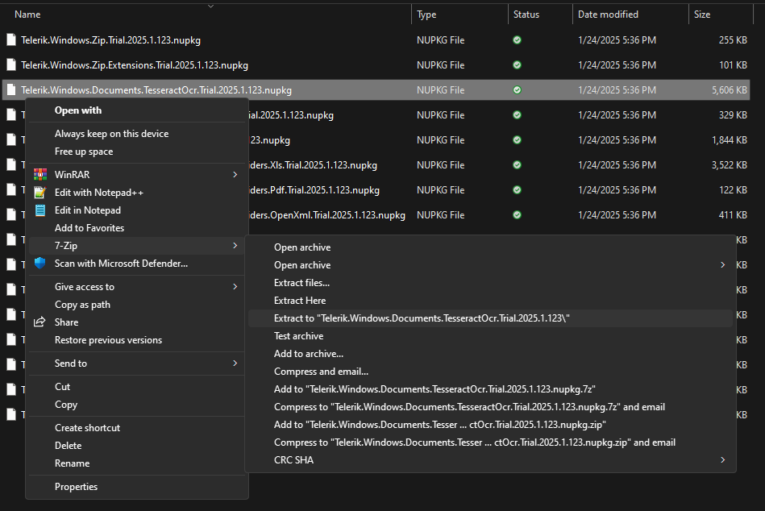
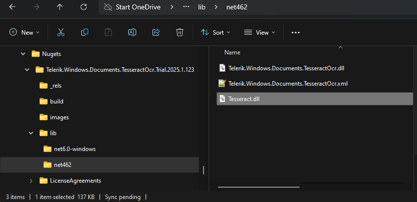

## Environment

| Version | Product | Author | 
| --- | --- | ---- | 
| Q1 2025 | Document Processing Libraries |[Desislava Yordanova](https://www.telerik.com/blogs/author/desislava-yordanova)| 

## Description

This article demonstrates how to extract the signed `Tesseract.dll` from the `Telerik.Windows.Documents.TesseractOcr` NuGet package.

>note You can follow a similar approach for any other NuGet package to extract the assemblies contained inside the `.nupkg` file.

## Solution

1. Right-click the `Telerik.Windows.Documents.TesseractOcr` NuGet package and select **Extract** with 7-Zip:

         

2. Find the contained assemblies in the `lib` folder:

        

3. Reference the extracted `Tesseract.dll` in your project.

## See Also

* [Prerequisites]()
* [Using OcrFormatProvider]()
* [Available NuGet Packages]()
