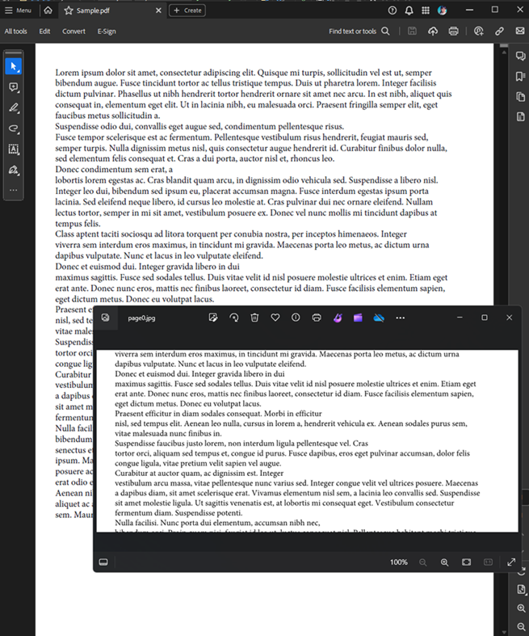
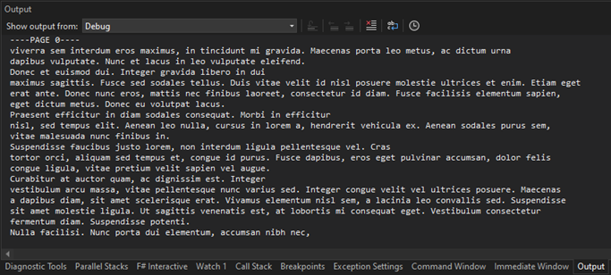

## Environment

| Version | Product | Author | 
| --- | --- | ---- | 
| 2024.2.426| RadPdfProcessing |[Desislava Yordanova](https://www.telerik.com/blogs/author/desislava-yordanova)| 

## Description

Learn how to extract the text from specific rectangular areas within PDF pages. 

## Solution

To extract text from a specific rectangle or crop box within a PDF page, you can utilize the [TextFragment]() class along with its [MatrixPosition]() property. The following code snippet demonstrates how to load a PDF document, define a rectangle that represents the desired area from which text should be extracted, and iterate through the text fragments within each page. It checks if the position of the text fragment is contained within the specified rectangle and, if so, outputs the text.

```csharp
        static void Main(string[] args)
        {
            string originalFilePath = @"WinForms PdfViewer.pdf";
            PdfFormatProvider provider = new PdfFormatProvider();
            RadFixedDocument croppedDocument = provider.Import(File.ReadAllBytes(originalFilePath));
            Rect middleRectangle = new Rect(croppedDocument.Pages.First().Size.Width/2, croppedDocument.Pages.First().Size.Height / 3, croppedDocument.Pages.First().Size.Width, croppedDocument.Pages.First().Size.Height / 3);

            foreach (RadFixedPage currentPage in croppedDocument.Pages)
            {
                foreach (var contentElement in currentPage.Content)
                {
                    TextFragment textFragment = contentElement as TextFragment;

                    if (textFragment != null)
                    {
                        string currentText = (contentElement as TextFragment).Text;
                        if (currentText==" ")
                        {
                            continue;
                        }
                        MatrixPosition position = textFragment.Position as MatrixPosition;
                        if (middleRectangle.Contains(position.Matrix.OffsetX, position.Matrix.OffsetY))
                        {
                            Debug.Write(currentText);
                        }
                }
            }
        }
```
The cropped middle part of the page is represented in the below screenshot:

   

The detected text is printed in the Output console:

   


## See Also

- [RadPdfProcessing Documentation](})
- [TextFragment](})
- [MatrixPosition]()
