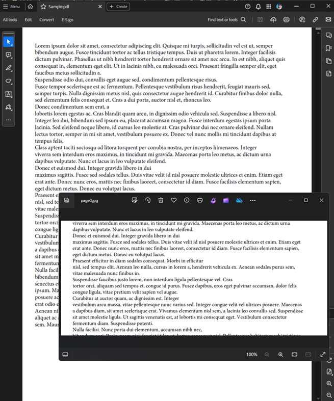
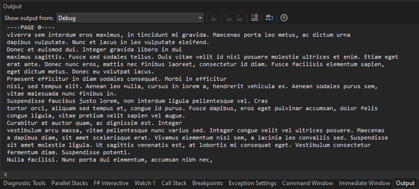

## Environment

| Version | Product | Author | 
| --- | --- | ---- | 
| 2024.2.426| RadPdfProcessing |[Desislava Yordanova](https://www.telerik.com/blogs/author/desislava-yordanova)| 

## Description

Learn how to extract the text from specific rectangular areas within PDF pages. 

## Solution

To extract text from a specific rectangle or crop box within a PDF page, use the [TextFragment]() class together with its [MatrixPosition]() property. The following example loads a PDF document, defines a rectangle for the target area, and iterates through the text fragments on each page. If the position of a text fragment falls within the specified rectangle, the code outputs the text.

```csharp
        static void Main(string[] args)
        {
            string originalFilePath = @"WinForms PdfViewer.pdf";
            PdfFormatProvider provider = new PdfFormatProvider();
            RadFixedDocument croppedDocument = provider.Import(File.ReadAllBytes(originalFilePath));
            Rect middleRectangle = new Rect(croppedDocument.Pages.First().Size.Width/2, croppedDocument.Pages.First().Size.Height / 3, croppedDocument.Pages.First().Size.Width, croppedDocument.Pages.First().Size.Height / 3);

            foreach (RadFixedPage currentPage in croppedDocument.Pages)
            {
                foreach (var contentElement in currentPage.Content)
                {
                    TextFragment textFragment = contentElement as TextFragment;

                    if (textFragment != null)
                    {
                        string currentText = (contentElement as TextFragment).Text;
                        if (currentText==" ")
                        {
                            continue;
                        }
                        MatrixPosition position = textFragment.Position as MatrixPosition;
                        if (middleRectangle.Contains(position.Matrix.OffsetX, position.Matrix.OffsetY))
                        {
                            Debug.Write(currentText);
                        }
                }
            }
        }
```
The following screenshot shows the cropped middle part of the page:

   

The Output console displays the detected text:

   


## See Also

* [RadPdfProcessing Documentation]()
* [TextFragment]()
* [MatrixPosition]()
