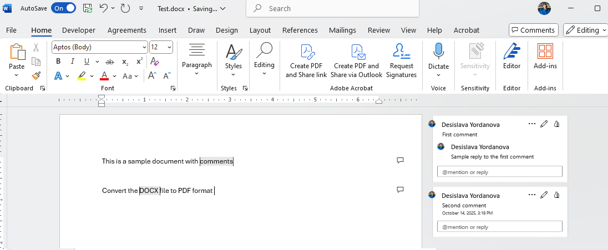
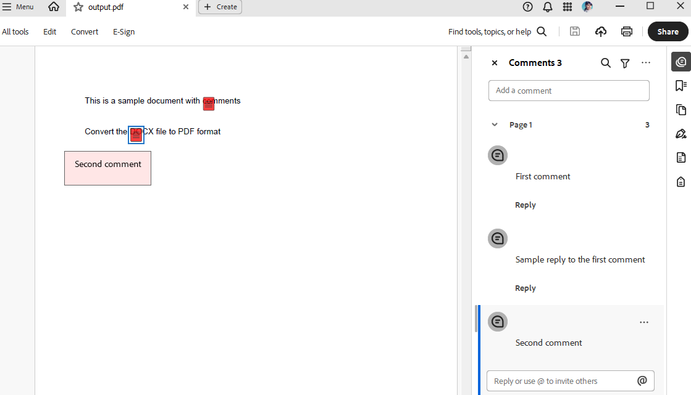

<style>
img[alt$="><"] {
  border: 1px solid lightgrey;
}
</style>

## Environment

| Version | Product | Author | 
| ---- | ---- | ---- | 
| 2025.3.806| RadWordsProcessing |[Desislava Yordanova](https://www.telerik.com/blogs/author/desislava-yordanova)| 

## Description

This article aims to demonstrate a sample approach of extracting comments from Word (DOCX) documents and add them as annotations to the converted PDF document. Currently, comments in Word documents are not preserved during the conversion to PDF.  

This knowledge base article also answers the following questions:
- How to extract comments from Word documents using RadWordsProcessing?
- How to convert the DOCX file to PDF format?
- How to convert Word document comments to PDF annotations?

   

## Solution

To achieve the desired behavior, follow these steps:

1. Import the existing DOCX file to [RadFlowDocument]().

1. Convert the RadFlowDocument to PDF format ([RadFixedDocument]()).

1. Extract the [Comments]() from the RadFlowDocument and add programmatically [Annotations]() to the RadFixedDocument.

1. Export the RadFixedDocument to PDF file.

```csharp
        static void Main(string[] args)
        {
            RadFlowDocument flowDocument;
            using (Stream input = File.OpenRead("Test.docx"))
            {
                //or DocFormatProvider for .doc files
                var docxProvider = new DocxFormatProvider();
                flowDocument = docxProvider.Import(input, TimeSpan.FromSeconds(10));
            }

            // Convert RadFlowDocument to RadFixedDocument for PDF export
            var flowToPdfProvider = new Telerik.Windows.Documents.Flow.FormatProviders.Pdf.PdfFormatProvider();
            RadFixedDocument fixedDocument;

            using (var memoryStream = new MemoryStream())
            {
                flowToPdfProvider.Export(flowDocument, memoryStream, TimeSpan.FromSeconds(10));
                memoryStream.Position = 0;

                var fixedPdfProvider = new Telerik.Windows.Documents.Fixed.FormatProviders.Pdf.PdfFormatProvider();
                fixedDocument = fixedPdfProvider.Import(memoryStream, TimeSpan.FromSeconds(10));
            }

            // Add annotations for each comment
            AddCommentsAsAnnotations(fixedDocument, flowDocument);

            string outputFilePath = "output.pdf";
            // Export the final PDF with annotations
            using (Stream output = File.Create(outputFilePath))
            {
                var pdfProvider = new Telerik.Windows.Documents.Fixed.FormatProviders.Pdf.PdfFormatProvider();
                pdfProvider.Export(fixedDocument, output, TimeSpan.FromSeconds(10));
            }

            Process.Start(new ProcessStartInfo() { FileName = outputFilePath, UseShellExecute = true });
        }

        private static void AddCommentsAsAnnotations(RadFixedDocument fixedDocument, RadFlowDocument flowDocument)
        {
            // This is a simplified approach - in a real scenario, you'd need to map comment positions
            // from the flow document to the fixed document coordinates

            int commentIndex = 0;
            foreach (Comment comment in flowDocument.Comments)
            {

                var start = comment.CommentRangeStart;
                var end = comment.CommentRangeEnd;
                var paragraph = start.Paragraph;
                System.Text.StringBuilder commentTextBuilder = new System.Text.StringBuilder();
                foreach (Paragraph commentBlock in comment.Blocks)
                {
                    foreach (Run inline in commentBlock.Inlines)
                    {
                        commentTextBuilder.AppendLine(inline.Text);
                    }
                }
                string commentText = commentTextBuilder.ToString();
                // Get all inlines between start and end
                var inlines = paragraph.Inlines
                    .SkipWhile(inline => inline != start)
                    .Skip(1)
                    .TakeWhile(inline => inline != end);

                var associatedText = string.Join("", inlines
                    .OfType<Run>()
                    .Select(run => run.Text));

                Debug.WriteLine($"Comment: {commentText}");
                Debug.WriteLine($"Associated Text: {associatedText}");

                if (fixedDocument.Pages.Count > 0)
                {
                    TextSearch search = new TextSearch(fixedDocument);
                    SearchResult result = search.Find(associatedText, TextSearchOptions.Default);
                    if (result.Result != null)
                    {
                        System.Windows.Rect rect = result.GetWordBoundingRect();
                        RadFixedPage page = result.GetResultPage();
                        TextAnnotation annotation = page.Annotations.AddText(rect);
                        annotation.Contents = commentTextBuilder.ToString();
                        annotation.Opacity = 0.5;
                        annotation.Color = new RgbColor(255, 0, 0);  
                    }
                }
            }

```

    

## See Also

- [RadFlowDocument]()
- [RadFixedDocument]()
 
