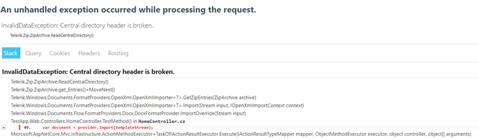

## Environment

| Version | Product | Author | 
| --- | --- | ---- | 
| 2024.1.124 | RadWordsProcessing |[Desislava Yordanova](https://www.telerik.com/blogs/author/desislava-yordanova)| 

## Description

The following exception may occur when trying to import a DOC file using RadWordsProcessing:

   

## Solution

To resolve this issue, please follow these steps:

1. Make sure that you are using the correct format provider for importing the DOC file. Use the [DocFormatProvider]() instead of the [DocxFormatProvider]() for importing the DOC file.

2. After importing the document, if you need to export it as a DOCX file, use the `DocxFormatProvider`.

By following these steps, you should be able to import the DOC file without encountering the `InvalidDataException`.

## See Also

* [DocFormatProvider]()
* [DocxFormatProvider]()

