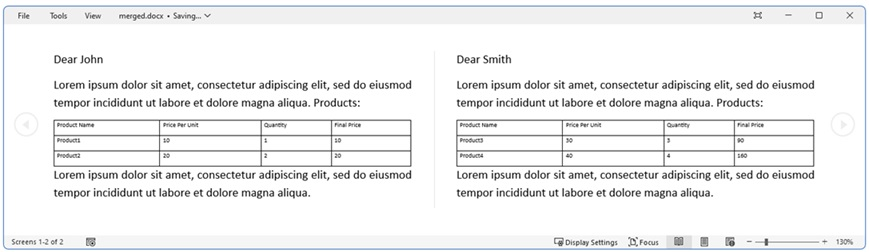

## Environment

| Version | Product | Author | 
| --- | --- | ---- | 
| 2024.2.426| RadWordsProcessing|[Desislava Yordanova](https://www.telerik.com/blogs/author/desislava-yordanova)| 

## Description

A common requirement when working with Word documents is to generate and populate a document with data/collection of data, such as a list of products, without rebuilding the application. This operation can be achieved using the Mail Merge functionality provided by RadWordsProcessing. 

## Solution

To generate a Word document and populate it with a collection of data using RadWordsProcessing, follow these steps:

1. **Prepare the Template**: Ensure that the Word document template contains the appropriate merge fields for the data that will be populated. For nested collections, use [nested merge fields]().

2. **Create a Data Source**: Prepare the data source that will be used to populate the template. This can include simple properties or nested collections.

3. **Perform the Mail Merge Operation**: Use the Mail Merge functionality of RadWordsProcessing to populate the template with data from your data source.

4. **Save and Open the Result Document**: Save the populated document to a file and, if needed, open it for review or further processing.

The following code snippet demonstrates these steps, including the setup for a nested Mail Merge operation:

```csharp
static void Main(string[] args)
        {
            RadFlowDocument template;
            DocxFormatProvider provider = new DocxFormatProvider();

            var items = GetMemberProducts();
            BuildTemplateDocument(items); 
        }

        private static void BuildTemplateDocument(IEnumerable itemsHolders)
        {
            RadFlowDocument document = new RadFlowDocument();
            RadFlowDocumentEditor editor = new RadFlowDocumentEditor(document);

            editor.InsertText("Dear ");
            editor.InsertField("MERGEFIELD Name", "");
            editor.InsertParagraph();
            editor.InsertText("Lorem ipsum dolor sit amet, consectetur adipiscing elit, sed do eiusmod tempor incididunt ut labore et dolore magna aliqua. ");
            editor.InsertText("Products:");
            Table table = editor.InsertTable(2, 4);
            table.Rows[0].Cells[0].Blocks.AddParagraph().Inlines.AddRun("Product Name");
            table.Rows[0].Cells[1].Blocks.AddParagraph().Inlines.AddRun("Price Per Unit");
            table.Rows[0].Cells[2].Blocks.AddParagraph().Inlines.AddRun("Quantity");
            table.Rows[0].Cells[3].Blocks.AddParagraph().Inlines.AddRun("Final Price");
            TableRow row = table.Rows[1];
            var productNameParagraph = table.Rows[1].Cells[0].Blocks.AddParagraph();
            editor.MoveToParagraphStart(productNameParagraph);
            editor.InsertField("MERGEFIELD TableStart:Items", "");
            editor.InsertField("MERGEFIELD ProductName", "");

            var priceParagraph = table.Rows[1].Cells[1].Blocks.AddParagraph();
            editor.MoveToParagraphStart(priceParagraph);
            editor.InsertField("MERGEFIELD Price", "");

            var quantityParagraph = table.Rows[1].Cells[2].Blocks.AddParagraph();
            editor.MoveToParagraphStart(quantityParagraph);
            editor.InsertField("MERGEFIELD Qty", "");

            var amountParagraph = table.Rows[1].Cells[3].Blocks.AddParagraph();
            editor.MoveToParagraphStart(amountParagraph);
            editor.InsertField("MERGEFIELD Amount", "");
            editor.InsertField("MERGEFIELD TableEnd:Items", "");

            table.PreferredWidth = new TableWidthUnit(TableWidthUnitType.Percent, 100);
            Border border = new Border(1, BorderStyle.Single, new ThemableColor(Colors.Black));
            table.Borders = new TableBorders(border);

            editor.MoveToTableEnd(table);

            editor.InsertParagraph();
            editor.InsertText("Lorem ipsum dolor sit amet, consectetur adipiscing elit, sed do eiusmod tempor incididunt ut labore et dolore magna aliqua. ");

            RadFlowDocument mailMergeResult = document.MailMerge(itemsHolders);        
            string resultFileNameDocx = "merged.docx";
            File.Delete(resultFileNameDocx);
            DocxFormatProvider provider = new DocxFormatProvider();
            using (var output = File.OpenWrite(resultFileNameDocx))
            {
                provider.Export(mailMergeResult, output);
            }
            Process.Start(resultFileNameDocx);
        }

        private static IEnumerable GetMemberProducts()
        {
            List<Product> products = new List<Product>()
            {
               new Product(){
                   Name = "John",
                   Items = new List<Items>()
                   {
                       new Items(){ProductName = "Product1", Price = 10, Qty = 1, Amount = 10},
                       new Items(){ProductName = "Product2", Price = 20, Qty = 2, Amount = 20},
                   }
               },
               new Product(){
                   Name = "Smith",
                   Items = new List<Items>()
                   {
                       new Items(){ProductName = "Product3", Price = 30, Qty = 3, Amount = 90},
                       new Items(){ProductName = "Product4", Price = 40, Qty = 4, Amount = 160},
                   }
               },
            };

            return products;
        }

        private static List<ProductItem> GetProductItems()
        {
            List<ProductItem> items = new List<ProductItem>()
            {
                new ProductItem(){ProductName = "Product1", Price = 10, Qty = 1, Amount = 10},
                new ProductItem(){ProductName = "Product2", Price = 20, Qty = 2, Amount = 40}
            };
            return items;
        }

        public class Product
        {
            public string Name { get; set; }
            public List<Items> Items { get; set; }
        }

        public class Items
        {
            public string ProductName { get; set; }
            public decimal Price { get; set; }
            public int Qty { get; set; }
            public decimal Amount { get; set; }
        }

        public class ProductItem
        {
            public string ProductName { get; set; }
            public decimal Price { get; set; }
            public int Qty { get; set; }
            public decimal Amount { get; set; }
        }
```
  

## See Also

- [Populate a Table with Data using Nested Mail Merge Functionality]()
- [RadWordsProcessing]()
- [Mail Merge]()


