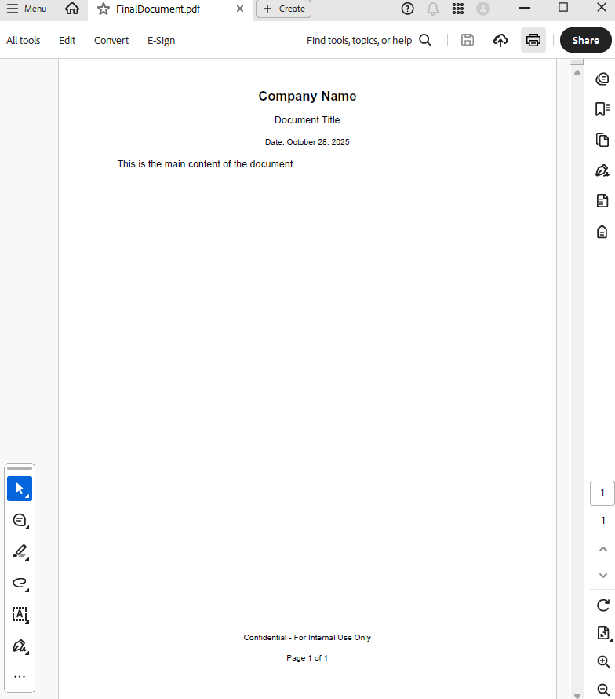

## Environment

| Version | Product | Author | 
| ---- | ---- | ---- | 
| 2025.3.806| RadWordsProcessing |[Desislava Yordanova](https://www.telerik.com/blogs/author/desislava-yordanova)| 

## Description

Learn how to combine **separate** HTML files for **header**, **footer** and **content** into one common document and product a PDF document with the result.

## Solution

To generate a PDF with separate headers and footers, process the HTML files using RadWordsProcessing. Follow these steps:

1. **Import the HTML content**: Use the [HtmlFormatProvider]() to import the HTML content into [RadFlowDocument]() objects.
2. **Add headers and footers**: Use the [DocumentElementImporter]() to insert [header and footer]() content into the main document.
3. **Export the document to PDF**: Use the [PdfFormatProvider]() to export the final document to PDF format.

### Code Example

```csharp
        static void Main(string[] args)
        {

            string headerHtml = "\r\n<p style=\"text-align: center; font-size: 16pt; font-weight: bold;\">\r\n    Company Name\r\n</p>\r\n<p style=\"text-align: center; font-size: 12pt;\">\r\n    Document Title\r\n</p>\r\n<p style=\"text-align: center; font-size: 10pt;\">\r\n    Date: October 28, 2025\r\n</p>\r\n";
            string contentHtml = "<p>This is the main content of the document.</p>";
            string footerHtml = "\r\n<p style=\"text-align: center; font-size: 10pt;\">\r\n    Confidential - For Internal Use Only\r\n</p>\r\n<p style=\"text-align: center; font-size: 10pt;\">\r\n    Page 1 of 1\r\n</p>\r\n";

            var htmlProvider = new HtmlFormatProvider();

            // Load each HTML file into a separate document
            RadFlowDocument headerDoc = htmlProvider.Import(headerHtml, TimeSpan.FromSeconds(10));
            RadFlowDocument contentDoc = htmlProvider.Import(contentHtml, TimeSpan.FromSeconds(10));
            RadFlowDocument footerDoc = htmlProvider.Import(footerHtml, TimeSpan.FromSeconds(10));

            // Create importer for header
            var headerImporter = new DocumentElementImporter(contentDoc, headerDoc, ConflictingStylesResolutionMode.UseTargetStyle);
            Header defaultHeader = contentDoc.Sections.First().Headers.Add();

            foreach (var block in headerDoc.Sections.First().Blocks)
            {
                BlockBase importedBlock = headerImporter.Import(block);
                defaultHeader.Blocks.Add(importedBlock);
            }

            // Create importer for footer
            var footerImporter = new DocumentElementImporter(contentDoc, footerDoc, ConflictingStylesResolutionMode.UseTargetStyle);
            Footer defaultFooter = contentDoc.Sections.First().Footers.Add();

            foreach (var block in footerDoc.Sections.First().Blocks)
            {
                BlockBase importedBlock = footerImporter.Import(block);
                defaultFooter.Blocks.Add(importedBlock);
            }

            // Export to PDF
            var pdfProvider = new PdfFormatProvider();
            string outputFilePath = "FinalDocument.pdf";
            using (var outputStream = File.Create(outputFilePath))
            {
                pdfProvider.Export(contentDoc, outputStream, TimeSpan.FromSeconds(10));
            }
            Process.Start(new ProcessStartInfo() { FileName = outputFilePath, UseShellExecute = true });
        }
```
Let's have the following 3 separate HTML files: 

* Header HTML:

```html
<p style="text-align: center; font-size: 16pt; font-weight: bold;">
    Company Name
</p>
<p style="text-align: center; font-size: 12pt;">
    Document Title
</p>
<p style="text-align: center; font-size: 10pt;">
    Date: October 28, 2025
</p>

``` 


* Footer HTML

```html
<p style="text-align: center; font-size: 10pt;">
    Confidential - For Internal Use Only
</p>
<p style="text-align: center; font-size: 10pt;">
    Page 1 of 1
</p>

``` 
    

* Content HTML

```html
<p>This is the main content of the document.</p>

``` 


The result PDF document combined all of the HTML files in one common document:

  

## See Also

- [DocumentElementImporter]() 
- [Headers and footers]() 
