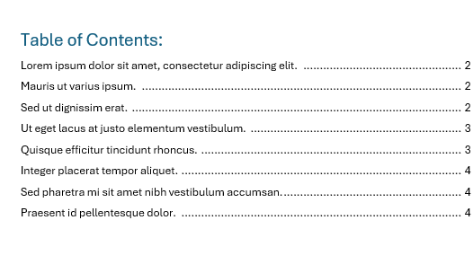

## Environment

| Version | Product | Author | 
| --- | --- | ---- | 
| 2024.2.426| RadWordsProcessing |[Desislava Yordanova](https://www.telerik.com/blogs/author/desislava-yordanova)| 

## Description

This article shows how to merge two DOCX documents into a single document and generate a unified TOC that correctly reflects the merged content.  

## Solution

To merge two Word documents and generate a unified TOC, follow these steps:

1. Import the documents using the [DocxFormatProvider]().
2. [Merge]() the documents using the `Merge` method with appropriate `MergeOptions`.
3. Insert a unified TOC at the desired location in the merged document.
4. [Update the TOC field](https://docs.telerik.com/devtools/document-processing/libraries/radwordsprocessing/concepts/fields/fields#updating-fields) to reflect the merged content accurately.

Here is an example code that demonstrates this process:

```csharp
using Telerik.Windows.Documents.Flow.Model;
using Telerik.Windows.Documents.Flow.Model.Editing;
using Telerik.Windows.Documents.Flow.Model.Fields;
using Telerik.Windows.Documents.Flow.FormatProviders.Docx;
using System;
using System.IO;
using System.Linq;

class Program
{
    static void Main(string[] args)
    {
        Telerik.Windows.Documents.Flow.FormatProviders.Docx.DocxFormatProvider DocxProvider = new Telerik.Windows.Documents.Flow.FormatProviders.Docx.DocxFormatProvider();
        DocxProvider.ExportSettings.AutoUpdateFields = false;

        // Importing the first document
        RadFlowDocument doc1;
        using (Stream input = File.OpenRead("file1.docx"))
        {
            doc1 = DocxProvider.Import(input);
        }

        // Importing the second document
        RadFlowDocument doc2;
        using (Stream input = File.OpenRead("file2.docx"))
        {
            doc2 = DocxProvider.Import(input);
        }

        // Merging documents
        MergeOptions mergeOptions = new MergeOptions
        {
            ConflictingStylesResolutionMode = ConflictingStylesResolutionMode.UseTargetStyle
        };
        doc1.Merge(doc2, mergeOptions);

        // Positioning and inserting the unified TOC
        RadFlowDocumentEditor masterEditor = new RadFlowDocumentEditor(doc1);
        Paragraph firstParagraph = doc1.EnumerateChildrenOfType<Paragraph>().FirstOrDefault();
        masterEditor.MoveToParagraphStart(firstParagraph);

        // Inserting a page break and the TOC title
        masterEditor.InsertBreak(BreakType.PageBreak);
        Run title = masterEditor.InsertText("Table of Contents:\n");
        Style style = doc1.StyleRepository.AddBuiltInStyle(BuiltInStyleNames.TocHeadingStyleId);
        title.Paragraph.StyleId = style.Id;

        // Inserting the TOC
        FieldInfo fieldInfo = masterEditor.InsertField("TOC");
        masterEditor.InsertParagraph();
        fieldInfo.UpdateField();

        // Saving the merged document with the unified TOC
        SaveDocument(doc1, "mergedFileLocation.pdf");
        SaveDocument(doc1, "mergedFileLocation.docx");
    }

    private static void SaveDocument(RadFlowDocument document, string filePath)
    {
        string extension = Path.GetExtension(filePath).ToLower();
        using (Stream output = File.Create(filePath))
        {
            if (extension == ".pdf")
            {
                Telerik.Windows.Documents.Flow.FormatProviders.Pdf.PdfFormatProvider provider = new Telerik.Windows.Documents.Flow.FormatProviders.Pdf.PdfFormatProvider();
                provider.Export(document, output);
            }
            else if (extension == ".docx")
            {
                Telerik.Windows.Documents.Flow.FormatProviders.Docx.DocxFormatProvider provider = new Telerik.Windows.Documents.Flow.FormatProviders.Docx.DocxFormatProvider();
                provider.Export(document, output);
            }
        }

        // Open the saved file
        System.Diagnostics.Process.Start(new System.Diagnostics.ProcessStartInfo { FileName = filePath, UseShellExecute = true });
    }
}
```

This example demonstrates merging two DOCX files, positioning the document editor at the beginning of the merged document, inserting a page break followed by a unified TOC title, and finally, inserting the TOC field. The document is then saved as both a PDF and a DOCX file.

The achieved result is illustrated below:

  

## Notes

- Ensure that the documents you are merging have compatible styles to avoid conflicts in the merged document.
- The TOC will need to be manually updated in the output document to reflect the current headings and page numbers accurately.

## See Also

- [Fields Overview]()
- [Working with Fields in RadWordsProcessing]()
- [Merge Documents in RadWordsProcessing](https://docs.telerik.com/devtools/document-processing/libraries/radwordsprocessing/editing/clone-and-merge#merging-documents)
