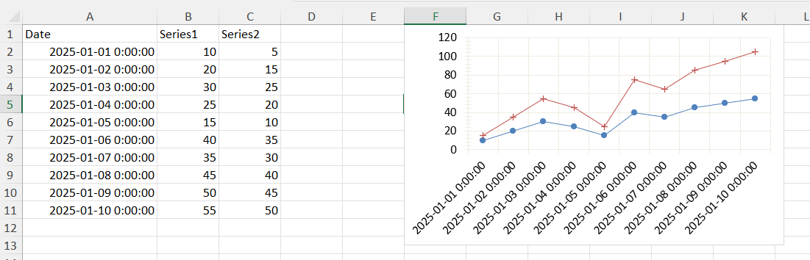

## Environment

| Version | Product | Author | 
| --- | --- | ---- | 
| 2025.3.806 | SpreadProcessing |[Yoan Karamanov](https://www.telerik.com/blogs/author/yoan-karamanov)| 

## Description

This article demonstrates how to generate stacked line charts in worksheets using the SpreadProcessing library. It also covers how to specify the data sources for the X-axis (dates) and Y-axis (numerical values). Additionally, it explains how to configure chart properties such as marker types, line styles, and visibility to customize the chart's appearance.

Key topics addressed in this guide include:
- Creating line and stacked line charts in Excel using Telerik Document Processing.
- Assigning specific data ranges to the X-axis (e.g., dates) and Y-axis (numerical values).
- Customizing chart properties, including marker types for each series, line styles, and removing markers when needed.
- Plotting multiple columns of data while ensuring correct alignment between axes.

 

## Solution

To create a stacked line chart and configure the axes as desired, follow these steps:

1. Define the `LineSeriesGroup` and set its grouping to `Stacked`. This ensures the chart is created as a stacked line chart.
2. Create individual `[LineSeries](#lineseries)` for each data column. Set the `Values` to represent numerical data and `Categories` to represent dates.
3. Define the axes for the chart. Set the `CategoryAxis` to plot dates and the `ValueAxis` for numerical values.
4. Create the chart and associate the `LineSeriesGroup` and axes with it.
5. Replace the default chart in the `[FloatingChartShape](#floatingchartshape)` with the configured document chart`. Set the dimensions and add it to the worksheet.

```csharp
var fileBytes = File.ReadAllBytes("fileWithChartData.xlsx");

Workbook workbook = xlsxFormatProvider.Import(fileBytes, null);
Worksheet worksheet = workbook.ActiveWorksheet;

LineSeriesGroup seriesGroup = new LineSeriesGroup();
seriesGroup.Grouping = SeriesGrouping.Stacked;

// Make the series one by one
LineSeries lineSeries1 = new LineSeries();
lineSeries1.Values = new WorkbookFormulaChartData(worksheet, new CellRange(1, 1, 10, 1));
lineSeries1.Categories = new WorkbookFormulaChartData(worksheet, new CellRange(1, 0, 10, 0));
lineSeries1.Marker = new Marker();
lineSeries1.Marker.Symbol = MarkerStyle.Circle;
seriesGroup.Series.Add(lineSeries1);

LineSeries lineSeries2 = new LineSeries();
lineSeries2.Values = new WorkbookFormulaChartData(worksheet, new CellRange(1, 2, 10, 2));
lineSeries2.Categories = new WorkbookFormulaChartData(worksheet, new CellRange(1, 0, 10, 0));
lineSeries2.Marker = new Marker();
lineSeries2.Marker.Symbol = MarkerStyle.Plus;
seriesGroup.Series.Add(lineSeries2);

// Some axes
SolidFill lineColor = new SolidFill(new ThemableColor(ThemeColorType.Background2));

AxisGroup axisGroup = new AxisGroup();
CategoryAxis categoryAxis = new CategoryAxis();
categoryAxis.Outline.Fill = lineColor;
categoryAxis.MajorGridlines.Outline.Fill = lineColor;
axisGroup.CategoryAxis = categoryAxis;

ValueAxis valueAxis = new ValueAxis();
valueAxis.Outline.Fill = lineColor;
valueAxis.MajorGridlines.Outline.Fill = lineColor;
axisGroup.ValueAxis = valueAxis;

// Here is the chart itself
DocumentChart documentChart = new DocumentChart();
documentChart.SeriesGroups.Add(seriesGroup);
documentChart.PrimaryAxes = axisGroup;

// We'll make a dummy FloatingChartShape and we'll replace the inner chart.
FloatingChartShape floatingChartShape = new FloatingChartShape(worksheet, new CellIndex(0, 5), new CellRange(0, 0, 4, 3), ChartType.Line);
floatingChartShape.Chart = documentChart;
floatingChartShape.Width = 400;
floatingChartShape.Height = 250;

worksheet.Charts.Add(floatingChartShape);

string exportFileName = "fileWithChart.xlsx";
using (Stream str = File.OpenWrite(exportFileName))
{
    xlsxFormatProvider.Export(workbook, str, null);
}
```
By following these steps, you can generate a stacked line chart without markers and configure the axes to display the required data.

## See Also

* [SpreadProcessing Overview]()
* [Charts Overview]()