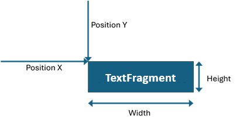

## Environment

| Version | Product | Author | 
| --- | --- | ---- | 
| 2024.3.806| RadPdfProcessing |[Desislava Yordanova](https://www.telerik.com/blogs/author/desislava-yordanova)| 

## Description

Determining the precise location and size of a [TextFragment]() in a PDF document is essential for various document processing tasks. A `TextFragment`'s position is accessible through its () property, which returns a `MatrixPosition`. This article outlines how to translate the `MatrixPosition` into (x,y) coordinates and how to calculate the width and height of a `TextFragment`.

   

This KB article also answers the following questions:
- How can I find the exact location of a text in a PDF document?
- What is the method to determine the dimensions of a text segment within a PDF file?
- How to use the `MatrixPosition` for locating text in a PDF document?

## Solution

To obtain the (x,y) coordinates and the dimensions (width and height) of a `TextFragment`, follow these steps:

1. **Extract the (x,y) Coordinates:**
   
   Each `TextFragment` has a `Position` property of type [MatrixPosition](https://docs.telerik.com/devtools/document-processing/libraries/radpdfprocessing/concepts/position#matrixposition). The `MatrixPosition` object includes a `Matrix` that exposes `OffsetX` and `OffsetY` properties. These properties represent the fragment's offset from the top-left corner of the PDF page.

   ```csharp
   float offsetX = textFragment.Position.Matrix.OffsetX;
   float offsetY = textFragment.Position.Matrix.OffsetY;
   ```

2. **Calculate the Size (Width and Height):**
   
   To determine the width and height of a `TextFragment`, leverage the measuring functionality of the `Block` object. First, insert the `TextFragment` into a `Block`, and then use the `Measure` method to find its size.

   ```csharp
   private static Size GetFragmentSize(TextFragment textFragment)
   {
       Block block = new Block();
       block.Insert(textFragment);
       Size textFragmentSize = block.Measure();
       return textFragmentSize;
   }
   ```

By following these steps, you can accurately locate a `TextFragment` within a PDF document and determine its size, enabling enhanced document processing and manipulation capabilities.

## Notes

- The `OffsetX` and `OffsetY` values pinpoint the location relative to the top-left corner of the PDF page.
- The `Measure` method of the `Block` object provides the width and height of the contained `TextFragment`, facilitating precise layout and positioning operations.

## See Also

- [Position Concept in RadPdfProcessing]()
- [TextFragment in RadPdfProcessing]()
- [Extracting Text Within a Specific Rectangle in PDF Documents]()
