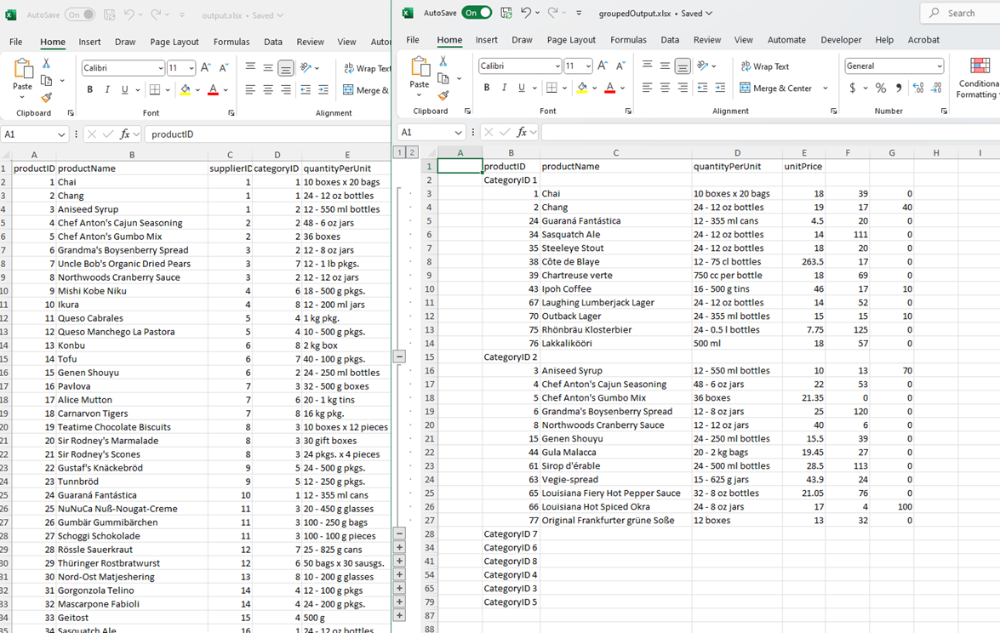

<style>
img[alt$="><"] {
  border: 1px solid lightgrey;
}
</style>

## Environment

| Version | Product | Author | 
| ---- | ---- | ---- | 
| 2025.2.520| RadSpreadProcessing |[Desislava Yordanova](https://www.telerik.com/blogs/author/desislava-yordanova)| 

## Description

This article shows how to generate a worksheet with **grouped** data from a **flat** collection of records as an input. 

>caption Flat vs. Grouped Data

   

## Solution

Note that the grouping should be performed separately beforehand, and only then can the Worksheet be populated with the grouped data.

Once you have the grouped data, the SpreadProcessing functionality (in a similar way to MS Excel) allows you to assign the outline level to all rows that belong to the same group. 
To make it clear and simple, let's take the following example - a flat list of products stored in CSV data:

### Preparing Grouped Data

1. Group your flat data (e.g. Northwind.Products) before populating the worksheet.
2. Use LINQ or other methods to group rows based on a specific column (e.g. CategoryID).

Use the following code snippet to group rows in a worksheet:

```csharp
    internal class Program
    {
        static void Main(string[] args)
        {
            string fileName = "sample.csv";
            Workbook workbook;
          
            CsvFormatProvider csv_formatProvider = new CsvFormatProvider();

            using (Stream input = new FileStream(fileName, FileMode.Open))
            {
                workbook = csv_formatProvider.Import(input, TimeSpan.FromSeconds(10));

            }
            Worksheet worksheet = workbook.ActiveWorksheet;

            // Convert worksheet data to DataTable
            DataTable dataTable = WorksheetToDataTable(worksheet);

            // Apply grouping and outlining
           Workbook groupedWorkbook= ApplyGroupingToWorksheet(dataTable, new Workbook());

            Telerik.Windows.Documents.Spreadsheet.FormatProviders.IWorkbookFormatProvider xlsx_formatProvider = 
                new Telerik.Windows.Documents.Spreadsheet.FormatProviders.OpenXml.Xlsx.XlsxFormatProvider();
         
            string outputFilePath = "output.xlsx";
            File.Delete(outputFilePath);
            using (Stream output = new FileStream(outputFilePath, FileMode.Create))
            {
                xlsx_formatProvider.Export(workbook, output, TimeSpan.FromSeconds(10));
            }

            Process.Start(new ProcessStartInfo() { FileName = outputFilePath, UseShellExecute = true });

            outputFilePath = "groupedOutput.xlsx";
            File.Delete(outputFilePath);
            using (Stream output = new FileStream(outputFilePath, FileMode.Create))
            {
                xlsx_formatProvider.Export(groupedWorkbook, output, TimeSpan.FromSeconds(10));
            }

            Process.Start(new ProcessStartInfo() { FileName = outputFilePath, UseShellExecute = true });
        }
        static DataTable WorksheetToDataTable(Worksheet worksheet)
        {
            DataTable dataTable = new DataTable();

            // Get used range
            CellRange usedRange = worksheet.UsedCellRange;

            // Add columns to DataTable (assuming first row contains headers)
            for (int col = 0; col < usedRange.ColumnCount; col++)
            {
                string columnName = worksheet.Cells[0, col].GetValue().Value.RawValue.ToString();
                dataTable.Columns.Add(columnName ?? $"Column{col}");
            }

            // Add data rows
            for (int row = 1; row < usedRange.RowCount; row++)
            {
                DataRow dataRow = dataTable.NewRow();
                for (int col = 0; col < usedRange.ColumnCount; col++)
                {
                    dataRow[col] = worksheet.Cells[row, col].GetValue().Value.RawValue ?? string.Empty;
                }
                dataTable.Rows.Add(dataRow);
            }

            return dataTable;
        }

        static Workbook ApplyGroupingToWorksheet(DataTable dataTable, Workbook workbook)
        {
            // Group the data by the sixth column (index 5)
            var groupedResults = from p in dataTable.AsEnumerable()
                          group p by p.Field<string>("categoryID") into g
                          select new
                          {
                              categoryID = g.Key,
                              productID = string.Join(";", from i in g select i.Field<string>("productID")),
                              productName = string.Join(";", from i in g select i.Field<string>("productName")),
                              quantityPerUnit = string.Join(";", from i in g select i.Field<string>("quantityPerUnit")),
                              CustomunitPriceerLastname = string.Join(";", from i in g select i.Field<string>("unitPrice")),
                              unitsInStock = string.Join(";", from i in g select i.Field<string>("unitsInStock")),
                              unitsOnOrder = string.Join(";", from i in g select i.Field<string>("unitsOnOrder"))
                          };


            workbook.Worksheets.Add();
            Worksheet worksheet = workbook.ActiveWorksheet;
            worksheet.Cells[0, 1].SetValue("productID");
            worksheet.Cells[0, 2].SetValue("productName");
            worksheet.Cells[0, 3].SetValue("quantityPerUnit");
            worksheet.Cells[0, 4].SetValue("unitPrice");
            // Header is row 0, data starts at row 1
            int currentRow = 1;

            // Process each group
            foreach (var group in groupedResults)
            {
                worksheet.Cells[currentRow, 1].SetValue("CategoryID "+group.categoryID);
                currentRow++;

                string[] productsIDs= group.productID.Split(';');
                string[] productNames = group.productName.Split(';');
                string[] quantityPerUnits = group.quantityPerUnit.Split(';');
                string[] unitPrices = group.CustomunitPriceerLastname.Split(';');
                string[] unitsInStocks = group.unitsInStock.Split(';');
                string[] unitsOnOrders = group.unitsOnOrder.Split(';');

                int start = currentRow;
                int end= currentRow+ productsIDs.Length - 1;
                for (int i = 0; i < productsIDs.Length; i++)
                {
                    worksheet.Cells[currentRow, 1].SetValue(productsIDs[i]);
                    worksheet.Cells[currentRow, 2].SetValue(productNames[i]);
                    worksheet.Cells[currentRow, 3].SetValue(quantityPerUnits[i]);
                    worksheet.Cells[currentRow, 4].SetValue(unitPrices[i]);
                    worksheet.Cells[currentRow, 5].SetValue(unitsInStocks[i]);
                    worksheet.Cells[currentRow, 6].SetValue(unitsOnOrders[i]);
                    currentRow++;
                }
                worksheet.Rows[start, end].Group();
            }
            return workbook;
        }
    }
```
Modify the example to suit your specific data structure and requirements.

## See Also

- [Grouping in SpreadProcessing]()
