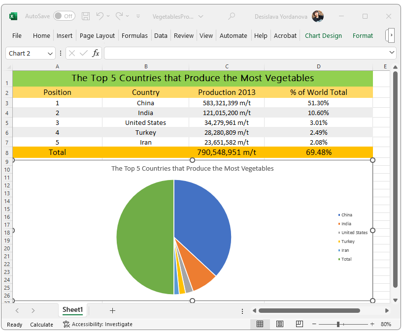
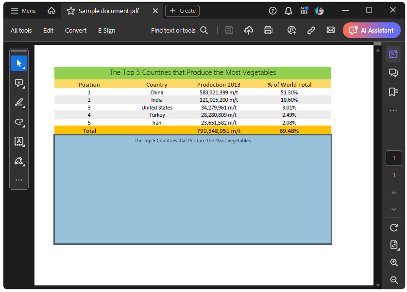
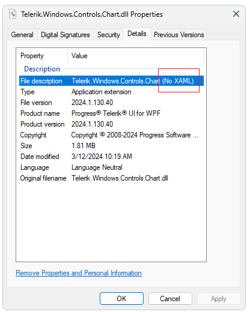
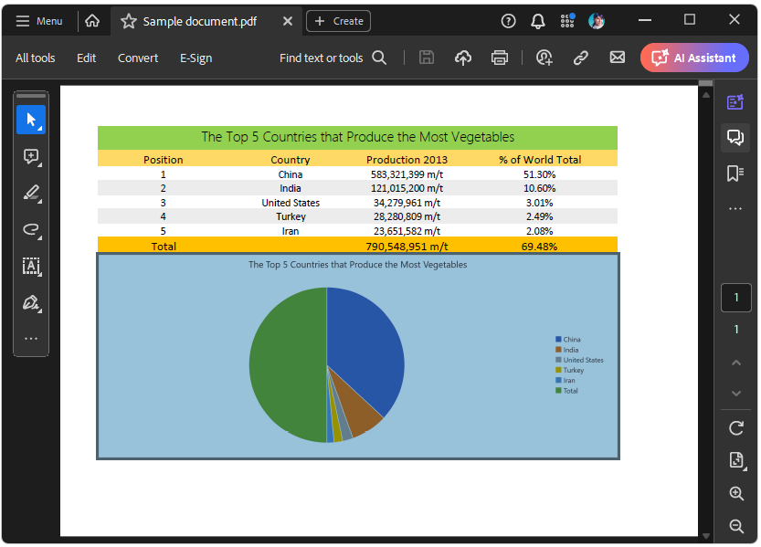

## Environment

| Version | Product | Author |  
| --- | --- | ---- | 
| 2024.1.124 | RadSpreadProcessing  |[Desislava Yordanova](https://www.telerik.com/blogs/author/desislava-yordanova)|  

## Description

When using the SDK example, [Export Chart](https://github.com/telerik/document-processing-sdk/tree/master/SpreadProcessing/ExportChart), the exported chart images might get exported as blank images in some cases. This article explains how to handle this undesired behavior.

|XLSX document with Charts|Exported PDF document with Blank charts|
|----|----|
|||

## Solution

The SDK example uses the `ChartModelToImageConverter` class which is readily available in the `Telerik.Windows.Controls.Spreadsheet` assembly and uses internally the `RadChartView` control to visualize the chart and create an image.

If you are using different versions of Telerik products in your project, this can sometimes cause compatibility issues. Verify that all references to Telerik products in your project are the same version, including the suffix (for example, `.40`). If necessary, remove all references and add them again using the correct DLLs.

The main reason behind the exported blank charts is if their style is missing. This is typically the case when the [NoXaml assemblies](https://docs.telerik.com/devtools/wpf/styling-and-appearance/xaml-vs-noxaml) are referenced for `Telerik.Windows.Controls.Spreadsheet` and `Telerik.Windows.Controls.Chart`.

>important Verify that the [Xaml assemblies](https://docs.telerik.com/devtools/wpf/styling-and-appearance/xaml-vs-noxaml) are used from the UI for WPF suite. The Xaml assemblies embed all styles of the controls. As a result, the exported chart images render as expected.

  

## See Also

- [Export Chart to PDF]()
