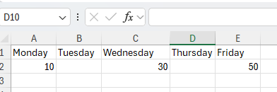

<style> img[alt$="><"] { border: 1px solid lightgrey; } </style>

## Environment

| Version | Product | Author | 
| ---- | ---- | ---- | 
| 2025.1.205| RadSpreadStreamProcessing |[Desislava Yordanova](https://www.telerik.com/blogs/author/desislava-yordanova)| 

## Description

When importing an Excel file into a [DataTable](https://learn.microsoft.com/en-us/dotnet/api/system.data.datatable?view=net-9.0) using [RadSpreadStreamProcessing](), empty cells are skipped, resulting in misalignment of the data with the columns. This article explains how to correctly handle empty cells during the import process, ensuring data is accurately represented in the DataTable.

   

## Solution

To handle empty cells correctly and maintain the alignment of data with the columns in the DataTable, manually verify when a skip in the cells occurs. Calculate how many cells this skip is and insert the same amount of DBNull.Value entries in the DataTable. This approach ensures that the structure of the DataTable accurately reflects the structure of the Excel file, including the empty cells.

The following code snippet demonstrates how to implement this solution:

```csharp
DataTable dt = new DataTable();
string fileName = "Book1.xlsx";
using (System.IO.FileStream fs = new System.IO.FileStream(fileName, FileMode.Open))
{
    using (IWorkbookImporter workBookImporter = SpreadImporter.CreateWorkbookImporter(SpreadDocumentFormat.Xlsx, fs))
    {
        foreach (IWorksheetImporter worksheetImporter in workBookImporter.WorksheetImporters)
        {
            foreach (IRowImporter rowImporter in worksheetImporter.Rows)
            {
                if (rowImporter.RowIndex == 0)
                {
                    foreach (ICellImporter cell in rowImporter.Cells)
                    {
                        dt.Columns.Add(cell.Value);
                    }
                }
                else
                {
                    var newRow = dt.NewRow();
                    var cellIndex = 0;
                    foreach (ICellImporter cell in rowImporter.Cells)
                    {
                        // Fill in DBNull.Value for skipped cells
                        while (cellIndex < cell.ColumnIndex)
                        {
                            newRow[cellIndex] = DBNull.Value;
                            cellIndex++;
                        }
                        newRow[cellIndex] = cell.Value;
                        cellIndex++;
                    }
                    dt.Rows.Add(newRow);
                }
            }
        }
    }
}
```

This code iterates through each cell in the imported rows. If a cell is skipped due to being empty, it inserts `DBNull.Value` for each skipped position before inserting the next non-empty cell's value. This method ensures that each cell, including the empty ones, is accounted for in the DataTable, preserving the data's alignment with the Excel file's structure.

## See Also

- [RadSpreadStreamProcessing]()
- [Import Excel File Formats with RadSpreadStreamProcessing]() 
