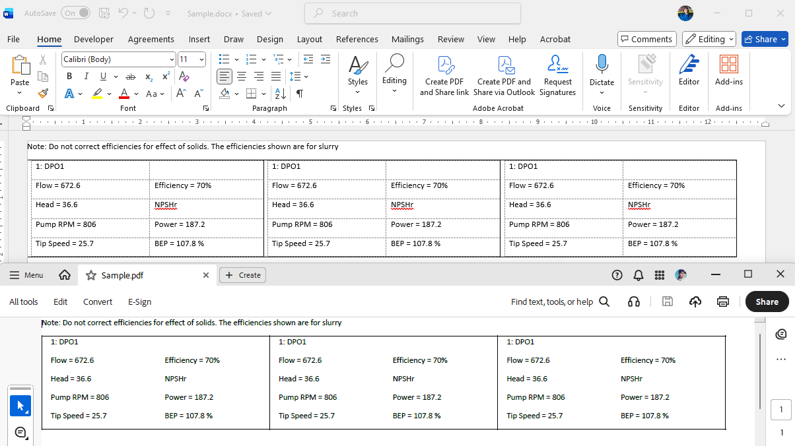

## Environment

| Version | Product | Author | 
| ---- | ---- | ---- | 
| 2025.4.1104| RadWordsProcessing |[Desislava Yordanova](https://www.telerik.com/blogs/author/desislava-yordanova)| 
## Description

This article shows how to achieve strict alignment for nested tables in both DOCX and PDF output using Telerik [WordsProcessing](). The generated DOCX document meets the desired layout, but the PDF output does not match due to differences in format rendering. The following approach shows how to achieve consistent table layout in exported documents.



## Solution 

To achieve strict alignment in both DOCX and PDF, set the table's layout type to `TableLayoutType.FixedWidth`. Define column widths explicitly to ensure consistent rendering across formats. Follow these steps:

1. Create a [RadFlowDocument]() and initialize a [RadFlowDocumentEditor]().
2. Insert a main [Table]() with predefined column widths and set the layout type to `TableLayoutType.FixedWidth`.
3. For each cell in the main table, add a nested table with explicitly defined column widths.
4. Define equal column widths in the nested table using `TableWidthUnitType.Fixed`.
5. Adjust page margins and dimensions for uniform rendering in PDF.

Below is a sample code snippet illustrating the solution:

```csharp
            RadFlowDocument flowDocument= new RadFlowDocument(); 
            RadFlowDocumentEditor editor = new RadFlowDocumentEditor(flowDocument);

            // Adds a new run to the document. 
            Run run1 = editor.InsertText("Note: Do not correct efficiencies for effect of solids. The efficiencies shown are for slurry");
 
            // Create a table with 1 row and 3 columns
            Table table = editor.InsertTable(1, 3);
            table.PreferredWidth = new TableWidthUnit(TableWidthUnitType.Fixed, 1200);

            table.LayoutType = TableLayoutType.FixedWidth; // stabilize outer columns
                                                           // Define equal thirds
            table.Rows[0].Cells[0].PreferredWidth = new TableWidthUnit(TableWidthUnitType.Fixed, 400);
            table.Rows[0].Cells[1].PreferredWidth = new TableWidthUnit(TableWidthUnitType.Fixed, 400);
            table.Rows[0].Cells[2].PreferredWidth = new TableWidthUnit(TableWidthUnitType.Fixed, 400);


            foreach (TableRow row in table.Rows)
            {
                foreach (TableCell cell in row.Cells)
                {
                    cell.Borders = new TableCellBorders(new Border(1, BorderStyle.Single, ThemableColor.FromColor(Color.FromHex("#000000"))),
                                         new Border(1, BorderStyle.Single, ThemableColor.FromColor(Color.FromHex("#000000"))),
                                         new Border(1, BorderStyle.Single, ThemableColor.FromColor(Color.FromHex("#000000"))),
                                         new Border(1, BorderStyle.Single, ThemableColor.FromColor(Color.FromHex("#000000")))); ;
                    Table cellTable = new Table(flowDocument,5, 2);

                    // Define the two column widths once (use the first row’s cells)
                    cellTable.Rows[0].Cells[0].PreferredWidth = new TableWidthUnit(TableWidthUnitType.Fixed, 200);
                    cellTable.Rows[0].Cells[1].PreferredWidth = new TableWidthUnit(TableWidthUnitType.Fixed, 200);

                    cellTable.PreferredWidth = new TableWidthUnit(TableWidthUnitType.Fixed, 400);
                    cell.Blocks.Add(cellTable);
                    
                    Paragraph paragraph = cellTable.Rows[0].Cells[0].Blocks.AddParagraph();
                    Run run = paragraph.Inlines.AddRun();
                    run.Text = "1: DPO1";

                    paragraph = cellTable.Rows[1].Cells[0].Blocks.AddParagraph();
                    run = paragraph.Inlines.AddRun();
                    run.Text = "Flow = 672.6";

                    paragraph = cellTable.Rows[1].Cells[1].Blocks.AddParagraph();
                    run = paragraph.Inlines.AddRun(); 
                    run.Text = "Efficiency = 70%";

                    paragraph = cellTable.Rows[2].Cells[0].Blocks.AddParagraph();
                    run = paragraph.Inlines.AddRun();
                    run.Text = "Head = 36.6";

                    paragraph = cellTable.Rows[2].Cells[1].Blocks.AddParagraph();
                    run = paragraph.Inlines.AddRun();
                    run.Text = "NPSHr";

                    paragraph = cellTable.Rows[3].Cells[0].Blocks.AddParagraph();
                    run = paragraph.Inlines.AddRun();
                    run.Text = "Pump RPM = 806";

                    paragraph = cellTable.Rows[3].Cells[1].Blocks.AddParagraph();
                    run = paragraph.Inlines.AddRun();
                    run.Text="Power = 187.2"; 

                    paragraph = cellTable.Rows[4].Cells[0].Blocks.AddParagraph(); 
                    run = paragraph.Inlines.AddRun();
                    run.Text = "Tip Speed = 25.7";

                    paragraph = cellTable.Rows[4].Cells[1].Blocks.AddParagraph();
                    run = paragraph.Inlines.AddRun();
                   run.Text= "BEP = 107.8 %";
                }
            }

            foreach (var section in flowDocument.Sections)
            {
                section.PageMargins = new Padding(0); 
                section.Rotate(PageOrientation.Landscape);
                section.PageSize = new Telerik.Documents.Primitives.Size(1250, 1000);
            }


            Telerik.Windows.Documents.Flow.FormatProviders.Docx.DocxFormatProvider provider = new Telerik.Windows.Documents.Flow.FormatProviders.Docx.DocxFormatProvider();

            string outputFilePath = "Sample.docx";
            File.Delete(outputFilePath);
            using (Stream output = File.OpenWrite(outputFilePath))
            { 
                provider.Export(flowDocument, output, TimeSpan.FromSeconds(10));
            }

            Process.Start(new ProcessStartInfo() { FileName = outputFilePath, UseShellExecute = true });

            PdfFormatProvider pdf_provider = new PdfFormatProvider();
            string outputPdfFilePath = "Sample.pdf";
            File.Delete(outputPdfFilePath);
            using (Stream output = File.OpenWrite(outputPdfFilePath))
            {
                pdf_provider.Export(flowDocument, output, TimeSpan.FromSeconds(10));
            }
            Process.Start(new ProcessStartInfo() { FileName = outputPdfFilePath, UseShellExecute = true });
```

## See Also

- [WordsProcessing]()
- [Table]()
- [PDF Export in WordsProcessing]()
