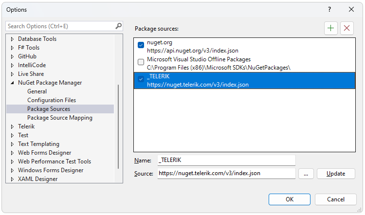
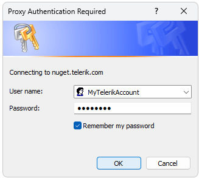
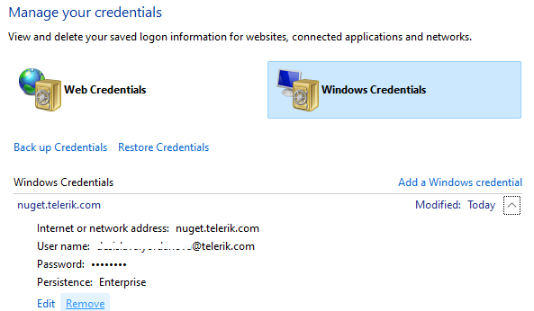

## Environment

| Version | Product | Author | 
| --- | --- | ---- | 
| 2024.4.1106| Document Processing Libraries |[Desislava Yordanova](https://www.telerik.com/blogs/author/desislava-yordanova)| 

## Description

When adding the [Telerik NuGet source](#download-from-the-nuget-server) to your Visual Studio, the expected Telerik Document Processing NuGet packages may not appear in the *Manage NuGet Packages* window. This knowledge base article shows how to troubleshoot this scenario and properly setup the NuGet feed.

>note Make sure that your firewall or proxy doesn't prevent the access to the Telerik NuGet server.

## Solution

To resolve the issue of Telerik NuGet packages not appearing in Visual Studio, follow these steps:

1. **Add Telerik NuGet Source Correctly**: Make sure the Telerik NuGet source is added correctly to Visual Studio. The correct source URL is `https://nuget.telerik.com/v3/index.json`. Refer to the [Download from the NuGet server section](#download-from-the-nuget-server) for detailed instructions.

    

If the setup is proper and you still don't have access to the Telerik Document Processing NuGet packages from the server, it may be related to the specific account used for authentication. 

2. **Enter Correct Credentials**: When prompted, enter the correct Telerik account credentials. Ensure you are using an account with an active subscription or trial. 

    

3. **Check for Multiple Accounts**: Verify if you have multiple Telerik accounts and ensure you are using the one with an active subscription. Packages may not appear if the account used has no active licenses or expired trials.

4. **Reset Telerik NuGet Credentials**: If you have verified the above steps and still face issues, try resetting your Telerik NuGet credentials. This ensures that Visual Studio is using the correct account for authentication. Instructions for resetting credentials can be found in the [Troubleshooting Telerik NuGet](#issue-resetting-telerik-nuget-credentials) guide.

    

5. **Download Packages Manually (Optional)**: As a workaround, you can manually download the required Telerik NuGet packages and add them as a local source in Visual Studio. Detailed steps for manual download are provided in the [Manually Download NuGet Packages](https://docs.telerik.com/devtools/document-processing/getting-started/installation/install-nuget-packages#manually-download-nuget-packages) section.

## See Also

- [Available NuGet Packages]()
- [Install Using NuGet Packages]()
- [Restoring NuGet Packages in Your CI Workflow]()
- [Troubleshooting Telerik NuGet]()

---
