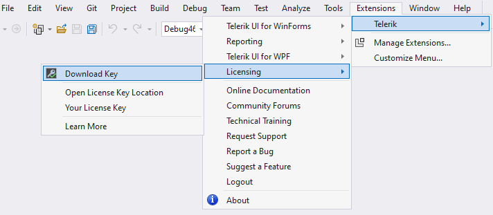
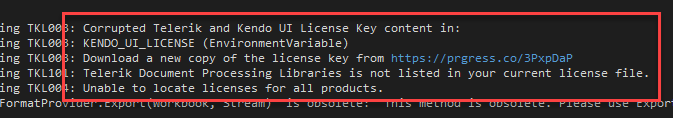
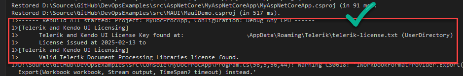

## Environment

| Version | Product | Author | 
| ---- | ---- | ---- | 
| Q1 2025| Telerik Document Processing |[Desislava Yordanova](https://www.telerik.com/blogs/author/desislava-yordanova)| 

## Description

After downloading the License Key file by using the VS2022 extensions menu:
  

when building a simple console app with the Telerik Document Processing libraries, you get the following error:

  

## Solution

It may be caused by an old KENDO_UI_LICENSE environment variable. So, delete it and invoke `refreshenv` command. If the rebuild has the same error again:

1\. Go to telerik.com and generate a new [License Key](https://www.telerik.com/account/your-licenses/license-keys). 

2\. Compare the license key with the one downloaded from the extensions. If it indeed looks different than the one VS2022 got, replace the original telerik-license.txt file with the newly downloaded one.

3\.Next, I restart VS2022 (to ensure it has a fresh copy env vars) and compile the project. It is expected to work:

   

## See Also

* [Unable to find package Telerik.Licensing]()