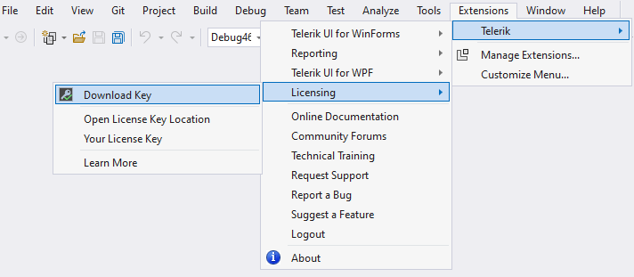
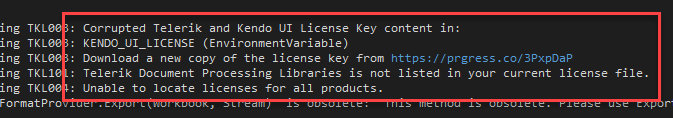
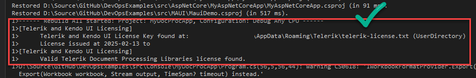

## Environment

| Version | Product | Author | 
| ---- | ---- | ---- | 
| Q1 2025| Telerik Document Processing |[Desislava Yordanova](https://www.telerik.com/blogs/author/desislava-yordanova)| 

## Description

After downloading the License Key file by using the VS2022 extensions menu:
  

when building a simple console app with the Telerik Document Processing libraries, you get the following error:

  

## Solution

An old [KENDO_UI_LICENSE environment variable](https://docs.telerik.com/kendo-ui/knowledge-base/license-key-file-name-and-environment-variable) may cause this error. Delete it and run the `refreshenv` command. If the rebuild produces the same error again, follow these steps:

1. Go to telerik.com and generate a new [License Key](https://www.telerik.com/account/your-licenses/license-keys). 
2. Compare the license key with the one downloaded from the extensions. If it differs from the one VS2022 downloaded, replace the original `telerik-license.txt` file with the newly downloaded one.
3. Restart VS2022 to ensure it loads fresh environment variables and compile the project. The build succeeds:

   

## See Also

* [Unable to find package Telerik.Licensing]()