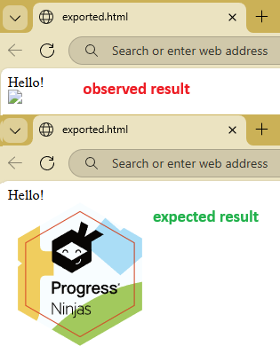

## Environment

| Version | Product | Author | 
| ---- | ---- | ---- | 
| 2025.4.1104| RadWordsProcessing |[Desislava Yordanova](https://www.telerik.com/blogs/author/desislava-yordanova)| 

## Description

When importing an HTML document using Telerik WordsProcessing, images with local file paths (e.g., "C:\temp\image.png") may fail to load which leads to missing image content once the document gets exported. Instead, blank placeholders appear in the media section of the exported document. This happens due to the lack of handling for external resources during the import process. Embedding images as base64-encoded data in the HTML works, but a more flexible solution involves using the `HtmlImportSettings` with the `LoadImageFromUri` event.
 

This knowledge base article also answers the following questions:

- How to load local path images in Telerik WordsProcessing during HTML to DocX conversion?
- Why are images with local paths not rendering in DocX files?
- What is the best way to handle images in HTML for DocX conversion?

## Solution

To ensure images with local paths render properly during HTML import , use the `LoadImageFromUri` event in the `HtmlImportSettings`. This event allows loading external image files during the import process.

1. Create an instance of `HtmlImportSettings` and set up the `LoadImageFromUri` event.
2. Implement a method to handle the event and load image data from the specified file path.
3. Attach the `HtmlImportSettings` to the `HtmlFormatProvider` before importing the HTML document.

Here is an example code snippet:

```csharp
            string html = @"<html><body><p>Hello!</p></body></html>";

            HtmlFormatProvider provider = new HtmlFormatProvider();
            HtmlImportSettings importSettings = new HtmlImportSettings();
            importSettings.LoadImageFromUri += (sender, e) =>
            {
                string path = System.IO.Path.Combine("Images", e.Uri); // e.g., "Images/logo.png"
                if (!System.IO.File.Exists(path))
                {
                    //set default image or navigate to a default location
                    byte[] bytes = System.IO.File.ReadAllBytes(@"..\..\..\" +e.Uri);
                    e.SetImageInfo(bytes, "png");
                }
                else
                {
                    //load image from the specified path
                    byte[] bytes = System.IO.File.ReadAllBytes(path);
                    e.SetImageInfo(bytes, "png");
                }
            };
            provider.ImportSettings = importSettings;
            RadFlowDocument document = provider.Import(html, TimeSpan.FromSeconds(10)); 

            string outputFilePath= "exported.html";
            using (Stream output = File.Create(outputFilePath))
            { 
                provider.Export(document, output, TimeSpan.FromSeconds(10));
            }

            Process.Start(new ProcessStartInfo() { FileName = outputFilePath, UseShellExecute = true });
```

### Key Notes:

- Replace the `path` in the `LoadImageFromUri ` event handler with the path to your local image directory.
- Ensure the file extension and image format are correctly set using `SetImageInfo`.

For a more robust approach, consider embedding images as base64-encoded data directly in the HTML source. This avoids dependencies on file paths and ensures image data is always available during the conversion process.

## See Also

- [HtmlImportSettings Documentation]()  
