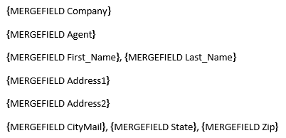
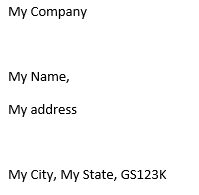
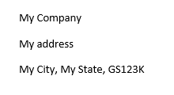

## Environment
| Version | Product | Author | 
| --- | --- | ---- | 
| 2024.1.124 | RadWordsProcessing |[Desislava Yordanova](https://www.telerik.com/blogs/author/desislava-yordanova)| 

## Description
This article demonstrates how to hide the empty lines in the output Word document when the fields are blank during the [Mail Merge]() process using RadWordsProcessing.

|Original Document|Merged Document|
|----|----|
|||

## Solution
To achieve this, you can follow these steps:

1. Instead of leaving the fields blank, insert some specific text that will serve as a placeholder. For example, you can use "{remove_Empty_field}" as the placeholder text.
2. Perform the MailMerge process as usual.
3. After the MailMerge process is complete, iterate through the document and remove the paragraphs that contain the placeholder text.

Here's a code snippet demonstrating this solution:

```csharp
using Telerik.Windows.Documents.Flow.FormatProviders.Docx;
using Telerik.Windows.Documents.Flow.Model;
using Telerik.Windows.Documents.Flow.Model.Editing;
using Telerik.Windows.Documents.Flow.TextSearch;

internal class Program
{
    static void Main(string[] args)
    {
        string placeHolder = "{remove_Empty_field}";
        RadFlowDocument document = new RadFlowDocument();
        RadFlowDocumentEditor editor = new RadFlowDocumentEditor(document);
        editor.InsertField("MERGEFIELD Company", "");
        editor.InsertParagraph();
        editor.InsertField("MERGEFIELD Agent", "");
        editor.InsertParagraph();
        editor.InsertField("MERGEFIELD First_Name", ""); editor.InsertText(", ");
        editor.InsertField("MERGEFIELD Last_Name", "");
        editor.InsertParagraph();
        editor.InsertField("MERGEFIELD Address1", "");
        editor.InsertParagraph();
        editor.InsertField("MERGEFIELD Address2", "");
        editor.InsertParagraph();
        editor.InsertField("MERGEFIELD CityMail", ""); editor.InsertText(", ");
        editor.InsertField("MERGEFIELD State", ""); editor.InsertText(", ");
        editor.InsertField("MERGEFIELD Zip", "");

        List<MailMergeRecord> mailMergeDataSource = new List<MailMergeRecord>()
        {
            new MailMergeRecord()
            {
                Company = "My Company",
                First_Name = "My Name",
                Last_Name = placeHolder,
                Address1 = "My address",
                Address2= placeHolder,
                State = "My State",
                Zip= "GS123K",
                CityMail="My City",
                Agent=placeHolder
            }
        };
        RadFlowDocument mailMergeResult = document.MailMerge(mailMergeDataSource);
        editor = new RadFlowDocumentEditor(mailMergeResult);
        foreach (FindResult find in editor.FindAll(placeHolder))
        {
            Paragraph paragraph = find.Runs[0].Paragraph;
            BlockContainerBase paragraphParent = paragraph.Parent as BlockContainerBase;
            if (paragraphParent != null)
            {
                paragraphParent.Blocks.Remove(paragraph);
            }
        }

        DocxFormatProvider provider = new DocxFormatProvider();
        string originalFilePath = @"..\..\..\original.docx";
        string mergedFilePath = @"..\..\..\merged.docx";
        File.Delete(originalFilePath);
        File.Delete(mergedFilePath);
        using (Stream output = File.OpenWrite(originalFilePath))
        {
            provider.Export(document, output);
        }
        using (Stream output = File.OpenWrite(mergedFilePath))
        {
            provider.Export(mailMergeResult, output);
        }
    }
    public class MailMergeRecord
    {
        public MailMergeRecord()
        { }
        public string Company { get; set; }
        public string Agent { get; set; }
        public string First_Name { get; set; }
        public string Last_Name { get; set; }
        public string Address1 { get; set; }
        public string Address2 { get; set; }
        public string CityMail { get; set; }
        public string State { get; set; }
        public string Zip { get; set; }
    }
```
|Result Document|
|----|
|| 

## See Also
- [Mail Merge]() 
