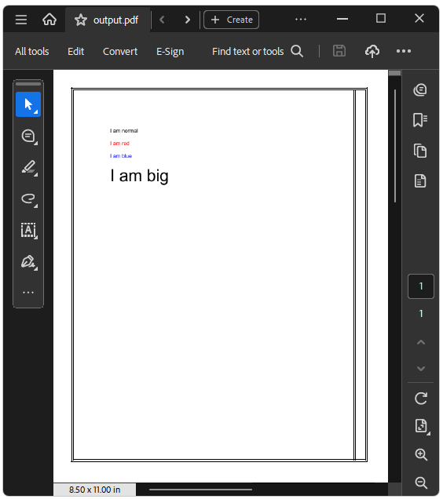

## Environment 

| Version | Product | Author | 
| --- | --- | ---- | 
| 2024.4.1106.NET Standard| RadWordsProcessing-RadPdfProcessing |[Desislava Yordanova](https://www.telerik.com/blogs/author/desislava-yordanova)| 

## Description
When generating PDF documents, a common requirement is to insert HTML content into specific sections of the document, such as a [TableCell](). This article demonstrates how to achieve this using the smooth integration between [RadPdfProcessing]() and [RadWordsProcessing]() libraries. 

>caption Sample HTML content to Insert

```HTML
<!DOCTYPE html>
<html>
<body>
<p>I am normal</p>
<p style="color:red;">I am red</p>
<p style="color:blue;">I am blue</p>
<p style="font-size:50px;">I am big</p>
</body>
</html>
```

  

## Solution
To insert HTML content into a `TableCell` in a PDF document, you can obtain the HTML content as an image and insert the image inside the PDF table cell. Below are the steps and complete code snippet for achieving this:

1. **Import HTML Content**: Use the RadWordsProcessing's [HtmlFormatProvider]() to import the HTML content into a [RadFlowDocument]().

1. **Export the HTML Content to PDF Format**: Use the RadWordsProcessing's [PdfFormatProvider]() to convert the `RadFlowDocument` into PDF format.

1. **Convert the exported PDF content to an Image**: Use the RadPdfProcessing's [PdfFormatProvider]() to import the PDF-converted HTML content to [RadFixedDocument]() and the [SkiaImageFormatProvider]() to export the PDF pages to images.

1. **Insert the exported Images into the PDF TableCell**: Use RadPdfProcessing's [FixedContentEditor]() to create the main PDF document with a table and insert the converted PDF images into the desired [TableCell]().

### Inserting HTML Content as PDF

```csharp
            Telerik.Documents.ImageUtils.ImagePropertiesResolver defaultImagePropertiesResolver = new Telerik.Documents.ImageUtils.ImagePropertiesResolver();
            Telerik.Windows.Documents.Extensibility.FixedExtensibilityManager.ImagePropertiesResolver = defaultImagePropertiesResolver;

            RadFixedDocument mainPdfDocument = new RadFixedDocument();
            RadFixedPage page = mainPdfDocument.Pages.AddPage();

            FixedContentEditor editor = new FixedContentEditor(page);
            Telerik.Windows.Documents.Fixed.FormatProviders.Pdf.PdfFormatProvider fixedPdfFormatProvider = new Telerik.Windows.Documents.Fixed.FormatProviders.Pdf.PdfFormatProvider();

            //Create PDF table
            Telerik.Windows.Documents.Fixed.Model.Editing.Tables.Table table = new Telerik.Windows.Documents.Fixed.Model.Editing.Tables.Table();

            //Set borders
            Telerik.Windows.Documents.Fixed.Model.Editing.Border border = new Telerik.Windows.Documents.Fixed.Model.Editing.Border();
            table.Borders = new Telerik.Windows.Documents.Fixed.Model.Editing.TableBorders(border);
            table.DefaultCellProperties.Borders = new Telerik.Windows.Documents.Fixed.Model.Editing.Tables.TableCellBorders(border, border, border, border);

            //Set table properties
            table.Margin = new Thickness(20);
            table.DefaultCellProperties.Padding = new Thickness(5);
            table.BorderSpacing = 2;

            //Create row 
            Telerik.Windows.Documents.Fixed.Model.Editing.Tables.TableRow row1 = table.Rows.AddTableRow(); 
            Telerik.Windows.Documents.Fixed.Model.Editing.Tables.TableCell imgCell = row1.Cells.AddTableCell();
            imgCell.PreferredWidth = 200;
            string htmlContent = File.ReadAllText("cellContent.html");

            //Import HTML as RadFlowDocument
            HtmlFormatProvider htmlFormatProvider = new HtmlFormatProvider();
            RadFlowDocument htmlDocument = htmlFormatProvider.Import(htmlContent, TimeSpan.FromSeconds(10));

            //Export HTML to PDF
            Telerik.Windows.Documents.Flow.FormatProviders.Pdf.PdfFormatProvider flowPdfFormatProvider = new Telerik.Windows.Documents.Flow.FormatProviders.Pdf.PdfFormatProvider();
            byte[] htmlToPdfByteArray = flowPdfFormatProvider.Export(htmlDocument, TimeSpan.FromSeconds(10));

            //Import htmlToPdfByteArray as RadFixedDocument 
            RadFixedDocument htmlPdfDocument = fixedPdfFormatProvider.Import(htmlToPdfByteArray, TimeSpan.FromSeconds(10));

            RgbColor bordersColor = new RgbColor(255, 0, 0);
            Telerik.Windows.Documents.Fixed.Model.Editing.Border cellBorder = new Telerik.Windows.Documents.Fixed.Model.Editing.Border(2, Telerik.Windows.Documents.Fixed.Model.Editing.BorderStyle.Single, bordersColor);
            Telerik.Windows.Documents.Fixed.Model.Editing.Tables.TableCellBorders tableCellsBorder = new Telerik.Windows.Documents.Fixed.Model.Editing.Tables.TableCellBorders(border, border, border, border, null, null);

            //Export the PDF pages as images
            Telerik.Documents.Fixed.FormatProviders.Image.Skia.SkiaImageFormatProvider imageProvider = new Telerik.Documents.Fixed.FormatProviders.Image.Skia.SkiaImageFormatProvider();
            string imagesFolderPath = @"..\..\..\Images\";
            int count = 1;
            foreach (RadFixedPage p in htmlPdfDocument.Pages)
            { 
                byte[] resultImage = imageProvider.Export(p, TimeSpan.FromSeconds(10));
                File.WriteAllBytes(imagesFolderPath + count++ + ".png", resultImage);
            }
 
            Block imageBlock;
            string[] pdfFilePaths = Directory.GetFiles(imagesFolderPath);
            foreach (string imageFilePath in pdfFilePaths)
            {
           
                imageBlock = imgCell.Blocks.AddBlock();
                imageBlock.HorizontalAlignment = Telerik.Windows.Documents.Fixed.Model.Editing.Flow.HorizontalAlignment.Center;
                imageBlock.InsertImage(new FileStream(imageFilePath, FileMode.Open),new Size(300,400));
                imgCell = row1.Cells.AddTableCell();
                imgCell.Borders = tableCellsBorder;
            }
            
            //Draw the generated table
            editor.DrawTable(table);

            string outputFile = "output.pdf";
            File.Delete(outputFile);
            //Export main PDF with changes
            using (Stream output = File.OpenWrite(outputFile))
            {
                fixedPdfFormatProvider.Export(mainPdfDocument, output, TimeSpan.FromSeconds(10));
            }
            //Open main PDF
            var psi = new ProcessStartInfo()
            {
                FileName = outputFile,
                UseShellExecute = true
            };
            Process.Start(psi);
```

 

## See Also
- [Generate Table with Images using RadPdfProcessing]()
