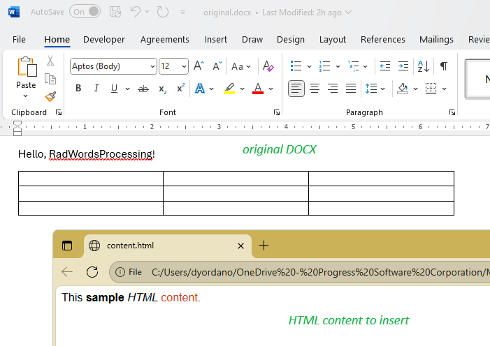
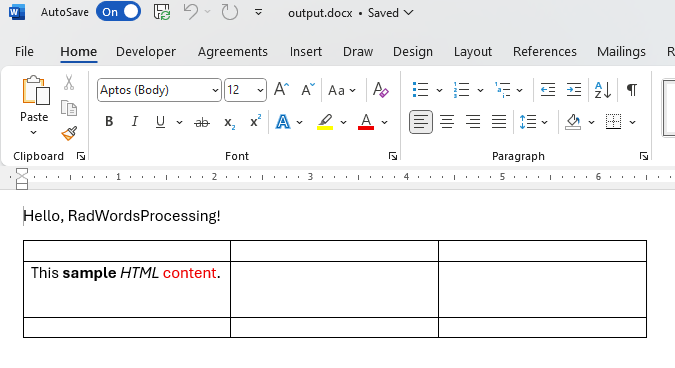

<style>
img[alt$="><"] {
  border: 1px solid lightgrey;
}

</style>

## Environment
| Version | Product | Author | 
| ---- | ---- | ---- | 
| 2025.3.806| RadWordsProcessing |[Desislava Yordanova](https://www.telerik.com/blogs/author/desislava-yordanova)| 

## Description

Learn how to insert HTML content at specific locations within a [RadFlowDocument]() using Telerik [WordsProcessing](). 

|Input Content|Output Content|
|----|----|
| |  | 

## Solution

To insert HTML content at specific locations in a RadFlowDocument, follow these steps:

1. Use the [HtmlFormatProvider]() to import HTML content into a [RadFlowDocument](). 

1. Use the [RadFlowDocumentEditor]() to insert the imported document (step 1) into a specific location in your target document.

Example:

```csharp
            RadFlowDocument originalDocument = new RadFlowDocument();
            DocxFormatProvider docxProvider = new DocxFormatProvider();
            originalDocument = docxProvider.Import(File.ReadAllBytes("original.docx"), TimeSpan.FromSeconds(10));

            HtmlFormatProvider htmlProvider = new HtmlFormatProvider();
            RadFlowDocument htmlDocument = htmlProvider.Import(File.ReadAllText("content.html"), TimeSpan.FromSeconds(10));
             
            // Get paragraphs from the imported document
            var importedParagraphs = htmlDocument.EnumerateChildrenOfType<Paragraph>().ToList();

            // Move editor to the start of the target paragraph
            RadFlowDocumentEditor editor = new RadFlowDocumentEditor(originalDocument);

            var tableCells = originalDocument.EnumerateChildrenOfType<TableCell>().ToList();
            TableCell cell = tableCells[3] as TableCell;
            editor.MoveToParagraphStart(cell.Blocks.First() as Paragraph);

            editor.InsertDocument(htmlDocument); 

            string outputFilePath = "output.docx";
            File.Delete(outputFilePath);
            using (Stream output = File.OpenWrite(outputFilePath))
            {
                docxProvider.Export(originalDocument, output, TimeSpan.FromSeconds(10));
            }

            Process.Start(new ProcessStartInfo() { FileName = outputFilePath, UseShellExecute = true });
```


### Additional Notes

- To target specific locations in the document, use the [RadFlowDocumentEditor]() to navigate to the desired position.
- Ensure the original document and imported HTML content are compatible in terms of styles and formatting.

## See Also

- [HtmlFormatProvider]() 
- [Insert Documents]()
- [RadFlowDocumentEditor]()
