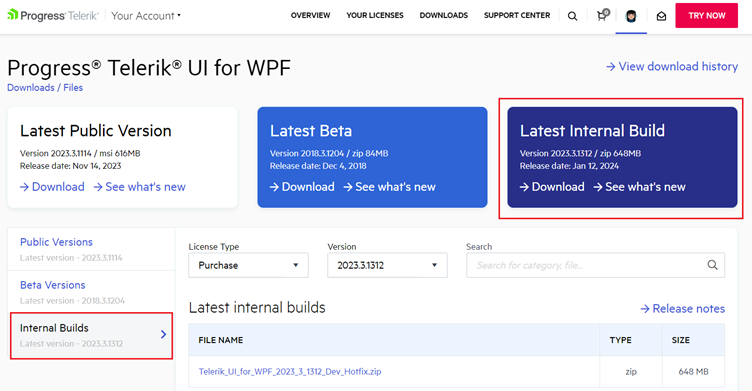

## Environment

| Version | Product | Author | 
| --- | --- | ---- | 
| - | Document Processing Libraries|[Desislava Yordanova](https://www.telerik.com/blogs/author/desislava-yordanova)| 

## Description

The Latest Internal Build (LIB) version refers to a distribution of the Document Processing Libraries' assemblies, which are built against the latest development environment. It contains all the newest bug fixes and is intended for users to test and verify these fixes.

## Solution

To obtain the Latest Internal Build (LIB) version, follow these steps:

1. Log in to your Telerik account.
2. Navigate to the Download section.
3. Find the product from which you obtained the Document Processing Libraries distribution.
4. Click on "Internal Builds".
5. Look for the zip archive containing the LIB version.
6. Download the zip archive.

Please note that the Latest Internal Builds are intended for development purposes only and are not recommended for production use. These distributions have not gone through the complete QA process and may contain issues that could affect the stability and reliability of your application.
