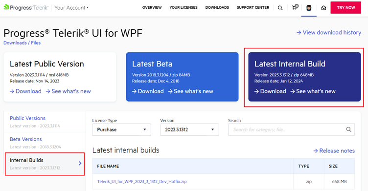

## Environment

| Version | Product | Author | 
| --- | --- | ---- | 
| - | Document Processing Libraries|[Desislava Yordanova](https://www.telerik.com/blogs/author/desislava-yordanova)| 

## Description

The Latest Internal Build (LIB) version is a distribution of the Document Processing Libraries assemblies built against the latest development environment. It contains all the recent bug fixes and allows you to test and verify these fixes.

## Solution

To get the Latest Internal Build (LIB) version, follow these steps:

1. Log in to your Telerik account.
2. Navigate to the Download section.
3. Find the product from which you got the Document Processing Libraries distribution.
4. Click **Internal Builds**.
5. Look for the zip archive that contains the LIB version.
6. Download the zip archive.

The Latest Internal Builds are intended for development purposes only and are not recommended for production use. These distributions have not gone through the complete QA process and can contain issues that affect the stability and reliability of your application.
