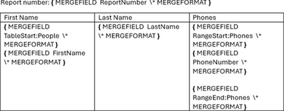
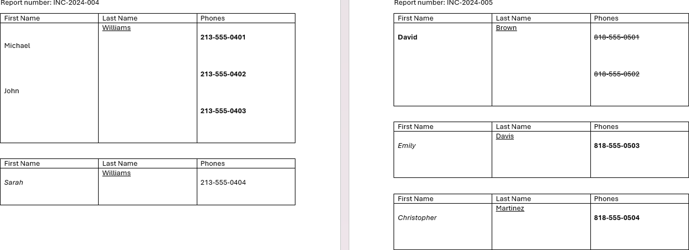

## Environment

| Version | Product | Author | 
| --- | --- | ---- |
| 2026.1.210 | RadWordsProcessing |[Yoan Karamanov](https://www.telerik.com/blogs/author/yoan-karamanov)| 

## Description

When performing a [Mail Merge]() operation with a DOCX template, the merge data may include HTML formatted strings. By default, these HTML strings are not parsed and are displayed as raw text in the result document after the mail merge. However, you can process and parse these HTML strings to display them with their intended formatting in the final document.

## Solution

The solution involves importing the HTML formatted strings as separate [RadFlowDocument]() instances using the [HtmlFormatProvider](), then replacing the original HTML text with the parsed content.

The following example demonstrates the complete workflow:

* Import the template document using [DocxFormatProvider]()
* Perform the mail merge operation with data containing HTML strings
* Iterate through all table cells in the merged document
* Detect lines containing HTML tags (using regex to find "<" or ">")
* Import each HTML string as a separate document using [HtmlFormatProvider]()
* Replace the raw HTML text with the parsed content using [RadFlowDocumentEditor]()
* Export the final document

> This is just an example approach. The implementation can vary depending on the template document structure and the HTML content.



#### **Mail Merge with HTML Formatted Strings**

```csharp
using System;
using System.Collections.Generic;
using System.Diagnostics;
using System.IO;
using System.Linq;
using System.Text.RegularExpressions;
using Telerik.Windows.Documents.Flow.FormatProviders.Docx;
using Telerik.Windows.Documents.Flow.FormatProviders.Html;
using Telerik.Windows.Documents.Flow.Model;
using Telerik.Windows.Documents.Flow.Model.Editing;

var mergeData = new List<Incident>{
    new Incident{
        ReportNumber = "INC-2024-004",
        People = new List<Person>{
            new Person{
                FirstName = "<p>Michael</p></br><p>John<p>",
                LastName = "<u>Williams</u>",
                Phones = new List<Phone>{
                    new Phone{ PhoneNumber = "<b>213-555-0401</b>" },
                    new Phone{ PhoneNumber = "<b>213-555-0402</b>" },
                    new Phone{ PhoneNumber = "<b>213-555-0403</b>" }
                }
            },
            new Person{
                FirstName = "<i>Sarah</i>",
                LastName = "<u>Williams</u>",
                Phones = new List<Phone>{
                    new Phone{ PhoneNumber = "213-555-0404" }
                }
            }
        }
    },
    new Incident{
        ReportNumber = "INC-2024-005",
        People = new List<Person>{
            new Person{
                FirstName = "<b>David</b>",
                LastName = "<u>Brown</u>",
                Phones = new List<Phone>{
                    new Phone{ PhoneNumber = "<s>818-555-0501</s>" },
                    new Phone{ PhoneNumber = "<s>818-555-0502</s>" }
                }
            },
            new Person{
                FirstName = "<i>Emily</i>",
                LastName = "<u>Davis</u>",
                Phones = new List<Phone>{
                    new Phone{ PhoneNumber = "<b>818-555-0503</b>" }
                }
            },
            new Person{
                FirstName = "<i>Christopher</i>",
                LastName = "<u>Martinez</u>",
                Phones = new List<Phone>{
                    new Phone{ PhoneNumber = "<b>818-555-0504</b>" }
                }
            }
        }
    }
};

RadFlowDocument template;
DocxFormatProvider docxFormatProvider = new DocxFormatProvider();

using (Stream input = File.OpenRead("template.docx"))
{
    template = docxFormatProvider.Import(input, null);
}

RadFlowDocument mailMergeResult = template.MailMerge(mergeData);
RadFlowDocumentEditor htmlEditor = new RadFlowDocumentEditor(mailMergeResult);
var tables = mailMergeResult.EnumerateChildrenOfType<Table>();

var regex = new Regex(@"[<>]");

HtmlFormatProvider htmlFormatProvider = new HtmlFormatProvider();

// Iterate all table lines of text
foreach (Table table in tables)
{
    foreach (TableRow row in table.Rows)
    {
        foreach (TableCell cell in row.Cells)
        {
            foreach (var block in cell.Blocks.ToList())
            {
                var paragraph = block as Paragraph;

                if (paragraph != null)
                {
                    foreach (var inline in paragraph.Inlines.ToList())
                    {
                        string line = inline.ToString();

                        // If line contains "<" or ">", treat it as HTML and import it as an HTML document
                        if (regex.IsMatch(line))
                        {
                            RadFlowDocument htmlDocument = htmlFormatProvider.Import(line, TimeSpan.FromSeconds(10));

                            // Clear the paragraph of the original line and insert the new fomatted HTML document
                            paragraph.Inlines.Clear();
                            htmlEditor.MoveToParagraphEnd(paragraph);
                            htmlEditor.InsertDocument(htmlDocument);
                        }
                    }
                }
            }
        }
    }
}

string docxOutputPath = "output.docx";
using (Stream output = File.OpenWrite(docxOutputPath))
{
    docxFormatProvider.Export(mailMergeResult, output, TimeSpan.FromSeconds(20));
}

var psi = new ProcessStartInfo()
{
    FileName = docxOutputPath,
    UseShellExecute = true
};
Process.Start(psi);

public class Incident
{
    public string ReportNumber { get; set; }
    public List<Person> People { get; set; }
}

public class Person
{
    public string FirstName { get; set; }
    public string LastName { get; set; }
    public List<Phone> Phones { get; set; }
}

public class Phone
{
    public string PhoneNumber { get; set; }
}
```



## See Also

* [Mail Merge]()
* [RadFlowDocument]()
* [RadFlowDocumentEditor]()
* [HtmlFormatProvider]()
* [DocxFormatProvider]()
