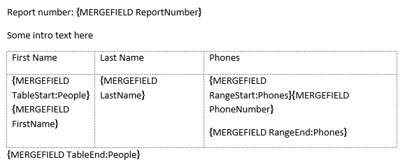
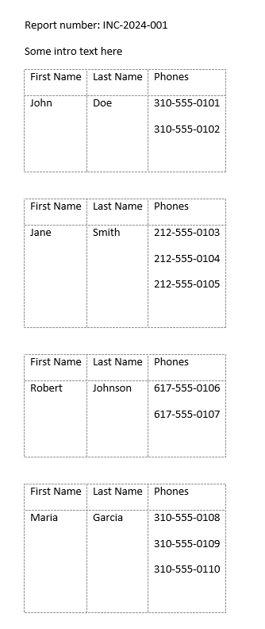

## Environment

| Version | Product | Author | 
| --- | --- | ---- | 
| 2024.3.806| RadWordsProcessing |[Desislava Yordanova](https://www.telerik.com/blogs/author/desislava-yordanova)| 

## Description

Learn how to perform a [MailMerge]() operation with multiple levels of nested data, such as a list within a list (e.g., `Incident` > `Person` > `Phones`) in [RadWordsProcessing]().

## Solution

To achieve a nested [MailMerge]( operation with multiple levels of data, follow the steps below:

1. Prepare your data model to reflect the nested structure. In this case, the model includes `Incident`, `Person`, and `Phone` classes.

2. Use the [MailMerge]() method to merge the data with the document template. Ensure your document template has the appropriate merge fields defined for each level of data.

3. Use special merge fields (`TableStart`, `TableEnd`, `RangeStart`, and `RangeEnd`) to denote the beginning and end of each nested collection.

Here is an example demonstrating how to set up your data model and perform the nested MailMerge:

```csharp
// Define your data models
public class Incident
{
    public string ReportNumber { get; set; }
    public List<Person> People { get; set; }
}

public class Person
{
    public string FirstName { get; set; }
    public string LastName { get; set; }
    public List<Phone> Phones { get; set; }
}

public class Phone
{
    public string PhoneNumber { get; set; }
}

// Preparing the data
var mergeData = new List<Incident>{
    new Incident{
        ReportNumber = "INC-2024-001",
        People = new List<Person>{
            new Person{
                FirstName = "John",
                LastName = "Doe",
                Phones = new List<Phone>{
                    new Phone{ PhoneNumber = "310-555-0101" },
                    new Phone{ PhoneNumber = "310-555-0102" }
                }
            },
            // Add more Person instances as needed
        }
    }
};

// Perform the MailMerge operation
RadFlowDocument document = new RadFlowDocument();
// Assume 'provider' is initialized and points to the appropriate document format provider
var mailMergeResult = document.MailMerge(mergeData);
```

In your document template, ensure you have the corresponding merge fields:

- For the start and end of the `People` list: `TableStart:People` and `TableEnd:People`.
- For the start and end of the `Phones` list within each `Person`: `RangeStart:Phones` and `RangeEnd:Phones`.
- For merging individual property values, use merge fields named after the properties, such as `FirstName`, `LastName`, and `PhoneNumber`.

  

### Generating the Necessary Table Structure in the Document

When dealing with nested collections, it's crucial to dynamically create table structures that can accommodate the varying lengths of these collections.

By following these steps and utilizing the provided code snippets, you can effectively perform nested MailMerge operations with multiple levels of data in RadWordsProcessing.

 

## See Also

- [MailMerge]()
- [Generating a Word Document with Data Using MailMerge in RadWordsProcessing]()
- [Populate a Table with Data using Nested Mail Merge Functionality]()
