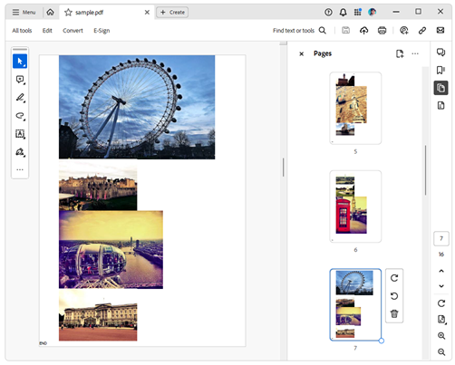

# Environment
| Version | Product | Author | 
| --- | --- | ---- | 
| 2024.1.124 | RadPdfProcessing|[Desislava Yordanova](https://www.telerik.com/blogs/author/desislava-yordanova)| 

# Description
This tutorial demonstrates a sample approach how to generate a PDF document from a collection of images located in a local folder.


# Solution
To create the PDF document, we will use a [FixedContentEditor]() which is always associated with a single [RadFixedPage](). The editor maintains an internal [Position]() inside the page at which the image block element will be inserted and drawn. The Position is adjusted after the image is rendered. If there is no remaining space on the page to draw the next image, a new page will be created and the editor's position will be moved to the beginning of the new page. 
 
```csharp
        private static void GeneratePdfFromImagesWithFixedContentEditor(string imageFolderPath)
        {
            Size pageSize = new Size(Unit.MmToDip(210), Telerik.Windows.Documents.Media.Unit.MmToDip(297));
            Padding pageMarginsValue = new Telerik.Windows.Documents.Primitives.Padding(
                Unit.MmToDip(20),//left
                 Unit.MmToDip(0),//top
                  Unit.MmToDip(0),//right
                   Unit.MmToDip(0));//bottom
            RadFixedDocument fixedDocument = new RadFixedDocument();
            RadFixedPage fixedPage = fixedDocument.Pages.AddPage();
            fixedPage.Size = pageSize;
            FixedContentEditor fixedEditor = new FixedContentEditor(fixedPage);
            double currentYposition = pageMarginsValue.Top;
            double pageYLimit = pageSize.Height - pageMarginsValue.Bottom;
            string[] imageFiles = Directory.GetFiles(imageFolderPath);

            foreach (string imageFilePath in imageFiles)
            {
                Block imageBlock = new Block();
                imageBlock.SpacingAfter = 0;
                imageBlock.HorizontalAlignment = HorizontalAlignment.Center;
                FileStream fileStream = new FileStream(imageFilePath, FileMode.Open);
                var _imageSource = new Telerik.Windows.Documents.Fixed.Model.Resources.ImageSource(fileStream);
                imageBlock.InsertImage(_imageSource);
                Size imageBlockDesiredSize = imageBlock.Measure();

                double desiredYLocationToDraw = currentYposition + imageBlockDesiredSize.Height;
                if (desiredYLocationToDraw > pageYLimit)
                {
                    //indicate the page end [optional]
                    fixedEditor.Position.Translate(0, pageYLimit - Unit.MmToDip(5));
                    fixedEditor.DrawText("END");
                    //above code is just for testing purposes

                    currentYposition = pageMarginsValue.Top;
                    fixedPage = fixedDocument.Pages.AddPage();
                    fixedPage.Size = pageSize;
                    fixedEditor = new FixedContentEditor(fixedPage);
                    //move the cursor to the beginning of the new page
                    fixedEditor.Position.Translate(pageMarginsValue.Left, currentYposition);
                }
                fixedEditor.DrawBlock(imageBlock);
                currentYposition += imageBlock.ActualSize.Height;
                fixedEditor.Position.Translate(pageMarginsValue.Left, currentYposition);
            }

            PdfFormatProvider provider = new PdfFormatProvider();
            string outputFilePath = @"..\..\sample.pdf";
            File.Delete(outputFilePath);
            using (Stream output = File.OpenWrite(outputFilePath))
            {
                provider.Export(fixedDocument, output);
            }
            Process.Start(outputFilePath);
        }
```
The produced document is illustrated in the screenshot:



# See Also
- [FixedContentEditor]()
- [RadFixedPage]()
- [Position]()
- [PdfFormatProvider]()
- [RadPdfProcessing](https://docs.telerik.com/devtools/document-processing/libraries/radpdfprocessing/overview)
- [Converting Colored PDF Documents to GrayScale with Telerik Document Processing]()
