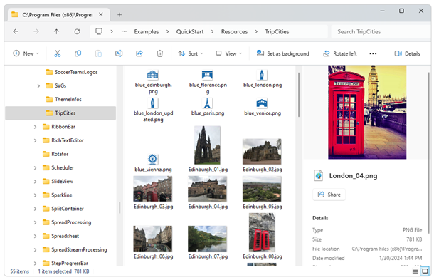
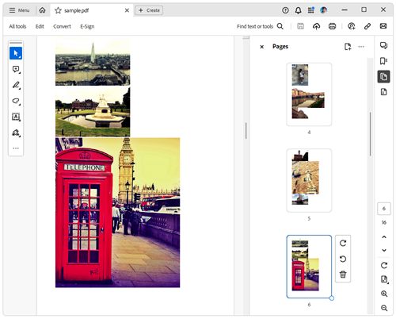

# Environment
| Version | Product | Author | 
| --- | --- | ---- | 
| 2024.1.124 | RadPdfProcessing|[Desislava Yordanova](https://www.telerik.com/blogs/author/desislava-yordanova)| 

# Description
This tutorial demonstrates a sample approach how to generate a PDF document from a collection of images located in a local folder.

 

# Solution
To create the PDF document, we will use a [RadFixedDocumentEditor]() which generates the document  in a flow-like manner. The editor provides methods that enable the generation of documents, which automatically flows to pages.
 
```csharp
         private static void GeneratePdfFromImagesWithRadFixedDocumentEditor(string imageFolderPath)
        {
            Padding _pageMargins = new Padding(
                Unit.MmToDip(20),//left
                 Unit.MmToDip(0),//top
                  Unit.MmToDip(0),//right
                   Unit.MmToDip(0));//bottom
            Size _pageSize = new Size(Unit.MmToDip(210), Unit.MmToDip(297));
            RadFixedDocument fixedDocument = new RadFixedDocument();
            RadFixedDocumentEditor documentEditor = new RadFixedDocumentEditor(fixedDocument);
            documentEditor.SectionProperties.PageSize = _pageSize;
            documentEditor.SectionProperties.PageMargins = _pageMargins;
            string[] imageFiles = Directory.GetFiles(imageFolderPath);

            foreach (string imageFilePath in imageFiles)
            {
                FileStream fileStream = new FileStream(imageFilePath, FileMode.Open);
                Telerik.Windows.Documents.Fixed.Model.Resources.ImageSource _imageSource = new Telerik.Windows.Documents.Fixed.Model.Resources.ImageSource(fileStream);
                documentEditor.InsertImageInline(_imageSource);
                documentEditor.InsertLineBreak();
            }
            documentEditor.Dispose();

            PdfFormatProvider provider = new PdfFormatProvider();
            string outputFilePath = @"..\..\sample.pdf";
            File.Delete(outputFilePath);
            using (Stream output = File.OpenWrite(outputFilePath))
            {
                provider.Export(fixedDocument, output);
            }
            Process.Start(outputFilePath);
        }        
```
The produced document is illustrated in the screenshot:

 

# See Also
- [RadFixedDocumentEditor]()  
- [PdfFormatProvider ]()
- [RadPdfProcessing ]()
