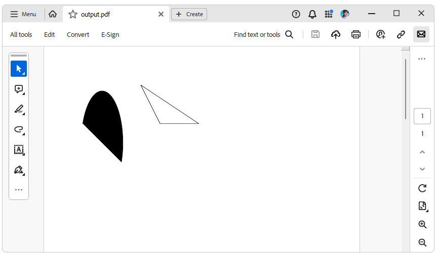

# Environment
| Version | Product | Author | 
| --- | --- | ---- | 
| 2024.1.124| RadPdfProcessing |[Desislava Yordanova](https://www.telerik.com/blogs/author/desislava-yordanova)| 

# Description

This article demonstrates a sample approach how to draw a small figure containing an arc and some lines using RadPdfProcessing. 

# Solution

To draw an arc using the [ArcSegment]() class, follow these steps:

1. Create a `Path` object and set its `IsFilled` and `IsStroked` properties to `true`.
2. Create a `PathGeometry` object and set its `FillRule` property to `FillRule.EvenOdd`.
3. Add a `PathFigure` to the `PathGeometry` and set its `StartPoint` property to the starting point of the figure.
4. Create an instance of the `ArcSegment` class and set its `Point`, `RadiusX`, and `RadiusY` properties. The `Point` property represents the end point of the arc, while `RadiusX` and `RadiusY` represent the radii for the X and Y coordinates respectively.
5. Add the `ArcSegment` to the `Segments` collection of the `PathFigure`.
6. Set the `Geometry` property of the `Path` to the `PathGeometry`.

Here is an example of how to draw an arc:

```csharp
private static void AddArcSegment(RadFixedPage page)
{
    Telerik.Windows.Documents.Fixed.Model.Graphics.Path path = page.Content.AddPath();
    path.IsFilled = true;
    path.IsStroked = true;

    PathGeometry pathGeometry = new PathGeometry();
    pathGeometry.FillRule = FillRule.EvenOdd;

    PathFigure figure = pathGeometry.Figures.AddPathFigure();
    figure.StartPoint = new Point(100, 200);

    var segment = new ArcSegment()
    {
        Point = new Point(200, 300),
        RadiusX = 20,
        RadiusY = 50,
    };

    figure.Segments.Add(segment);

    path.Geometry = pathGeometry;
}
```

To draw lines, you can use the [LineSegment]() class. Here is an example of how to draw a triangle:

```csharp
private void AddLineSegment(RadFixedPage page)
{
    Telerik.Windows.Documents.Fixed.Model.Graphics.Path path = page.Content.AddPath();
    path.IsFilled = false;
    path.IsStroked = true;

    PathGeometry pathGeometry = new PathGeometry();
    pathGeometry.FillRule = FillRule.EvenOdd;

    PathFigure figure1 = pathGeometry.Figures.AddPathFigure();
    ApplyLine(figure1, new Point(300, 200), new Point(400, 200));

    PathFigure figure2 = pathGeometry.Figures.AddPathFigure();
    ApplyLine(figure2, new Point(400, 200), new Point(250, 100));

    PathFigure figure3 = pathGeometry.Figures.AddPathFigure();
    ApplyLine(figure3, new Point(250, 100), new Point(300, 200));

    path.Geometry = pathGeometry;
}

private static void ApplyLine(PathFigure figure, Point startPoint, Point endPoint)
{
    figure.StartPoint = startPoint;

    var segment = new LineSegment
    {
        Point = endPoint
    };

    figure.Segments.Add(segment);
}
```
The following code snippet shows how to use the above methods:

```csharp

   RadFixedDocument fixedDocument = new RadFixedDocument();
   RadFixedPage fixedPage = fixedDocument.Pages.AddPage();
   AddArcSegment(fixedPage);
   AddLineSegment(fixedPage);

   PdfFormatProvider provider = new PdfFormatProvider();
   string filePath = @"..\..\output.pdf";
   File.Delete(filePath);
   using (Stream output = File.OpenWrite(filePath))
   { 
       provider.Export(fixedDocument, output);
   }

```
For more information on using geometries, figures, and segments, you can refer to our [Geometry]() help article. 

You can find the result of the combined arc and triangle in the below screenshot:

   


