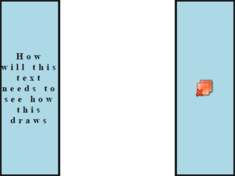

## Environment

| Version | Product | Author | 
| --- | --- | ---- | 
| 2025.1.205| RadPdfProcessing |[Yoan Karamanov](https://www.telerik.com/blogs/author/yoan-karamanov)| 

## Description

This article shows how to draw rectangles with formatted text or image content with the [FixedContentEditor]() in the [PdfProcessing]() library.

This knowledge base article also answers the following questions:
- How can I draw a rectangle and style it using RadPdfProcessing?
- How to add centered text within a rectangle in a PDF document?
- How to insert an image and center it within a rectangle using RadPdfProcessing?

## Solution

To draw a rectangle with a black stroke and a light blue background, add centered text, and insert a centered image within the rectangle using the RadPdfProcessing library, follow these steps:

1. Draw a rectangle by creating a [Path]() with a [RectangleGeometry](#rectanglegeometry), defining its dimensions, formatting it, and inserting it in the page.
2. Create a **Block** of text, format it, and draw it on top of the rectangle with the **FixedContentEditor** by specifying its **Position**.
3. Draw a second rectangle at a different position.
4. Create an image **Block** and draw it on top of the second rectangle with the **FixedContentEditor** while specifying its **Position**.
5. Export the **RadFixedDocument** to PDF.



```csharp
RadFixedDocument radFixedDocument = new RadFixedDocument();
RadFixedPage radFixedPage = new RadFixedPage();

radFixedPage.Size = new Size(11 * 100, 8.5 * 100);
radFixedDocument.Pages.Add(radFixedPage);

FixedContentEditor fixedContentEditor = new FixedContentEditor(radFixedPage);

int rectangle1X = 400;
int rectangle1Y = 100;
double rectangle1Width = 100;
double rectangle1Height = 300;

int rectangle2X = 700;
int rectangle2Y = 100;
double rectangle2Width = 100;
double rectangle2Height = 300;

// Draw a rectangle
RectangleGeometry rectangleGeometry1 = new RectangleGeometry();
rectangleGeometry1.Rect = new Rect(rectangle1X, rectangle1Y, rectangle1Width, rectangle1Height);

Telerik.Windows.Documents.Fixed.Model.Graphics.Path rectangle1Path = new Telerik.Windows.Documents.Fixed.Model.Graphics.Path();
rectangle1Path.Geometry = rectangleGeometry1;
rectangle1Path.IsFilled = true;
rectangle1Path.IsStroked = true;
rectangle1Path.Fill = new RgbColor(173, 216, 230);
rectangle1Path.Stroke = RgbColors.Black;
rectangle1Path.StrokeThickness = 2;

radFixedPage.Content.Add(rectangle1Path);

// Add formatted text Block on top of the rectangle
Block textBlock = new Block();

textBlock.VerticalAlignment = Telerik.Windows.Documents.Fixed.Model.Editing.Flow.VerticalAlignment.Center;
textBlock.HorizontalAlignment = Telerik.Windows.Documents.Fixed.Model.Editing.Flow.HorizontalAlignment.Center;
textBlock.TextProperties.CharacterSpacing = 5;
textBlock.TextProperties.Font = FontsRepository.TimesBold;
textBlock.TextProperties.FontSize = Unit.PointToDip(12);

textBlock.InsertText("How will this text needs to see how this draws");

fixedContentEditor.Position.Translate(rectangle1X, rectangle1Y);
fixedContentEditor.DrawBlock(textBlock, new Size(rectangle1Width, rectangle1Height));

// Draw a second rectangle
RectangleGeometry rectangleGeometry2 = new RectangleGeometry();
rectangleGeometry2.Rect = new Rect(rectangle2X, rectangle2Y, rectangle2Width, rectangle2Height);

Telerik.Windows.Documents.Fixed.Model.Graphics.Path rectangle2Path = new Telerik.Windows.Documents.Fixed.Model.Graphics.Path();
rectangle2Path.Geometry = rectangleGeometry2;
rectangle2Path.IsFilled = true;
rectangle2Path.IsStroked = true;
rectangle2Path.Fill = new RgbColor(173, 216, 230);
rectangle2Path.Stroke = RgbColors.Black;
rectangle2Path.StrokeThickness = 2;

radFixedPage.Content.Add(rectangle2Path);

// Draw a block with an image on top of the second rectangle
Block imageBlock = new Block();

imageBlock.VerticalAlignment = Telerik.Windows.Documents.Fixed.Model.Editing.Flow.VerticalAlignment.Center;
imageBlock.HorizontalAlignment = Telerik.Windows.Documents.Fixed.Model.Editing.Flow.HorizontalAlignment.Center;

Image image = new Image();
string imageFilePath = "..\\..\\..\\image.png";
FileStream fileStream = new FileStream(imageFilePath, FileMode.Open);

imageBlock.InsertImage(fileStream);

fixedContentEditor.Position.Translate(rectangle2X, rectangle2Y);
fixedContentEditor.DrawBlock(imageBlock, new Size(rectangle2Width, rectangle2Height));

// Export To PDF
string pdfOutputPath = "output.pdf";
PdfFormatProvider PDFProvider = new PdfFormatProvider();
using (FileStream FS = File.OpenWrite(pdfOutputPath))
{
    PDFProvider.Export(radFixedDocument, FS);
}

var psi = new ProcessStartInfo()
{
    FileName = pdfOutputPath,
    UseShellExecute = true
};
Process.Start(psi);
```

## See Also

- [Text and Graphic Properties]()
- [Path]()
- [Geometry]()
- [PdfProcessing Image]()
---
