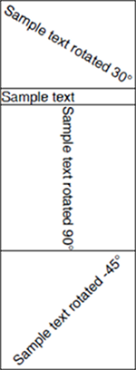

## Environment

| Version | Product | Author | 
| ---- | ---- | ---- | 
| 2026.2.402 | RadPdfProcessing | [Yoan Karamanov](https://www.telerik.com/blogs/author/yoan-karamanov) |

## Description

When working with [RadFixedDocument]() and [RadFixedDocumentEditor](), you may need to rotate the text inside a [TableCell](). This knowledge base article also answers the following questions:

* How to flip or rotate text in a PDF table cell?
* How to apply text rotation inside a table using [RadPdfProcessing]()?
* How to create a custom block element with transformation support?

## Solution

The [RadPdfProcessing]() library does not natively support rotated content inside [Table]() cells. However, you can achieve this by creating a custom `RotatedBlock` class that implements the `IBlockElement` interface and wraps an inner [Block]() instance.



Key points about the `RotatedBlock` implementation:

* The `RotatedBlock` class implements the `IBlockElement` interface.
* It contains an inner [Block]() instance that holds the actual content.
* When measured, the `RotatedBlock` returns the rotated bounding box of the inner block.
* When drawn, it applies additional matrix transformations to the [FixedContentEditor]() so that the content is rendered at the desired rotation angle.
* The sample implementation always measures the inner block to infinity. If you need to split the block across pages or wrap text onto multiple lines, additional custom logic is required depending on the desired behavior.

**Step 1:** Add the `RotatedBlock` class to your project:

```csharp
using Telerik.Documents.Primitives;
using Telerik.Windows.Documents.Fixed.Model.Data;
using Telerik.Windows.Documents.Fixed.Model.Editing;
using Telerik.Windows.Documents.Fixed.Model.Editing.Flow;

namespace Rotate_Table_Cell
{
    public class RotatedBlock : IBlockElement
    {
        private readonly double angleInDegrees;
        private readonly Block block;

        public RotatedBlock(double angleInDegrees)
            : this(new Block(), angleInDegrees)
        {
        }

        private RotatedBlock(Block block, double angleInDegrees)
        {
            this.block = block;
            this.angleInDegrees = angleInDegrees;
        }

        public bool HasPendingContent
        {
            get
            {
                return this.block.HasPendingContent;
            }
        }

        public bool HasOpenMarkedContent
        {
            get
            {
                return this.block.HasOpenMarkedContent;
            }
        }

        public Size DesiredSize
        {
            get
            {
                Rect rotatedBounds = this.GetRotatedBounds(this.block.DesiredSize);

                return rotatedBounds.Size;
            }
        }

        public void Draw(FixedContentEditor editor, Rect boundingRect)
        {
            using (editor.SavePosition())
            {
                using (editor.SaveProperties())
                {
                    Size innerBlockSize = this.block.DesiredSize;

                    Matrix matrix = CreateRotateAtMatrix(this.angleInDegrees, innerBlockSize.Width / 2, innerBlockSize.Height / 2);
                    matrix = MultiplyMatrices(matrix, CreateTranslationMatrix((boundingRect.Width - innerBlockSize.Width) / 2, (boundingRect.Height - innerBlockSize.Height) / 2));
                    matrix = MultiplyMatrices(matrix, CreateTranslationMatrix(boundingRect.X, boundingRect.Y));
                    matrix = MultiplyMatrices(matrix, editor.Position.Matrix);
                    editor.Position = new MatrixPosition(matrix);

                    editor.DrawBlock(this.block, this.block.DesiredSize);
                }
            }
        }

        public Size Measure(Size availableSize)
        {
            this.block.Measure(new Size(double.PositiveInfinity, double.PositiveInfinity));

            return this.DesiredSize;
        }

        public Size Measure(Size availableSize, CancellationToken cancellationToken)
        {
            return this.Measure(availableSize);
        }

        public IBlockElement Split()
        {
            return new RotatedBlock(this.block.Split(), this.angleInDegrees);
        }

        public void InsertText(string text)
        {
            this.block.InsertText(text);
        }

        private Rect GetRotatedBounds(Size size)
        {
            Matrix matrix = CreateRotateAtMatrix(this.angleInDegrees, size.Width / 2, size.Height / 2);
            Point[] corners =
            {
                new Point(0, 0),
                new Point(size.Width, 0),
                new Point(0, size.Height),
                new Point(size.Width, size.Height)
            };

            double minX = double.MaxValue, minY = double.MaxValue, maxX = double.MinValue, maxY = double.MinValue;

            foreach (Point corner in corners)
            {
                Point transformedCorner = TransformPoint(matrix, corner);
                minX = Math.Min(minX, transformedCorner.X);
                minY = Math.Min(minY, transformedCorner.Y);
                maxX = Math.Max(maxX, transformedCorner.X);
                maxY = Math.Max(maxY, transformedCorner.Y);
            }

            return new Rect(minX, minY, maxX - minX, maxY - minY);
        }

        private static Matrix CreateRotateAtMatrix(double angleDegrees, double centerX, double centerY)
        {
            double angleRadians = angleDegrees * Math.PI / 180.0;
            double cos = Math.Cos(angleRadians);
            double sin = Math.Sin(angleRadians);

            double offsetX = centerX * (1 - cos) + centerY * sin;
            double offsetY = centerY * (1 - cos) - centerX * sin;

            return new Matrix(cos, sin, -sin, cos, offsetX, offsetY);
        }

        private static Matrix CreateTranslationMatrix(double tx, double ty)
        {
            return new Matrix(1, 0, 0, 1, tx, ty);
        }

        private static Matrix MultiplyMatrices(Matrix a, Matrix b)
        {
            return new Matrix(
                a.M11 * b.M11 + a.M12 * b.M21,
                a.M11 * b.M12 + a.M12 * b.M22,
                a.M21 * b.M11 + a.M22 * b.M21,
                a.M21 * b.M12 + a.M22 * b.M22,
                a.OffsetX * b.M11 + a.OffsetY * b.M21 + b.OffsetX,
                a.OffsetX * b.M12 + a.OffsetY * b.M22 + b.OffsetY);
        }

        private static Point TransformPoint(Matrix matrix, Point point)
        {
            double x = point.X * matrix.M11 + point.Y * matrix.M21 + matrix.OffsetX;
            double y = point.X * matrix.M12 + point.Y * matrix.M22 + matrix.OffsetY;
            return new Point(x, y);
        }
    }
}
```

**Step 2:** Use the `RotatedBlock` inside a [Table]() and insert it into the document via [RadFixedDocumentEditor]():

```csharp
using Rotate_Table_Cell;
using Telerik.Windows.Documents.Fixed.FormatProviders.Pdf;
using Telerik.Windows.Documents.Fixed.Model;
using Telerik.Windows.Documents.Fixed.Model.Editing;
using Telerik.Windows.Documents.Fixed.Model.Editing.Tables;

const string outputPath = "..\\..\\..\\..\\output.pdf";

RadFixedDocument document = new RadFixedDocument();

DrawTableWithRotatedBlocks(document);

using (Stream output = new FileStream(outputPath, FileMode.OpenOrCreate))
{
    new PdfFormatProvider().Export(document, output, TimeSpan.FromSeconds(10));
}

static void DrawTableWithRotatedBlocks(RadFixedDocument document)
{
    Table table = new Table();
    Border border = new Border(BorderStyle.Single);
    table.DefaultCellProperties.Borders = new TableCellBorders(border, border, border, border);

    RotatedBlock rotatedBlock = new RotatedBlock(30);
    rotatedBlock.InsertText("Sample text rotated 30°");
    table.Rows.AddTableRow().Cells.AddTableCell().Blocks.Add(rotatedBlock);

    table.Rows.AddTableRow().Cells.AddTableCell().Blocks.AddBlock().InsertText("Sample text");

    rotatedBlock = new RotatedBlock(90);
    rotatedBlock.InsertText("Sample text rotated 90°");
    table.Rows.AddTableRow().Cells.AddTableCell().Blocks.Add(rotatedBlock);

    rotatedBlock = new RotatedBlock(-45);
    rotatedBlock.InsertText("Sample text rotated -45°");
    table.Rows.AddTableRow().Cells.AddTableCell().Blocks.Add(rotatedBlock);

    using (RadFixedDocumentEditor editor = new RadFixedDocumentEditor(document))
    {
        editor.InsertTable(table);
    }
}
```

## See Also

- [Block]()
- [Table]()
- [TableCell]()
- [FixedContentEditor]()