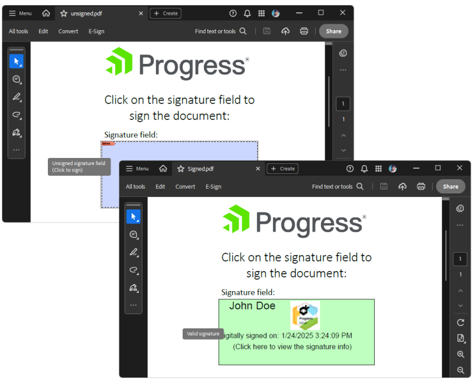

## Environment

| Version | Product | Author | 
| ---- | ---- | ---- | 
| 2024.4.1106| RadPdfProcessing |[Desislava Yordanova](https://www.telerik.com/blogs/author/desislava-yordanova)| 

## Description

This tutorial demonstrates how to import an unsigned PDF containing a signature and sign it using RadPdfProcessing.

   

## Solution
To add signatures and images to PDF documents and ensure the signed version correctly overwrites an existing file, follow these steps:

1. **Check if the Document is Already Signed**: Before adding a new signature, it's essential to check if the document is already signed. This can be done by iterating through the form fields and checking for signature fields.

2. **Prepare the Document for Signing**: Load the document into a `RadFixedDocument` object using the `PdfFormatProvider.Import` method. If the document already contains a signature field, you will need to access this field to add the signature.

3. **Add the Signature**: Use a certificate to sign the document. The `SignatureField.Signature` property allows you to assign a new `Signature` object, which is created using the certificate.

4. **Add an Image**: To insert an image, such as a signature graphic, use a `FixedContentEditor` on the desired page and use the `DrawBlock` method. The image can be loaded from a file using a `FileStream` and added to a `Block` object.

5. **Export the Signed Document**: Before exporting the signed document, delete the previous version of the file if it exists. This step is crucial to avoid permission issues or structure mismatches in the PDF file. Use the `PdfFormatProvider.Export` method to save the signed document.

Below is a sample code snippet demonstrating these steps:

```csharp
        static void Main(string[] args)
        {
            PdfFormatProvider provider = new PdfFormatProvider();
            RadFixedDocument document = provider.Import(File.ReadAllBytes("unsigned.pdf"), TimeSpan.FromSeconds(10));

            bool isSigned = CheckSignedDocument(document);
            Debug.WriteLine(isSigned.ToString());
            FormSource formSource = new FormSource();
            formSource.Size=new Size(420, 150);

            X509Certificate2 certificate = new X509Certificate2("JohnDoe.pfx", "johndoe");
            SignatureField signatureField = document.AcroForm.FormFields.Where(f => f.FieldType == FormFieldType.Signature).FirstOrDefault() as SignatureField;
            if (signatureField != null)
            {
                signatureField.Signature = new Signature(certificate);
                SignatureWidget widget = signatureField.Widgets.FirstOrDefault();
                if (widget != null)
                {
                    formSource = widget.Content.NormalContentSource;
                    FixedContentEditor ed = new FixedContentEditor(formSource);
                    ed.TextProperties.FontSize = 30;
                    ed.Position.Translate(30, 0);
                    ed.DrawText("John Doe");
                    ed.Position.Translate(200, 5);

                    FileStream fileStream = new FileStream("ProgressNinjas.png", FileMode.Open);
                    ImageSource _imageSource = new ImageSource(fileStream);
                    Block imageBlock = new Block();
                    imageBlock.InsertImage(_imageSource);
                    ed.DrawBlock(imageBlock);
                    

                    ed.Position.Translate(0, 90);
                    ed.TextProperties.FontSize = 20;
                    ed.DrawText("Digitally signed on: " + DateTime.Now.ToString());
                    ed.Position.Translate(40, 120);
                    ed.TextProperties.FontSize = 20;
                    ed.DrawText("(Click here to view the signature info)");
                }

                document.Pages[0].Annotations.Add(widget);

                string signedDocumentFilePath = "Signed.pdf";
                File.Delete(signedDocumentFilePath);
                using (Stream output = new FileStream(signedDocumentFilePath, FileMode.OpenOrCreate, FileAccess.ReadWrite))
                {
                    provider.Export(document, output, TimeSpan.FromSeconds(10));
                }

                isSigned = CheckSignedDocument(document);
                Debug.WriteLine(isSigned.ToString());
                Process.Start(new ProcessStartInfo() { FileName = signedDocumentFilePath, UseShellExecute = true });
            }

        }
        private static bool CheckSignedDocument(RadFixedDocument document)
        {
            bool isSigned = false;
            var signatureFields = document.AcroForm.FormFields.Where(field => field.FieldType == FormFieldType.Signature).ToList();
            if (signatureFields != null)
            {
                foreach (var signatureField in signatureFields)
                {
                    SignatureField field = (SignatureField)signatureField;

                    if (field != null && field.Signature != null)
                    {
                        if (field.Signature == null)
                        {
                            isSigned = false;
                            break;
                        }
                        SignatureDataProperties properties = field.Signature.Properties;

                        Debug.WriteLine("Signed on: " + properties.TimeOfSigning.ToString());
                        isSigned = true;
                        break;

                    }
                }
            }
            return isSigned;
        }
```

Remember to adjust the file paths, certificate details, and specific document requirements according to your application's context.

## See Also
- [RadPdfProcessing Documentation](https://docs.telerik.com/devtools/document-processing/libraries/radpdfprocessing/overview)
- [Working with Forms in RadPdfProcessing](https://docs.telerik.com/devtools/document-processing/libraries/radpdfprocessing/model/form-fields)
- [Exporting Documents with RadPdfProcessing](https://docs.telerik.com/devtools/document-processing/libraries/radpdfprocessing/formats-and-conversion/pdf/pdfformatprovider/export)
