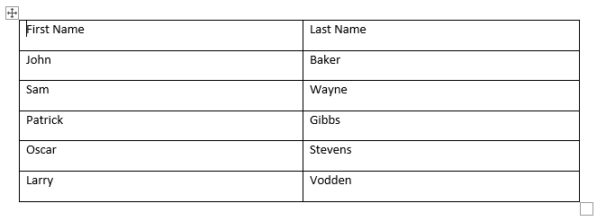
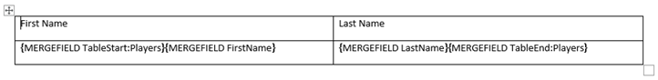

# Environment

| Version | Product | Author | 
| --- | --- | ---- | 
| 2024.1.124 | RadWordsProcessing |[Desislava Yordanova](https://www.telerik.com/blogs/author/desislava-yordanova)| 

# Description

Learn how to generate a Word (.DOCX) document that contains a [Table]() with a header row and an item row merge field. Then, passing a collection of records, automatically populate the data rows. 

# Solution

To achieve the desired result, you can use the [Nested Mail Merge]() functionality that [RadWordsProcessing]() offers and populate the data rows automatically.

Here's a sample code snippet that demonstrates how to achieve this:

```csharp
internal class Program
{
    static void Main(string[] args)
    {
        List<Player> players = GetPlayers();
        List<PlayersHolder> playersHolders = new List<PlayersHolder>() { new PlayersHolder(players) };
        RadFlowDocument document = new RadFlowDocument();
        RadFlowDocumentEditor editor = new RadFlowDocumentEditor(document);

        Table table = editor.InsertTable(2, 2);
        
        table.Rows[0].Cells[0].Blocks.AddParagraph().Inlines.AddRun("First Name");
        table.Rows[0].Cells[1].Blocks.AddParagraph().Inlines.AddRun("Last Name");
        TableRow row = table.Rows[1];
        var firstNameParagraph = table.Rows[1].Cells[0].Blocks.AddParagraph();
        editor.MoveToParagraphStart(firstNameParagraph);
        editor.InsertField("MERGEFIELD TableStart:Players", "");
        editor.InsertField("MERGEFIELD FirstName", "");

        var lastNameParagraph = table.Rows[1].Cells[1].Blocks.AddParagraph();
        editor.MoveToParagraphStart(lastNameParagraph);
        editor.InsertField("MERGEFIELD LastName", "");
        editor.InsertField("MERGEFIELD TableEnd:Players", "");

        table.PreferredWidth = new TableWidthUnit(TableWidthUnitType.Percent, 100);
        Border border = new Border(1, BorderStyle.Single, new ThemableColor(Colors.Black));
        table.Borders = new TableBorders(border);

        editor.MoveToTableEnd(table);

        editor.InsertParagraph();
        RadFlowDocument mergedDocument = document.MailMerge(playersHolders);
        string resultFileNameDocx = "merged.docx";
        File.Delete(resultFileNameDocx);
        DocxFormatProvider provider = new DocxFormatProvider();
        using (var output = File.OpenWrite(resultFileNameDocx))
        {
            provider.Export(mergedDocument, output);
        }
        Process.Start(resultFileNameDocx);
    }   
    
    public static List<Player> GetPlayers()
    {
        var Players = new List<Player>();

        Players.Add(new Player() { FirstName = "John", LastName = "Baker" });
        Players.Add(new Player() { FirstName = "Sam ", LastName = "Wayne" });
        Players.Add(new Player() { FirstName = "Patrick", LastName = "Gibbs" });
        Players.Add(new Player() { FirstName = "Oscar", LastName = "Stevens" });
        Players.Add(new Player() { FirstName = "Larry", LastName = "Vodden" });

        return Players;
    }
}

public class PlayersHolder
{
    public PlayersHolder(List<Player> players)
    {
        Players = players;
    }

    public List<Player> Players { get; set; }
}

public class Player {
    public string FirstName { get; set; }
    public string LastName { get; set; }
}
```

This code snippet will produce the desired result, merging the data into the table in the Word document.

 


If you skip the MailMerge step, the following template would be produced:

 

## See Also

* [Telerik Control Panel Forum](https://www.telerik.com/forums/telerik-control-panel)
* [Nested Mail Merge]()
* [Table]()