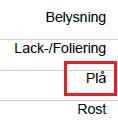
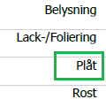

## Environment

| Version | Product | Author | 
| --- | --- | ---- | 
| 2024.3.806| RadWordsProcessing |[Desislava Yordanova](https://www.telerik.com/blogs/author/desislava-yordanova)| 

## Description
When converting HTML documents to PDF format using [RadWordsProcessing ]() and its [PdfFormatProvider](), text containing special characters such as **å, ä, or ö** gets cut off. This issue arises due to the library's requirement for explicit access to [font]() data, which is **not** automatically provided in the .NET Standard version of Telerik Document Processing.

This KB article also answers the following questions:
- How can I include special characters in PDFs using RadWordsProcessing?
- What steps are needed to support non-standard fonts in PDF conversion?
- How do I ensure all text is properly displayed when converting HTML to PDF?

|Before|After|
|----|----|
||| 

## Solution
To resolve the issue with text cut off and ensure all characters, including special ones, are correctly displayed, implement a custom `FontsProvider`. This provider will supply the necessary font data to the PdfProcessing library, enabling it to correctly render all characters.

1. Implement a custom [FontsProvider]() by extending `FontsProviderBase` and override the `GetFontData` method. This method should return the font data for the required fonts, including those with special characters.

The following example shows how to handle *Tahoma, Arial and Segoe UI* fonts. When using other fonts, the custom implementation should be modified and further extended with the respective fonts.

    ```csharp
    internal class FontsProvider : Telerik.Windows.Documents.Extensibility.FontsProviderBase
    {
        private readonly string fontFolder = Environment.GetFolderPath(Environment.SpecialFolder.Fonts);

        public override byte[] GetFontData(Telerik.Windows.Documents.Core.Fonts.FontProperties fontProperties)
        {
            string fontFamilyName = fontProperties.FontFamilyName;
            bool isBold = fontProperties.FontWeight == Telerik.Documents.Core.Fonts.FontWeights.Bold;
            if (fontFamilyName == "Tahoma" && isBold)
            {
                return GetFontDataFromFontFolder("tahomabd.ttf");
            }
            else if (fontFamilyName == "Tahoma")
            {
                return GetFontDataFromFontFolder("tahoma.ttf");
            }
            else if (fontFamilyName == "Arial" && isBold)
            {
                return GetFontDataFromFontFolder("arialbd.ttf");
            }
            else if (fontFamilyName == "Arial")
            {
                return GetFontDataFromFontFolder("arial.ttf");
            }
            else if (fontFamilyName == "Segoe UI")
            {
                return GetFontDataFromFontFolder("segoeui.ttf");
            }

            return null;
        }

        private byte[] GetFontDataFromFontFolder(string fontFileName)
        {
            using (FileStream fileStream = File.OpenRead(this.fontFolder + "\\" + fontFileName))
            {
                using (MemoryStream memoryStream = new MemoryStream())
                {
                    fileStream.CopyTo(memoryStream);
                    return memoryStream.ToArray();
                }
            }
        }
    }
    ```

2. Before converting your HTML document to PDF, set the custom `FontsProvider` to the `FontsProvider` property of the `FixedExtensibilityManager`.

    ```csharp
    Telerik.Windows.Documents.Extensibility.FontsProviderBase fontsProvider = new FontsProvider();
    Telerik.Windows.Documents.Extensibility.FixedExtensibilityManager.FontsProvider = fontsProvider;
    ```

Following these steps will ensure access to the necessary font data, preventing text from being cut off and ensuring all characters, including those with special characters, are properly rendered in the PDF document.

## See Also
- [PDF Format Provider]()
- [Fonts in RadPdfProcessing]()
- [How to Implement a FontsProvider]()
- [RadWordsProcessing Documentation]()
- [Preserving the Font in PDF Export from Excel]()
