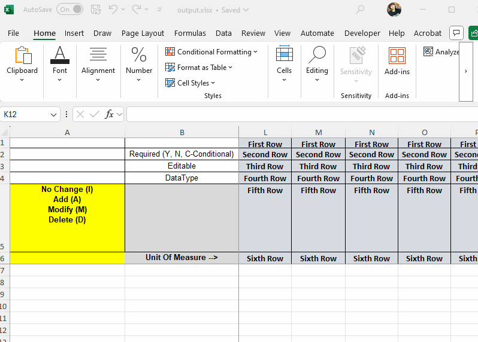
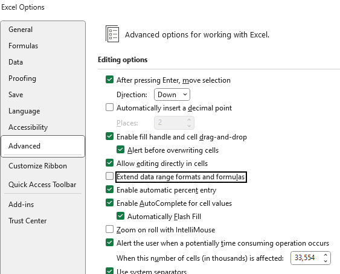
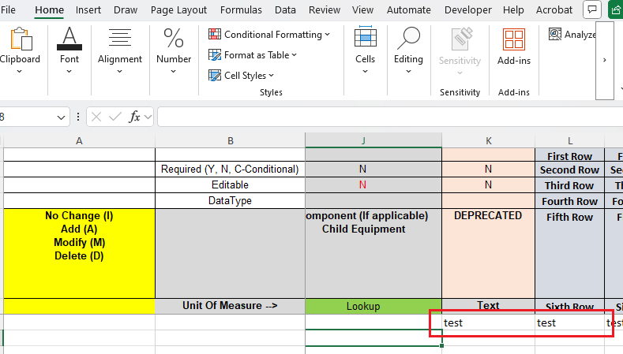

## Environment

 Version | Product | Author | 
| ---- | ---- | ---- | 
| 2025.2.520| RadSpreadProcessing |[Desislava Yordanova](https://www.telerik.com/blogs/author/desislava-yordanova)|

## Description

When exporting an Excel file using [SpreadProcessing](https://docs.telerik.com/devtools/document-processing/libraries/radspreadprocessing/overview) and applying formatting to a range of cells, entering data immediately below the formatted range may cause Excel to automatically extend the formatting: 

>caption Extend Data Range Formats and Formulas


This occurs due to Excel's built-in *"Extend data range formats and formulas"* feature. The behavior is controlled by Excel itself and cannot be disabled programmatically from within the SpreadProcessing library:



Clearing the formatting of cells in a range below the formatted data helps mitigate behavior. However, this approach works only for pre-defined ranges and does not override Excel's internal settings permanently. This article demonstrates a sample approach how to rectify such a behavior. 

## Solution

To prevent Excel's automatic formatting extension, clear the formatting of cells in a specified range below the formatted and populated range. Use the following steps and code:

1. Identify the used cell range in the worksheet.
2. Define a range below the used cells that you want to clear formatting from.
3. Apply default formatting (e.g., transparent fill, no borders, default alignment, etc.) to the defined range.

Use the following code example:

```csharp
// Identify the used range in the worksheet
CellRange usedCellRange = worksheet.UsedCellRange;
int rowIndexStart = usedCellRange.ToIndex.RowIndex + 1;
int columnIndexStart = usedCellRange.FromIndex.ColumnIndex + 1;
int rowIndexEnd = rowIndexStart + 10; // Adjust the range size as needed
int columnIndexEnd = usedCellRange.ToIndex.ColumnIndex;

// Define the range to clear formatting
CellRange clearRange = new CellRange(rowIndexStart, columnIndexStart, rowIndexEnd, columnIndexEnd);

// Set transparent fill and default formatting
var clearColor = Colors.Transparent;
SetDefaultFormattingCellRange(worksheet, clearRange, clearColor);

// Helper method to apply default formatting
static void SetDefaultFormattingCellRange(Worksheet worksheet, CellRange cellRange, Color cellColor)
{
    worksheet.Cells[cellRange].SetFill(new PatternFill(PatternType.Solid, cellColor, Colors.Transparent));
    worksheet.Cells[cellRange].SetIsBold(false);
    worksheet.Cells[cellRange].SetHorizontalAlignment(RadHorizontalAlignment.Left);
    worksheet.Cells[cellRange].SetVerticalAlignment(RadVerticalAlignment.Center);
    worksheet.Cells[cellRange].SetIsWrapped(false);
    worksheet.Cells[cellRange].SetValue(string.Empty);

    CellBorder border = new CellBorder(CellBorderStyle.Thin, ThemableColor.FromColor(Colors.LightGray));
    CellBorder noBorder = new CellBorder(CellBorderStyle.None, ThemableColor.FromColor(Colors.Black));

    worksheet.Cells[cellRange].SetBorders(new CellBorders(
        left: border,
        top: border,
        right: border,
        bottom: border,
        diagonalUp: noBorder,
        diagonalDown: noBorder,
        insideHorizontal: border,
        insideVertical: border)
    );
}
```

This approach minimizes the chances of Excel automatically extending formatting when new data is entered below the formatted range.

 

## See Also

- [SpreadProcessing Overview]()
- [Cell Styles]() 
