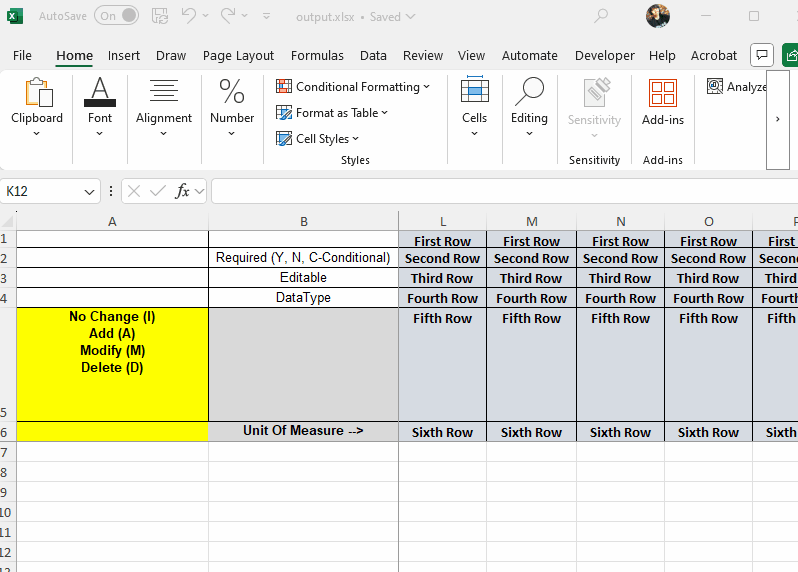
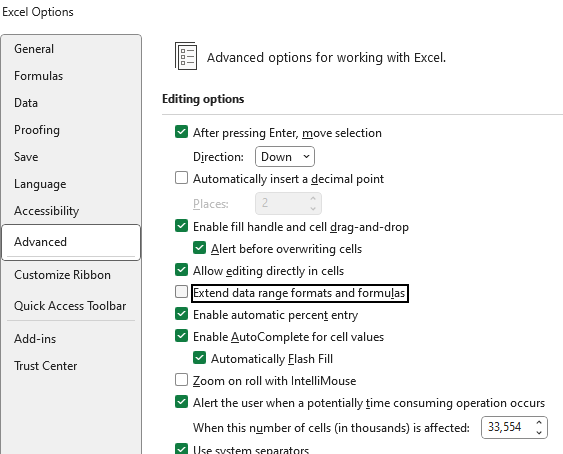
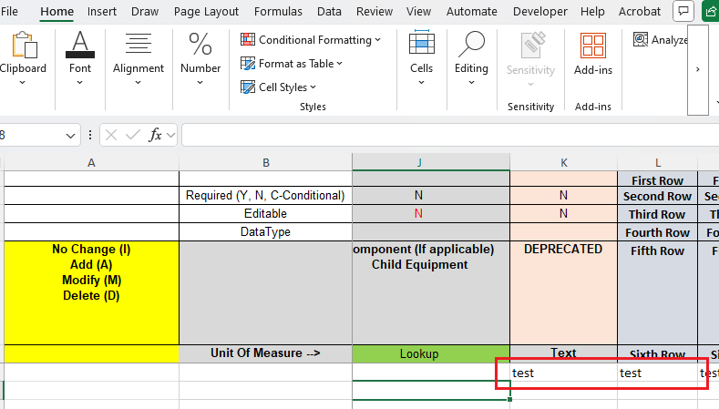

## Environment

| Version | Product | Author | 
| ---- | ---- | ---- | 
| 2025.2.520| RadSpreadProcessing |[Desislava Yordanova](https://www.telerik.com/blogs/author/desislava-yordanova)|

## Description

When you export an Excel file with [SpreadProcessing]() and apply formatting to a range of cells, entering data immediately below the formatted range may cause Excel to automatically extend the formatting: 

>caption Extend Data Range Formats and Formulas


This occurs because of the Excel built-in *"Extend data range formats and formulas"* feature. Excel itself controls the behavior and you cannot disable it programmatically from within the SpreadProcessing library:



Clearing the formatting of cells in a range below the formatted data helps mitigate this behavior. This approach works only for predefined ranges and does not override the Excel internal settings permanently. This article demonstrates a sample approach for how to rectify this behavior. 

## Solution

To prevent the Excel automatic formatting extension, clear the formatting of cells in a specified range below the formatted and populated range. Follow these steps:

1. Identify the used cell range in the worksheet.
2. Define a range below the used cells that you want to clear formatting from.
3. Apply default formatting (for example, transparent fill, no borders, and default alignment) to the defined range.

Use the following code example:

```csharp
// Identify the used range in the worksheet
CellRange usedCellRange = worksheet.UsedCellRange;
int rowIndexStart = usedCellRange.ToIndex.RowIndex + 1;
int columnIndexStart = usedCellRange.FromIndex.ColumnIndex + 1;
int rowIndexEnd = rowIndexStart + 10; // Adjust the range size as needed
int columnIndexEnd = usedCellRange.ToIndex.ColumnIndex;

// Define the range to clear formatting
CellRange clearRange = new CellRange(rowIndexStart, columnIndexStart, rowIndexEnd, columnIndexEnd);

// Set transparent fill and default formatting
var clearColor = Colors.Transparent;
SetDefaultFormattingCellRange(worksheet, clearRange, clearColor);

// Helper method to apply default formatting
static void SetDefaultFormattingCellRange(Worksheet worksheet, CellRange cellRange, Color cellColor)
{
    worksheet.Cells[cellRange].SetFill(new PatternFill(PatternType.Solid, cellColor, Colors.Transparent));
    worksheet.Cells[cellRange].SetIsBold(false);
    worksheet.Cells[cellRange].SetHorizontalAlignment(RadHorizontalAlignment.Left);
    worksheet.Cells[cellRange].SetVerticalAlignment(RadVerticalAlignment.Center);
    worksheet.Cells[cellRange].SetIsWrapped(false);
    worksheet.Cells[cellRange].SetValue(string.Empty);

    CellBorder border = new CellBorder(CellBorderStyle.Thin, ThemableColor.FromColor(Colors.LightGray));
    CellBorder noBorder = new CellBorder(CellBorderStyle.None, ThemableColor.FromColor(Colors.Black));

    worksheet.Cells[cellRange].SetBorders(new CellBorders(
        left: border,
        top: border,
        right: border,
        bottom: border,
        diagonalUp: noBorder,
        diagonalDown: noBorder,
        insideHorizontal: border,
        insideVertical: border)
    );
}
```

This approach minimizes the chances of Excel automatically extending formatting when new data is entered below the formatted range.

 

## See Also

* [SpreadProcessing Overview]()
* [Cell Styles]()
