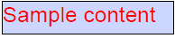

## Environment

| Version | Product | Author | 
| --- | --- | ---- | 
| 2024.4.1106| RadPdfProcessing |[Desislava Yordanova](https://www.telerik.com/blogs/author/desislava-yordanova)| 

## Description

When creating PDF documents containing [form fields](), you might need to update the text and border colors of a [TextBoxField]() and highlight specific fields. This article demonstrates how to customize the appearance of `TextBoxField` elements, including changing their text and border colors.

    

## Solution

To change the text and border colors of a `TextBoxField` in a PDF document, utilize the `TextProperties` and `AppearanceCharacteristics` properties provided by the [VariableContentWidget]() class. The following example demonstrates how to customize these aspects.

1. Create a new [RadFixedDocument]() and add a page to it.
2. Instantiate a `TextBoxField` and configure its properties as needed.
3. Add a widget to the `TextBoxField` and set up the text and border colors using the `TextProperties` and [AppearanceCharacteristics]() properties.
4. Recalculate the content of the widget and add the `TextBoxField` to the document.
5. Save the document to a file.

```csharp
RadFixedDocument fixedDocument = new RadFixedDocument();
fixedDocument.Pages.AddPage();

TextBoxField textField = new TextBoxField("SampleTextBox")
{
    MaxLengthOfInputCharacters = 500,
    IsMultiline = true,
    IsPassword = false,
    IsFileSelect = false,
    ShouldSpellCheck = true,
    AllowScroll = true,
    Value = "Sample content",
};

VariableContentWidget widget = textField.Widgets.AddWidget();
VariableTextProperties textProperties = new VariableTextProperties();
textProperties.Fill = new RgbColor(255, 0, 0); // Set text color to red
textProperties.FontSize = 24; 
widget.TextProperties = textProperties;

widget.AppearanceCharacteristics.BorderColor = new RgbColor(0, 0, 0); // Set border color to black
widget.AppearanceCharacteristics.Background = new RgbColor(255, 255, 0); // Optional: Set background color to yellow
widget.Rect = new Rect(10, 10, 250, 50);
widget.RecalculateContent();

fixedDocument.AcroForm.FormFields.Add(textField);
fixedDocument.Pages[0].Annotations.Add(widget);

string fileName = "CustomizedTextBoxField.pdf";
File.WriteAllBytes(fileName, new PdfFormatProvider().Export(fixedDocument, TimeSpan.FromSeconds(10)));

Console.WriteLine("Document with customized TextBoxField created.");
```

The demonstrated approach is applicable not only for creating new documents, but for importing documents that already contains form fields as well. 

## See Also

- [TextBoxField Documentation]()
- [Text and Graphic Properties]()
- [Create Interactive Forms SDK Example](https://github.com/telerik/document-processing-sdk/tree/master/PdfProcessing/CreateInteractiveForms)
- [Modify Form Values SDK Example](https://github.com/telerik/document-processing-sdk/tree/master/PdfProcessing/ModifyForms)

