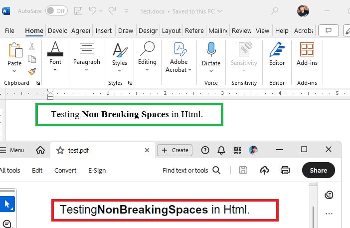

## Environment

| Version | Product | Author | 
| ---- | ---- | ---- | 
| 2025.1.205| RadWordsProcessing |[Desislava Yordanova](https://www.telerik.com/blogs/author/desislava-yordanova)| 

## Description

When converting HTML content to PDF format using [RadWordsProcessing](), non-breaking spaces (`&nbsp;`) within and surrounding HTML tags are not rendered correctly in the generated PDF document, although they appear as expected in the DOCX output. This issue occurs only when exporting to PDF format due to the .NET Standard version of RadPdfProcessing lacking a default mechanism for reading font data, which is required for accurate space rendering in PDFs.

This knowledge base article shows how to ensure that non-breaking spaces in HTML are correctly rendered in the exported PDF documents using RadWordsProcessing.



## Solution

To resolve the issue of non-breaking spaces not being rendered correctly in PDF documents generated from HTML content, it is necessary to implement a custom [FontsProvider](). This ensures [RadPdfProcessing]() has access to font data for accurately rendering spaces and other font-related features in the PDF output.

1. **Implement a Custom FontsProvider**

   Create a class that extends `FontsProviderBase` and override the `GetFontData` method to provide the necessary font data. This method should return the font data as a byte array for the specified font properties.

    ```csharp
        public class FontsProvider : Telerik.Windows.Documents.Extensibility.FontsProviderBase
        {
            public override byte[] GetFontData(Telerik.Windows.Documents.Core.Fonts.FontProperties fontProperties)
            {
                string fontFileName = fontProperties.FontFamilyName + ".ttf";
                string fontFolder = Environment.GetFolderPath(Environment.SpecialFolder.Fonts);

                //The fonts can differ depending on the file 
                if (fontProperties.FontFamilyName == "Segoe UI")
                {
                    if (fontProperties.FontStyle == FontStyles.Italic && fontProperties.FontWeight == FontWeights.Bold)
                    {
                        fontFileName = $"segoeuiz.ttf";
                    }
                    else if (fontProperties.FontStyle == FontStyles.Italic)
                    {
                        fontFileName = $"segoeuii.ttf";
                    }
                    else if (fontProperties.FontWeight == FontWeights.Normal)
                    {
                        fontFileName = "segoeui.ttf";
                    }
                    else if (fontProperties.FontWeight == FontWeights.Bold)
                    {
                        fontFileName = $"segoeuib.ttf";
                    }
                }
                else if (fontProperties.FontFamilyName == "Times New Roman")
                {
                    if (fontProperties.FontStyle == FontStyles.Italic && fontProperties.FontWeight == FontWeights.Bold)
                    {
                        fontFileName = $"timesbi.ttf";
                    }
                    else if (fontProperties.FontStyle == FontStyles.Italic)
                    {
                        fontFileName = $"timesi.ttf";
                    }
                    else if (fontProperties.FontWeight == FontWeights.Normal)
                    {
                        fontFileName = "times.ttf";
                    }
                    else if (fontProperties.FontWeight == FontWeights.Bold)
                    {
                        fontFileName = $"timesbd.ttf";
                    }
                }

                //...add more fonts if needed... 

                DirectoryInfo directory = new DirectoryInfo(fontFolder);
                FileInfo[] fontFiles = directory.GetFiles();

                var fontFile = fontFiles.FirstOrDefault(f => f.Name.Equals(fontFileName, StringComparison.InvariantCultureIgnoreCase));
                if (fontFile != null)
                {
                    var targetPath = fontFile.FullName;
                    using (FileStream fileStream = File.OpenRead(targetPath))
                    {
                        using (MemoryStream memoryStream = new MemoryStream())
                        {
                            fileStream.CopyTo(memoryStream);
                            Debug.WriteLine("Found "+ fontFileName);
                            return memoryStream.ToArray();
                        }
                    }
                }
                Debug.WriteLine("NOT Found " + fontFileName);
                return null;
            }
        }
    ```

2. **Set the Custom FontsProvider to the FixedExtensibilityManager**

   Before generating the PDF document, assign an instance of the custom `FontsProvider` to the `FontsProvider` property of `FixedExtensibilityManager`.

    ```csharp
    Telerik.Windows.Documents.Extensibility.FontsProviderBase fontsProvider = new FontsProvider();
    Telerik.Windows.Documents.Extensibility.FixedExtensibilityManager.FontsProvider = fontsProvider;
    ```

3. **Generate PDF Document from HTML Content**

   Utilize the [HtmlFormatProvider]() to import HTML content and convert it to a [RadFlowDocument](). Then, use the [PdfFormatProvider]() to export the document to PDF, ensuring non-breaking spaces and other font-related elements are rendered correctly.

    ```csharp
    // Example method implementation for converting HTML to PDF
    public static byte[] CreateDocumentFromHtml(string html, bool pdf = false)
    {
        // Conversion logic...
    }
    ```

For a detailed guide on implementing a `FontsProvider`, refer to the [How to implement a FontsProvider]() article. This implementation ensures that non-breaking spaces and other font-related elements are accurately rendered in PDF documents generated from HTML content using RadWordsProcessing.

>note There is also an alternative option of [manually registering the fonts]().

## See Also

- [How to Implement a FontsProvider for RadPdfProcessing]()
