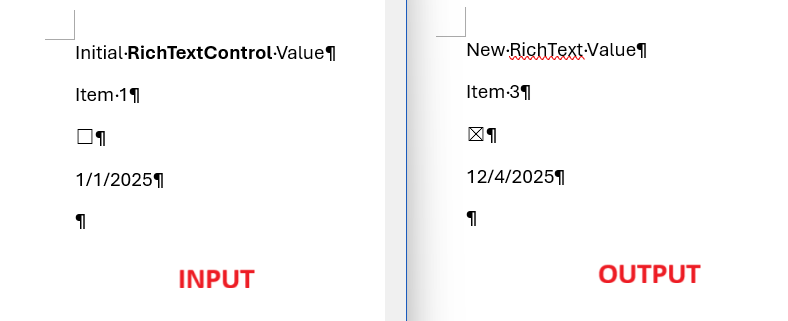

## Environment

| Version | Product | Author |
| --- | --- | ---- |
| 2025.4.1104 | RadWordsProcessing | [Yoan Karamanov](https://www.telerik.com/blogs/author/yoan-karamanov) |

## Description
Structured Document Tags (SDTs), also known as [Content Controls](), are implemented in [WordsProcessing]() using annotation markers. The markers are placed before and after the control’s content - **SdtRangeStart** at the beginning and **SdtRangeEnd** at the end. To modify the content of a content control, you must change the document elements between these two markers.

## Solution

The following example covers:

* **Load and parse**: Imports an input DOCX using **DocxFormatProvider** and retrieves all SDTs via **EnumerateChildrenOfType&lt;SdtRangeStart&gt;()**.
* **Classify by alias**: Iterates each SDT and uses **SdtProperties.Alias** to route updates for specific control types: "RichText", "ComboBox", "CheckBox", and "DatePicker".
* **Preserve formatting**: For inline SDTs, collects all **Run** elements between **SdtRangeStart** and **SdtRangeEnd**, removes all but the first **Run**, and reuses that first **Run** to keep existing text formatting.
* **Update values**:
    * **RichText**: Sets the first run’s **Text** to the new string.
    * **ComboBox**: Sets the first run’s **Text** to the selected item display text (e.g., "Item 3").
    * **CheckBox**: Toggles **CheckBoxProperties.Checked** and updates the glyph in the first run using the appropriate **SdtCheckBoxState** (font + character code).
    * **DatePicker**: Formats **DateTime.Now** using the SDT’s **DateProperties.DateFormat** and assigns the result to the first run’s **Text**.
* **Save and open**: Exports the modified **RadFlowDocument** back to DOCX and opens the file to verify the changes.

```csharp
const string InputFile = "input.docx";
const string OutputFile = "output.docx";

static void Main(string[] args)
{
    var provider = new DocxFormatProvider();
    var document = provider.Import(File.ReadAllBytes(InputFile), null);
    var sdtRangeStarts = document.EnumerateChildrenOfType<SdtRangeStart>().ToList();

    foreach (var sdtRangeStart in sdtRangeStarts)
    {
        if (sdtRangeStart.SdtProperties.Alias == "RichText")
        {
            ChangeRichTextValue(sdtRangeStart, "New RichText Value");
        }
        else if (sdtRangeStart.SdtProperties.Alias == "ComboBox")
        {
            ChangeComboBoxValue(sdtRangeStart, "Item 3");
        }
        else if (sdtRangeStart.SdtProperties.Alias == "CheckBox")
        {
            ChangeCheckBoxValue(sdtRangeStart);
        }
        else if (sdtRangeStart.SdtProperties.Alias == "DatePicker")
        {
            ChangeDatePickerValue(sdtRangeStart, DateTime.Now);
        }
    }

    var bytes = provider.Export(document, null);
    File.WriteAllBytes(OutputFile, bytes);
    Process.Start(new ProcessStartInfo(OutputFile) { UseShellExecute = true });
}

private static void ChangeDatePickerValue(SdtRangeStart sdtRangeStart, DateTime now)
{
    var firstRun = ReturnFirstRunAndRemoveOthersFromSdt(sdtRangeStart);

    var properties = (DateProperties)sdtRangeStart.SdtProperties;
    firstRun.Text = now.ToString(properties.DateFormat);
}

private static void ChangeRichTextValue(SdtRangeStart sdtRangeStart, string value)
{
    var firstRun = ReturnFirstRunAndRemoveOthersFromSdt(sdtRangeStart);

    firstRun.Text = value;
}

private static void ChangeComboBoxValue(SdtRangeStart sdtRangeStart, string value)
{
    var firstRun = ReturnFirstRunAndRemoveOthersFromSdt(sdtRangeStart);

    firstRun.Text = value;
}

private static void ChangeCheckBoxValue(SdtRangeStart sdtRangeStart)
{
    var firstRun = ReturnFirstRunAndRemoveOthersFromSdt(sdtRangeStart);
    CheckBoxProperties properties = (CheckBoxProperties)sdtRangeStart.SdtProperties;
    if (properties.Checked.HasValue && properties.Checked.Value)
    {
        properties.Checked = false;

        // If check box is currently checked, change it to unchecked
        ApplyNewCheckBoxState(firstRun, properties.UncheckedState);
    }
    else
    {
        properties.Checked = true;

        // If check box is currently unchecked, change it to checked
        ApplyNewCheckBoxState(firstRun, properties.CheckedState);
    }
}

private static void ApplyNewCheckBoxState(Run run, SdtCheckBoxState state)
{
    if (run != null)
    {
        run.Properties.FontFamily.LocalValue = new ThemableFontFamily(state.Font);
        run.Text = ((char)state.CharacterCode).ToString();
    }
}

private static Run ReturnFirstRunAndRemoveOthersFromSdt(SdtRangeStart sdtRangeStart)
{
    var runs = GetRunsInsideSdt(sdtRangeStart);

    // Remove all but the first run inside the SdtRangeStart
    // We want to keep the first run because it contains the formatting of the text
    var paragraph = sdtRangeStart.Paragraph;
    for (int i = 1; i < runs.Count; i++)
    {
        paragraph.Inlines.Remove(runs[i]);
    }

    return runs[0];
}

private static IList<Run> GetRunsInsideSdt(SdtRangeStart sdtRangeStart)
{
    List<Run> runs = new List<Run>();
    var paragraph = sdtRangeStart.Paragraph;
    var sdtStartIndex = paragraph.Inlines.IndexOf(sdtRangeStart);
    for (int i = sdtStartIndex + 1; i < paragraph.Inlines.Count; i++)
    {
        if (paragraph.Inlines[i] is SdtRangeEnd sdtRangeEnd && sdtRangeEnd.Start == sdtRangeStart)
        {
            return runs;
        }

        if (paragraph.Inlines[i] is Run run)
        {
            runs.Add(run);
        }
    }

    // It is possible that the SdtRangeEnd is inside another Paragraph
    // For demo purposes we will handle only the case where the SdtRangeEnd is in the same Paragraph
    return runs;
}
```


### Notes
* Use [RadFlowDocumentEditor]() for higher-level operations like inserting SDTs via **InsertStructuredDocumentTag**.
* The content control type (plain text, combo box, checkbox, etc.) is available through **SdtProperties.Type**. Adjust the replacement logic based on the control type when necessary.
* Content controls can exist at different levels (block, inline, row, cell). Ensure you modify the correct collection (**Inlines**, **Blocks**, **Cells**, etc.) depending on where the SDT is placed. See [**Content Controls**]().

## See Also
* [Content Controls]()