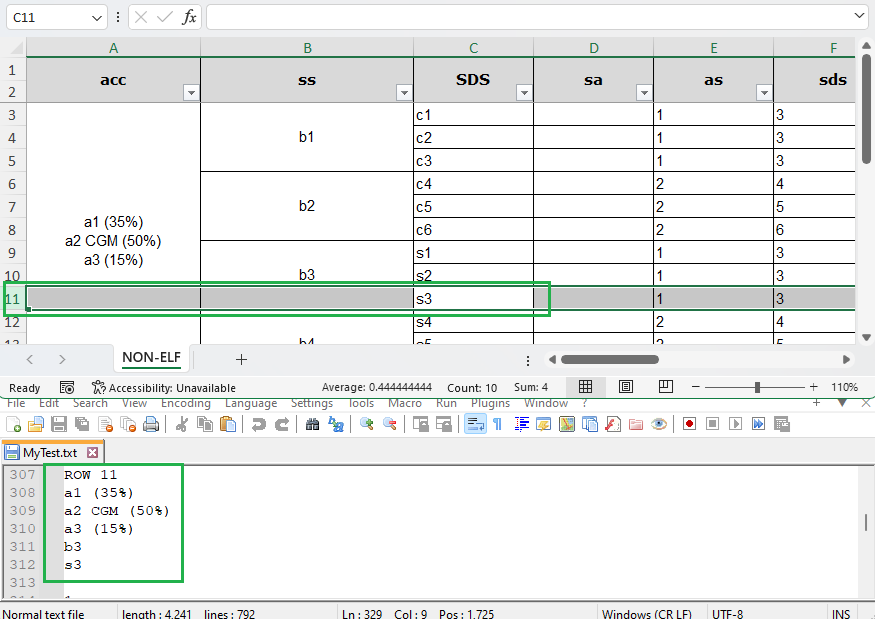

## Environment

| Version | Product | Author | 
| --- | --- | ---- | 
| 2024.1.124 | RadSpreadProcessing|[Desislava Yordanova](https://www.telerik.com/blogs/author/desislava-yordanova)| 

## Description

Learn how to read spreadsheet documents that contain [merged cells]() and retrieve the correct values stored in the merged cells.

## Solution

With the help of [RadSpreadProcessing]() it is easy to [identify merged cells](https://docs.telerik.com/devtools/document-processing/libraries/radspreadprocessing/features/merge-unmerge-cells#how-to-check-if-a-cell-is-merged) and extract their values no matter which cell of the merged region is accessed. 
With the following example we will iterate through the cells in the used range of the worksheet. If a cell is part of a merged region, obtain the value from the top-left cell of the merged region.

```csharp
            string fileName = "Sample.xls";
            if (!File.Exists(fileName))
            {
                throw new FileNotFoundException(String.Format("File {0} was not found!", fileName));
            }

            Telerik.Windows.Documents.Spreadsheet.Model.Workbook workbook;
            IWorkbookFormatProvider formatProvider = new Telerik.Windows.Documents.Spreadsheet.FormatProviders.Xls.XlsFormatProvider();

            using (Stream input = new FileStream(fileName, FileMode.Open))
            {
                workbook = formatProvider.Import(input);
            }

            Worksheet worksheet = workbook.Sheets[0] as Worksheet;
            CellRange usedCellRange = worksheet.UsedCellRange;
            StringBuilder sb = new StringBuilder();
            for (int rowIndex = usedCellRange.FromIndex.RowIndex; rowIndex <= usedCellRange.ToIndex.RowIndex; rowIndex++)
            {
                sb.AppendLine("ROW " + (rowIndex + 1));
                for (int columnIndex = usedCellRange.FromIndex.ColumnIndex; columnIndex <= usedCellRange.ToIndex.ColumnIndex; columnIndex++)
                {
                    CellSelection selection = worksheet.Cells[rowIndex, columnIndex];
                    CellIndex currentCellIndex = new CellIndex(rowIndex, columnIndex);
                    CellRange mergedCellRange;
                    if (worksheet.Cells.TryGetContainingMergedRange(currentCellIndex, out mergedCellRange))
                    {
                        selection= worksheet.Cells[mergedCellRange.FromIndex];
                    } 
                    ICellValue value = selection.GetValue().Value;
                    CellValueFormat format = selection.GetFormat().Value;
                    CellValueFormatResult formatResult = format.GetFormatResult(value);
                    string result = formatResult.InfosText;
                    if (result != null && result != string.Empty)
                    {
                        sb.AppendLine(result);
                    }
                    else
                    {
                        sb.AppendLine("-");
                    }
                }
            }

            string path = @"MyTest.txt";
            File.Delete(path);
            if (!File.Exists(path))
            {
                using (StreamWriter sw = File.CreateText(path))
                {
                    sw.WriteLine(sb.ToString());
                }
            }
            Process.Start(new ProcessStartInfo() { FileName = path, UseShellExecute = true });
```

This approach ensures that you correctly read the values of merged cells in a worksheet by always retrieving the value from the top-left cell of the merged region.

 

## See Also

- [Merge Cells in SpreadProcessing]()
