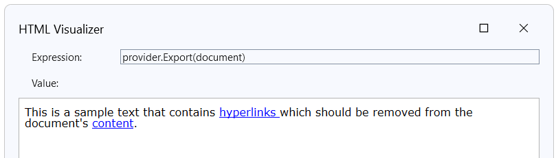
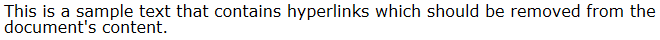

## Environment

| Version | Product | Author |
| --- | --- | ---- |
| 2023.3.1106 | RadWordsProcessing |[Desislava Yordanova](https://www.telerik.com/blogs/author/desislava-yordanova)|

## Description

This article demonstrates a sample approach how to remove hyperlinks from text in an HTML document using the [RadFlowDocument](%slug radwordsprocessing-model-radflowdocument%) from [RadWordsProcessing](%slug radwordsprocessing-overview%)].

|Before|After|
|----|----|
|||

## Solution
 
The hyperlinks are stored with the help of [FieldCharacter](%slug radwordsprocessing-model-fieldcharacter%) in RadFlowDocument. More information about the internal structure of the hyperlink fields is available in the following article: [Hyperlink Field](%slug radwordsprocessing-concepts-hyperlink-field%).

To remove hyperlinks from text in an HTML document using RadFlowDocument, follow these steps:

1. Load the HTML document into RadFlowDocument using the [HtmlFormatProvider](%slug radwordsprocessing-formats-and-conversion-html-htmlformatprovider%).
2. Enumerate the [FieldCharacters](%slug radwordsprocessing-model-fieldcharacter%) elements in the document and delete the content of the hyperlink fields. The **DeleteContent** method removes the hyperlink field elements and leave only the text run that store the text itself. 
3. Enumerate the **Run** elements in the document with the custom *Hyperlink* style and change their style to *Normal*.

```csharp
 using (Stream input = File.OpenRead(@"..\..\sample.html"))
            {
                Telerik.Windows.Documents.Flow.FormatProviders.Html.HtmlFormatProvider provider = new Telerik.Windows.Documents.Flow.FormatProviders.Html.HtmlFormatProvider();
                document = provider.Import(input);
                RadFlowDocumentEditor editor = new RadFlowDocumentEditor(document);
                var hyperlinkElements = document.EnumerateChildrenOfType<FieldCharacter>().Where(x => x.FieldCharacterType == FieldCharacterType.Start).ToList();
                foreach (FieldCharacter hyperlink in hyperlinkElements)
                {
                    editor.DeleteContent(hyperlink.FieldInfo.End, hyperlink.FieldInfo.End);
                    editor.DeleteContent(hyperlink.FieldInfo.Start, hyperlink.FieldInfo.Separator);
                }
                var hyperlinkRuns = document.EnumerateChildrenOfType<Run>().Where(x => x.StyleId.Contains("Hyperlink")).ToList();
                foreach (Run r in hyperlinkRuns)
                {
                    r.StyleId = "Normal";
                }
                var output = provider.Export(document);
            }
```


