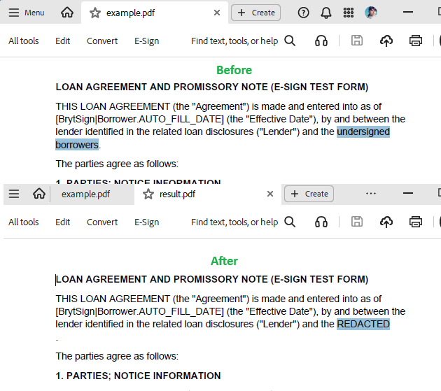

## Environment

| Version | Product | Author | 
| ---- | ---- | ---- | 
| 2026.1.210| RadPdfProcessing |[Desislava Yordanova](https://www.telerik.com/blogs/author/desislava-yordanova)| 

## Description

When you process a PDF with [TextFragment]() objects in RadPdfProcessing, the internal PDF structure may split text into fragments in an arbitrary manner. This behavior can lead to scenarios where text fragments do not align with the desired words or phrases. There is no direct way to edit text on a character-by-character basis within a `TextFragment`.

This article demonstrates a sample approach for replacing text that spans multiple `TextFragment` objects in RadPdfProcessing.

 

## Solution

To replace specific text, even if it spans multiple `TextFragment` objects, follow these steps:

1. Iterate through the pages of the PDF to collect all `TextFragment` objects.
2. Concatenate the text from the fragments and search for the desired string.
3. Identify which fragments the text spans.
4. Replace or reconstruct the fragments as needed.

Here is a code example:

```csharp
static void Main(string[] args)
{
    PdfFormatProvider pdf_provider = new PdfFormatProvider();
    RadFixedDocument document;
    using (Stream stream = File.OpenRead("example.pdf"))
    {
        document = pdf_provider.Import(stream, TimeSpan.FromSeconds(10));
    }
    string textToRemove = "undersigned borrowers";
    string textToReplace = "REDACTED";

    foreach (RadFixedPage page in document.Pages)
    {
        ReplaceTextInPage(page, textToRemove, textToReplace);
    }

    string outputFilePath = "result.pdf";
    File.Delete(outputFilePath);
    using (Stream output = File.OpenWrite(outputFilePath))
    {
        pdf_provider.Export(document, output, TimeSpan.FromSeconds(10));
    }

    Process.Start(new ProcessStartInfo() { FileName = outputFilePath, UseShellExecute = true });
}

private static void ReplaceTextInPage(RadFixedPage page, string textToRemove, string textToReplace)
{
    bool found = true;
    while (found)
    {
        found = false;
        List<TextFragment> textFragments = page.Content.OfType<TextFragment>().ToList();
        if (textFragments.Count == 0) break;

        // Combine text and track fragment positions
        StringBuilder sb = new StringBuilder();
        int[] fragmentStartPositions = new int[textFragments.Count];
        for (int i = 0; i < textFragments.Count; i++)
        {
            fragmentStartPositions[i] = sb.Length;
            sb.Append(textFragments[i].Text);
        }

        string fullText = sb.ToString();
        int matchPos = fullText.IndexOf(textToRemove, StringComparison.Ordinal);
        if (matchPos < 0) break;

        found = true;
        int matchEndPos = matchPos + textToRemove.Length;

        // Find affected fragments
        int firstFragIdx = -1;
        int lastFragIdx = -1;
        for (int i = 0; i < textFragments.Count; i++)
        {
            int fragStart = fragmentStartPositions[i];
            int fragEnd = fragStart + textFragments[i].Text.Length;
            if (firstFragIdx == -1 && matchPos >= fragStart && matchPos < fragEnd)
                firstFragIdx = i;
            if (matchEndPos > fragStart && matchEndPos <= fragEnd)
                lastFragIdx = i;
        }

        if (firstFragIdx == -1 || lastFragIdx == -1) break;

        // Adjust text in affected fragments
        string prefix = textFragments[firstFragIdx].Text.Substring(0, matchPos - fragmentStartPositions[firstFragIdx]);
        int matchEndInLastFrag = matchEndPos - fragmentStartPositions[lastFragIdx];
        string suffix = textFragments[lastFragIdx].Text.Substring(matchEndInLastFrag);

        if (firstFragIdx == lastFragIdx)
        {
            textFragments[firstFragIdx].Text = prefix + textToReplace + suffix;
        }
        else
        {
            textFragments[firstFragIdx].Text = prefix + textToReplace;

            if (!string.IsNullOrEmpty(suffix))
            {
                textFragments[lastFragIdx].Text = suffix;
            }
            else
            {
                page.Content.Remove(textFragments[lastFragIdx]);
            }

            for (int j = lastFragIdx - 1; j > firstFragIdx; j--)
            {
                page.Content.Remove(textFragments[j]);
            }
        }
    }
}
```

### Notes
* This approach handles text that spans multiple fragments by first concatenating all text and then mapping the text back to the fragments.
* Modify and extend this sample as needed to fit the specific requirements of your PDF documents.

## See Also

* [TextFragment]() 
* [TextSearch]()
