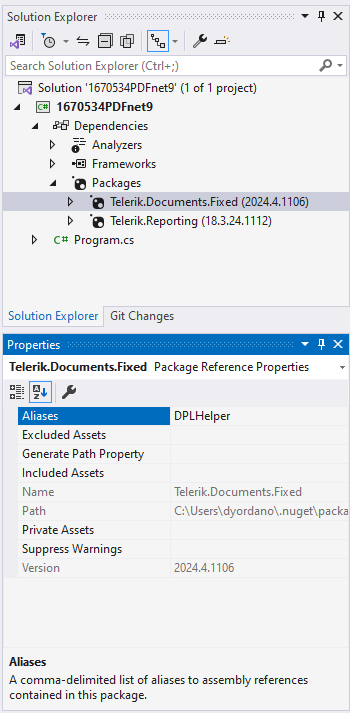
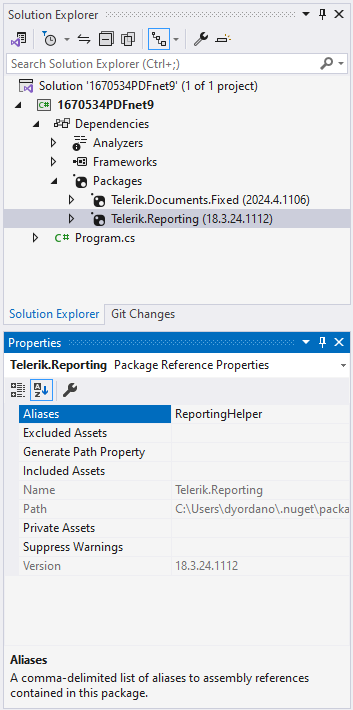

## Environment

| Version | Product | Author | 
| ---- | ---- | ---- | 
| 18.3.24.1112| Reporting |[Desislava Yordanova](https://www.telerik.com/blogs/author/desislava-yordanova)| 
|2024.4.1106| RadPdfProcessing (.NET Standard) ||

## Description

If you have the [Telerik.Reporting](https://docs.telerik.com/reporting/introduction) NuGet package (**18.3.24.1112**) installed simultaneously with the **Telerik.Documents.Fixed** NuGet package, a compile time error occurs:

The type 'Size' exists in both 'Telerik.Documents.Core, Version=2024.4.1106.20, Culture=neutral, PublicKeyToken=5803cfa389c90ce7' and 'Telerik.Reporting, Version=18.3.24.1112, Culture=neutral, PublicKeyToken=a9d7983dfcc261be'

>note This undesired behavior is not reproducible with the previous version of Telerik Reporting. It is caused due to the fact that Telerik.Documents.Primitives.Size is contained in both assemblies/packages with the same namespace.

## Solution

To resolve the compile time error caused by the conflicting 'Size' type in both  assemblies, use the C# **extern alias** feature. Follow these steps to implement the solution:

1. Select the Telerik.Documents.Fixed NuGet package and set its Alias to DPLHelper (or whatever you want):

    

1. Select the Telerik.Reporting NuGet package and set its Alias to ReportingHelper (or whatever you want):

    

1. **Use Extern Alias in Your Code**: At the top of your source file, add the [extern alias`](https://docs.microsoft.com/en-us/dotnet/csharp/language-reference/keywords/extern-alias) directive for each alias you assigned. This differentiates the namespaces, allowing you to use types from both assemblies without conflict.

1. **Adjust Your Code to Use the Aliased Namespaces**:

```csharp
extern alias DPLHelper;
extern alias ReportingHelper;

using DPLHelper::Telerik.Windows.Documents.Fixed.Model.Editing;
using DPLHelper::Telerik.Windows.Documents.Fixed.Model;

namespace YourNamespace
{
    internal class Program
    {
        static void Main(string[] args)
        {
            RadFixedDocument fixedDocument = new RadFixedDocument();
            RadFixedPage fixedPage = fixedDocument.Pages.AddPage();
            fixedPage.Size = new Telerik.Documents.Primitives.Size(210,297);
            FixedContentEditor fixedEditor = new FixedContentEditor(fixedPage);
        }
    }
}
```

This approach allows you to explicitly specify which 'Size' class to use, thereby resolving the compile time error and allowing your project to build successfully.

## See Also

- [Telerik Document Processing Libraries Overview]()
- [Feedback Portal Entry for Compile Time Error in Q4 2024](https://feedback.telerik.com/reporting/1670554-compile-time-error-occurs-after-upgrading-to-q4-2024)
- [Extern Alias](https://docs.microsoft.com/en-us/dotnet/csharp/language-reference/keywords/extern-alias)
