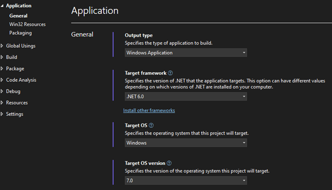
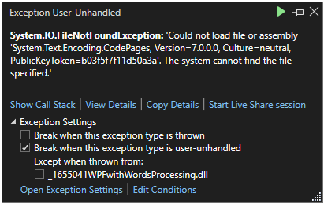
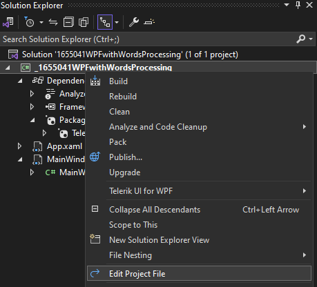
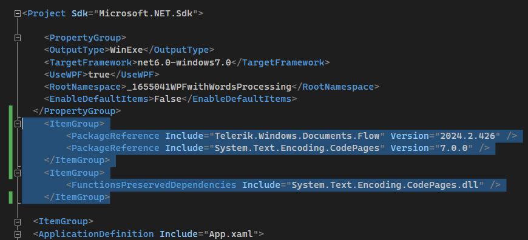

| Version | Product | Author | 
| --- | --- | ---- | 
| 2024.2.426| RadWordsProcessing |[Desislava Yordanova](https://www.telerik.com/blogs/author/desislava-yordanova)| 

## Description
When using the [RadWordsProcessing]() in a WPF/WinForms project which targets .NET 6.0 , a `System.IO.FileNotFoundException` error may occur, stating that the file for assembly 'System.Text.Encoding.CodePages, Version=7.0.0.0' could not be found. This issue arises while utilizing the `Telerik.Windows.Documents.Flow.FormatProviders.Html.HtmlFormatProvider`.

   

   

## Solution
To resolve the FileNotFoundException for 'System.Text.Encoding.CodePages' in a .NET 6.0 project using RadWordsProcessing, follow these steps:

1. Right-click the project to edit the `.csproj` file of your project.

    

2. Include the necessary `PackageReference` entry for `System.Text.Encoding.CodePages` and add a `FunctionsPreservedDependencies` entry for it.

```xml
<ItemGroup>
  <PackageReference Include="Telerik.Windows.Documents.Flow" Version="2024.2.426" />
  <PackageReference Include="System.Text.Encoding.CodePages" Version="7.0.0" />
</ItemGroup>
<ItemGroup>
  <FunctionsPreservedDependencies Include="System.Text.Encoding.CodePages.dll" />
</ItemGroup>
```
   

By adding these entries to your `.csproj` file, the required package references will be included in your project, resolving the FileNotFoundException.

## Notes
Ensure that your project targets the appropriate .NET 6.0 framework and that all NuGet package versions are compatible with your project setup.

## See Also
- [RadWordsProcessing]() 
