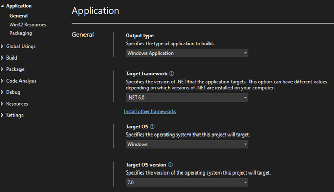
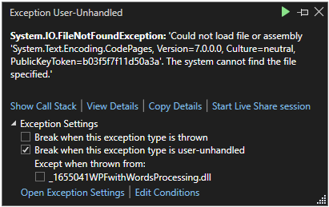
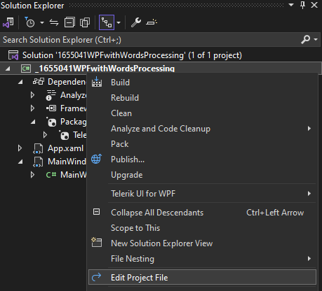
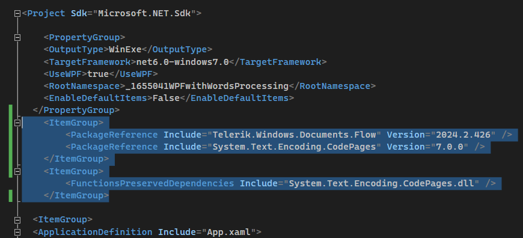

## Environment

| Version | Product | Author | 
| --- | --- | ---- | 
| 2024.2.426| RadWordsProcessing |[Desislava Yordanova](https://www.telerik.com/blogs/author/desislava-yordanova)| 

## Description

When you use [RadWordsProcessing]() in a WPF/WinForms project that targets .NET 6.0, a `System.IO.FileNotFoundException` error occurs. The error states that the file for assembly `System.Text.Encoding.CodePages, Version=7.0.0.0` cannot be found. This issue arises when you use the `Telerik.Windows.Documents.Flow.FormatProviders.Html.HtmlFormatProvider`.

   

   

## Solution

To resolve the `FileNotFoundException` for `System.Text.Encoding.CodePages` in a .NET 6.0 project that uses RadWordsProcessing, follow these steps:

1. Right-click your project and edit the `.csproj` file.

    

2. Add the `PackageReference` entry for `System.Text.Encoding.CodePages` and a `FunctionsPreservedDependencies` entry for it:

```xml
<ItemGroup>
  <PackageReference Include="Telerik.Windows.Documents.Flow" Version="2024.2.426" />
  <PackageReference Include="System.Text.Encoding.CodePages" Version="7.0.0" />
</ItemGroup>
<ItemGroup>
  <FunctionsPreservedDependencies Include="System.Text.Encoding.CodePages.dll" />
</ItemGroup>
```
   

These entries include the required package references in your project and resolve the `FileNotFoundException`.

>note Ensure that your project targets .NET 6.0 and that all NuGet package versions are compatible with your project setup.

## See Also
* [RadWordsProcessing]() 
