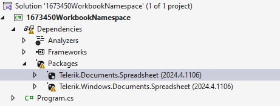
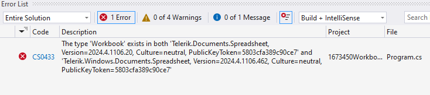
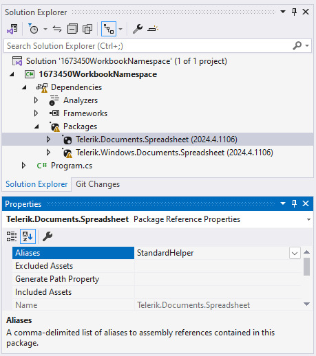
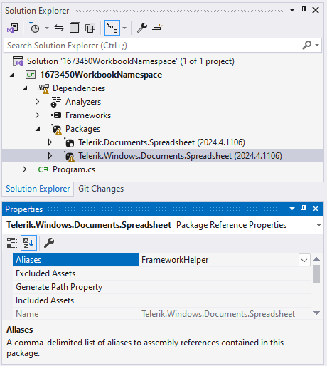

## Environment

| Version | Product | Author | 
| --- | --- | ---- | 
| 2024.4.1106| Telerik Document Processing |[Desislava Yordanova](https://www.telerik.com/blogs/author/desislava-yordanova)| 

## Description

When working on a .NET Core project that utilizes both, the .NET Standard and .NET Framework version of a specific Document Processing library, e.g. `Telerik.Documents.Spreadsheet` and `Telerik.Windows.Documents.Spreadsheet` packages, a namespace conflict arises due to the `Workbook` class existing in both packages. This conflict results in a compiler error, preventing successful compilation.

 

>note It is not recommended to install the .NET Standard and .NET Framework version of the Document Processing libraries simultaneously in the same project. Install the NuGet package which is compatible with the application's Target framework and Target OS. 

  

This knowledge base article also answers the following questions:
- How can I resolve type conflicts in .NET Core projects using Telerik Document Processing libraries?
- What is the correct way to handle namespace conflicts when using Telerik Document Processing in mixed .NET environments?
- How do I use the C# extern alias feature to differentiate between similar types in different assemblies?

## Solution

Depending on the target framework of your project (NET Framework, .NET Standard .NET Core, .NET 6, etc.), you should install the library version accordinglyt. However, if you need to install both versions for any reason, to resolve the compile-time error caused by the conflicting `Workbook` type in both assemblies, utilize the C# [extern alias](https://learn.microsoft.com/en-us/dotnet/csharp/language-reference/keywords/extern-alias) feature. This approach allows you to differentiate between assemblies and use types from both without conflict. Follow the steps below:

1. **Assign Alias to NuGet Packages**
   - For the `Telerik.Documents.Spreadsheet` NuGet package, set its alias to `StandardHelper` (or any preferred alias).
   - For the `Telerik.Windows.Documents.Spreadsheet` NuGet package, set its alias to `FrameworkHelper` (or any preferred alias).

     

    

2. **Use Extern Alias in Your Code**
   - At the top of your source file where you intend to use the conflicting types, add the `extern alias` directive for each alias you assigned. This directive differentiates the assemblies, allowing you to reference each type explicitly.

```csharp
extern alias StandardHelper;
//extern alias FrameworkHelper;

using StandardHelper::Telerik.Windows.Documents.Spreadsheet.Model;
//using FrameworkHelper::Telerik.Windows.Documents.Spreadsheet.Model;

namespace YourNamespace
{
    internal class Program
    {
        static void Main(string[] args)
        {
           Workbook workbook;
        }
    }
}
```

By following these steps, you can successfully resolve the namespace conflict and use the `Workbook` class from the desired NuGet package in your .NET Core project.

## See Also

- [Installation: NuGet Packages for Document Processing]()
- [C# Language Reference: extern alias](https://learn.microsoft.com/en-us/dotnet/csharp/language-reference/keywords/extern-alias)
- [What Versions of Document Processing Libraries are Distributed with the Telerik Products]()
