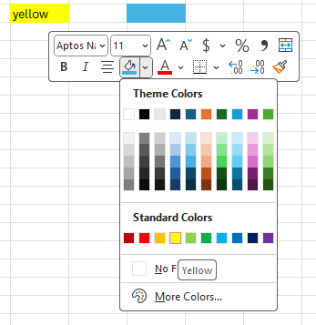
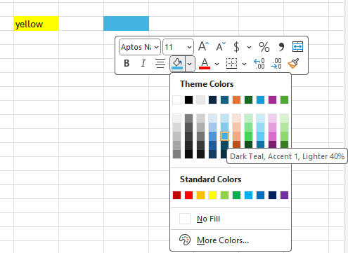
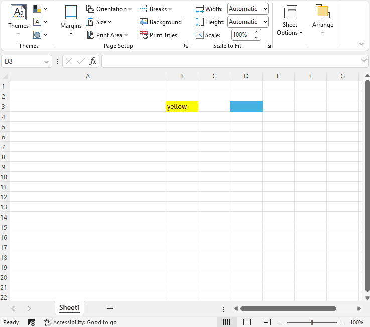

## Environment

| Version | Product | Author | 
| --- | --- | ---- | 
| 2024.2.426| RadSpreadProcessing |[Desislava Yordanova](https://www.telerik.com/blogs/author/desislava-yordanova)| 

## Description

You can import an Excel file with cells formatted with color and retrieve the cell color when the background color is set from MS Excel with a theme.

You can set a **Standard** color (for example, Yellow) or a **Theme** color (for example, Dark Teal, Accent 1) to a cell:

|Standard Color|Theme Color|
|----|----|
| | |   

The *Yellow* color is fixed and does not change after you change the document theme. The *Dark Teal, Accent 1* color changes if you select another theme:

    
 
This article shows how to extract the color value from a cell when it is applied through a theme color.

## Solution

To get the cell color in RadSpreadProcessing when the color is applied through the document theme, follow these steps:

1. [Import the Excel document]() with the appropriate format provider.
2. [Access the desired cell]() or range of cells.
3. Check if the cell fill is of type [PatternFill](https://docs.telerik.com/devtools/document-processing/libraries/radspreadprocessing/working-with-cells/get-set-clear-properties#fill-property).
4. Get the [ThemableColor]() object from the `PatternFill`.
5. Call the [GetActualValue](https://docs.telerik.com/devtools/document-processing/libraries/radspreadprocessing/features/styling/document-themes#getting-actual-values) method of the `ThemableColor` object and pass in the document theme to get the actual color value.

The following code snippet shows these steps:

```csharp
string filePath = "Book1.xlsx";
Workbook workbook = new Workbook(); 
IWorkbookFormatProvider formatProvider = new Telerik.Windows.Documents.Spreadsheet.FormatProviders.OpenXml.Xlsx.XlsxFormatProvider();

using (Stream input = new FileStream(filePath, FileMode.Open))
{
    workbook = formatProvider.Import(input);
}
Worksheet worksheet = workbook.Worksheets.First();
CellSelection selection = worksheet.Cells[0,1]; 
PatternFill solidPatternFill = selection.GetFill().Value as PatternFill;
if (solidPatternFill != null)
{
    PatternType type = solidPatternFill.PatternType;
    ThemableColor patternColor = solidPatternFill.PatternColor;
    Color color = patternColor.LocalValue;
    ThemableColor bg = solidPatternFill.BackgroundColor;
    Color bgcolor = bg.LocalValue;

    Color actualColor = patternColor.GetActualValue(workbook.Theme);
    // The actual color is the same as Accent1 color of the colorScheme 
    Debug.WriteLine("RGB: " + actualColor.R.ToString() + ", " + actualColor.G.ToString() + ", " + actualColor.B.ToString());
}
```

This approach ensures that even when a cell color is derived from the document theme, you can get the actual color value as displayed in the Excel file.

## See Also

* [Document Themes in RadSpreadProcessing]()
* [Getting Actual Values](https://docs.telerik.com/devtools/document-processing/libraries/radspreadprocessing/features/styling/document-themes#getting-actual-values)
