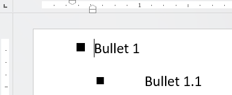

## Description

When working with bullet lists in [RadWordsProcessing]() documents, you might need to adjust the bullet position and text indentation to meet specific formatting requirements. This knowledge base article demonstrates how to set the text indent or adjust the bullet position for bullet lists in RadWordsProcessing.

 

## Environment

| Version | Product | Author | 
| ---- | ---- | ---- | 
| 2025.1.205| RadWordsProcessing |[Desislava Yordanova](https://www.telerik.com/blogs/author/desislava-yordanova)| 

## Solution

To set the bullet position and text indentation for a bullet list in RadWordsProcessing, follow these steps:

1. Initialize the [RadFlowDocument]() and add a section to it.
2. Create a [bullet list]() and configure its levels as needed.
3. Use the `ParagraphProperties`.[LeftIndent]() and `ParagraphProperties`.[HangingIndent]() properties to adjust the bullet position and text indentation.

### Example

```csharp
            RadFlowDocument document = new RadFlowDocument();
            Section section = document.Sections.AddSection();
            section.PageMargins = new Telerik.Windows.Documents.Primitives.Padding(10);
            document.Lists.Add(ListTemplateType.BulletDefault);
            List list = document.Lists.Last();

            // Configure the first level of the bullet list
            list.Levels[0].NumberTextFormat = "¾";
            list.Levels[0].NumberingStyle = NumberingStyle.Bullet;
            list.Levels[0].CharacterProperties.FontFamily.LocalValue = new ThemableFontFamily("Wingdings 2");
            list.Levels[0].CharacterProperties.FontSize.LocalValue = 16;
            // Adjust the space between the bullet and the text for the first level
            list.Levels[0].ParagraphProperties.LeftIndent.LocalValue = 50; // Bullet position
            list.Levels[0].ParagraphProperties.HangingIndent.LocalValue = 20; // Text indent
             
            // Configure the second level of the bullet list
            list.Levels[1].NumberTextFormat = "¾";
            list.Levels[1].NumberingStyle = NumberingStyle.Bullet;
            list.Levels[1].CharacterProperties.FontFamily.LocalValue = new ThemableFontFamily("Wingdings 2");
            list.Levels[1].CharacterProperties.FontSize.LocalValue = 14;
            // Adjust the space between the bullet and the text for the second level
            list.Levels[1].ParagraphProperties.LeftIndent.LocalValue = 100; // Bullet position
            list.Levels[1].ParagraphProperties.HangingIndent.LocalValue = 50; // Text indent

            // Add paragraphs and associate them with list levels
            Paragraph paragraph = document.Sections.Last().Blocks.AddParagraph();
            paragraph.Inlines.AddRun("Bullet 1");
            paragraph.ListId = list.Id;
            paragraph.ListLevel = 0;

            paragraph = document.Sections.Last().Blocks.AddParagraph();
            paragraph.Inlines.AddRun("Bullet 1.1");
            paragraph.ListId = list.Id;
            paragraph.ListLevel = 1;

            Telerik.Windows.Documents.Flow.FormatProviders.Docx.DocxFormatProvider provider = new Telerik.Windows.Documents.Flow.FormatProviders.Docx.DocxFormatProvider();
            string outputFilePath = "output.docx";
            File.Delete(outputFilePath);
            using (Stream output = File.OpenWrite(outputFilePath))
            { 
                provider.Export(document, output, TimeSpan.FromSeconds(10));
            }

            Process.Start(new ProcessStartInfo() { FileName = outputFilePath, UseShellExecute = true });
```


>tip The conversion from [device-independent pixels]() (DIP) to centimeters (cm) is based on the formula:[ text{cm} = text{DIP} / {96} * 2.54 ]. For instance, to convert 18.9 DIP to cm: 
[ text{cm} = 18.9 / 96 * 2.54 = 0.5cm ].

## See Also

- [Style Properties]()
- [Lists]()
- [Device Independent Pixels]()
