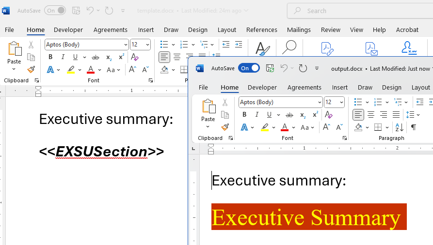

## Environment

| Version | Product | Author | 
| ---- | ---- | ---- | 
| 2025.2.520| RadWordProcessing |[Desislava Yordanova](https://www.telerik.com/blogs/author/desislava-yordanova)| 

## Description

This article demonstrates a sample approach how to simulate [mail merge](), where formatted HTML content needs to replace placeholders in a DOCX template. When performing a mail merge, the WordProcessing library binds plain HTML text, instead of rendering the HTML with its original formatting.

## Solution

To successfully insert the formatted HTML content, you can use the [Find-and-Replace]() functionality instead. Replace placeholders with the styled HTML content using the following steps:

1. Import the HTML content using [HtmlFormatProvider]().
2. Import the DOCX template using [DocxFormatProvider]().
3. Find placeholders in the template and replace them with the imported HTML content.

 

### Code Example

```csharp
// Import HTML content
RadFlowDocument htmlFlowDocument;
using (Stream input = File.OpenRead(@"info.html"))
{
    Telerik.Windows.Documents.Flow.FormatProviders.Html.HtmlFormatProvider htmlProvider = new Telerik.Windows.Documents.Flow.FormatProviders.Html.HtmlFormatProvider(); 
    htmlFlowDocument = htmlProvider.Import(input, TimeSpan.FromSeconds(10));
}

// Import DOCX template
RadFlowDocument templateFlowDocument;
Telerik.Windows.Documents.Flow.FormatProviders.Docx.DocxFormatProvider docxProvider = new Telerik.Windows.Documents.Flow.FormatProviders.Docx.DocxFormatProvider();

using (Stream input = File.OpenRead("template.docx"))
{
    templateFlowDocument = docxProvider.Import(input, TimeSpan.FromSeconds(10));
}

// Replace placeholder with HTML content
List<BlockBase> newContent = new List<BlockBase>();
RadFlowDocumentEditor editor = new RadFlowDocumentEditor(templateFlowDocument);

foreach (Section section in htmlFlowDocument.Sections)
{
    Section clonedSection = section.Clone(templateFlowDocument);
    newContent.AddRange(clonedSection.Blocks);
}

editor.ReplaceText("<<EXSUSection>>", newContent, true, false);

// Export the modified document
string outputFilePath = "output.docx";
File.Delete(outputFilePath);
using (Stream output = File.OpenWrite(outputFilePath))
{
    docxProvider.Export(templateFlowDocument, output, TimeSpan.FromSeconds(10));
}

// Open the output file
Process.Start(new ProcessStartInfo() { FileName = outputFilePath, UseShellExecute = true });
```

### Notes:
- Replace `<<EXSUSection>>` with your placeholder text.
- Modify the code to suit your template and requirements.
- Ensure the provided HTML content is [supported]() by HtmlFormatProvider.

## See Also

- [HtmlFormatProvider]()
- [DocxFormatProvider]()
- [Mail Merge Documentation]()
- [Find-and-Replace]() 
