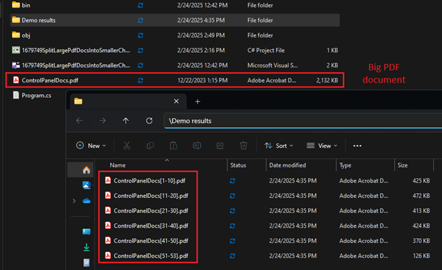

## Environment

| Version | Product | Author | 
| ---- | ---- | ---- | 
|2025.1.205| RadPdfProcessing |[Desislava Yordanova](https://www.telerik.com/blogs/author/desislava-yordanova)| 

## Description

When working with large PDF documents, it might be necessary to split these documents into smaller "chunks" of a specified number of pages. This article shows a sample approach how to export efficiently subsets of pages without having to repeatedly re-import the entire document for each chunk. 

## Solution

To efficiently export subsets of pages from a large PDF document, the [PdfStreamWriter]() functionality of [RadPdfProcessing]() can be leveraged. This approach significantly improves performance and reduces memory usage, making it ideal for processing large volumes of PDFs. Below is a step-by-step guide on how to split a PDF document into smaller "chunks" using `PdfStreamWriter`.

### Step 1: Include Necessary Namespaces

Ensure you include the necessary namespaces in your project:

```csharp
using Telerik.Windows.Documents.Fixed.FormatProviders.Pdf.Streaming;
using Telerik.Windows.Documents.Fixed.Model;
```

### Step 2: Implement the Splitting Logic

Use the following logic to split a PDF document into smaller chunks. This example splits a document into chunks of 10 pages each, but you can adjust the `pagesCount` variable to change the chunk size as needed.

```csharp
internal class Program
{
    public const string ResultDirName = @"..\..\..\Demo results";
    public const string InputFileMultipageDocument = "YourLargePDF.pdf";
    static void Main(string[] args)
    {
        EnsureEmptyResultDirectory();
        SplitDocumentPages("YourLargePDF_Chunk[{0}-{1}].pdf");
    }

    private static void SplitDocumentPages(string resultFileFormat)
    {
        string documentToSplit = InputFileMultipageDocument;
        int pagesCount = 10; // Number of pages per chunk
        using (PdfFileSource fileToSplit = new PdfFileSource(File.OpenRead(documentToSplit)))
        {
            int totalPages = fileToSplit.Pages.Length;
            int currentTotalPageIndex = 0;
            int numberOfSplitDocs = totalPages / pagesCount + (totalPages % pagesCount == 0 ? 0 : 1);

            for (int docIndex = 0; docIndex < numberOfSplitDocs; docIndex++)
            {
                int currentPagesEnd = Math.Min(currentTotalPageIndex + pagesCount, totalPages);
                string splitDocumentName = Path.Combine(ResultDirName, string.Format(resultFileFormat, docIndex * pagesCount + 1, currentPagesEnd));

                using (PdfStreamWriter fileWriter = new PdfStreamWriter(File.OpenWrite(splitDocumentName)))
                {
                    for (int pageIndex = currentTotalPageIndex; pageIndex < currentPagesEnd; pageIndex++)
                    {
                        PdfPageSource page = fileToSplit.Pages[pageIndex];
                        fileWriter.WritePage(page);
                        currentTotalPageIndex++;
                    }
                }
            }
        }
    }

    private static void EnsureEmptyResultDirectory()
    {
        if (Directory.Exists(ResultDirName))
        {
            foreach (string fileName in Directory.EnumerateFiles(ResultDirName))
            {
                File.Delete(fileName);
            }
        }
        else
        {
            Directory.CreateDirectory(ResultDirName);
        }
    }
}
```

This solution efficiently processes the splitting operation by writing each chunk directly to a new file without the need to re-import the original document multiple times:

  

## See Also

- [PdfStreamWriter]()
- [RadPdfProcessing]()
