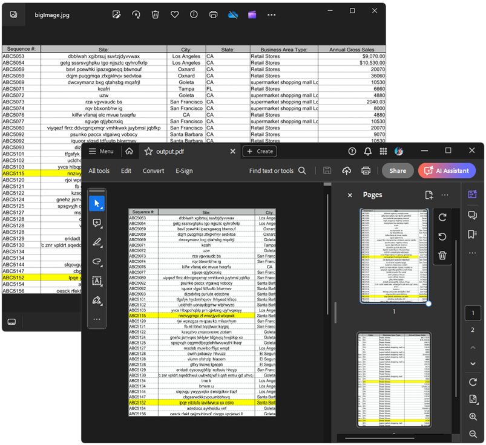

## Environment

| Version | Product | Author | 
| --- | --- | ---- | 
| 2024.2.426| RadPdfProcessing |[Desislava Yordanova](https://www.telerik.com/blogs/author/desislava-yordanova)| 

## Description

RadPdfProcessing doesn't have a built-in mechanism to split a large image accross the pages when it doesn't fit within a single page's boundaries.
This article demonstrates a sample approach how to do it.

## Solution

To export a large image across multiple PDF pages without adding headers or blank spaces, manually split (horizontally or vertically depending on the image dimensions) the image and add each part to a separate page. Below is a sample implementation using [RadPdfProcessing]() that demonstrates how to split an image into two parts and export it to a PDF file:

```csharp
         static void Main(string[] args)
        {
            RadFixedDocument document = new RadFixedDocument();
            RadFixedPage page = document.Pages.AddPage();
            System.Windows.Size pageSize = new System.Windows.Size(Unit.MmToDip(210),Unit.MmToDip(297));
            page.Size = pageSize;
            Bitmap bmp = new Bitmap(@"bigImage.jpg");

            if (bmp.Width > pageSize.Width && bmp.Height <= pageSize.Height)
            {
                SplitImages(true, bmp, document, page);
            }
            else
            {
                SplitImages(false, bmp, document, page);
            }
           
            PdfFormatProvider provider = new PdfFormatProvider();
            string outputFilePath = "output.pdf";
            File.Delete(outputFilePath);
            using (Stream output = File.OpenWrite(outputFilePath))
            {
                provider.Export(document, output);
            }
            Process.Start(new ProcessStartInfo() { FileName = outputFilePath, UseShellExecute = true });

        }

        private static void SplitImages(bool isVerticalSplit, Bitmap bmp, RadFixedDocument document, RadFixedPage page)
        {
            Bitmap firstHalf = bmp.Clone(new Rectangle(0, 0, bmp.Width, bmp.Height / 2), System.Drawing.Imaging.PixelFormat.DontCare);
            Bitmap secondHalf = bmp.Clone(new Rectangle(0, bmp.Height / 2, bmp.Width, bmp.Height / 2), System.Drawing.Imaging.PixelFormat.DontCare);
            if (isVerticalSplit)
            {
                firstHalf = bmp.Clone(new Rectangle(0, 0, bmp.Width / 2, bmp.Height), System.Drawing.Imaging.PixelFormat.DontCare);
                secondHalf = bmp.Clone(new Rectangle(bmp.Width / 2, 0, bmp.Width / 2, bmp.Height), System.Drawing.Imaging.PixelFormat.DontCare);
            }

            FixedContentEditor editor = new FixedContentEditor(page);
            var ms = new MemoryStream();
            firstHalf.Save(ms, System.Drawing.Imaging.ImageFormat.Png);
            ms.Seek(0, SeekOrigin.Begin);
            editor.DrawImage(ms, new System.Windows.Size((int)page.Size.Width, (int)page.Size.Height));

            RadFixedPage page1 = document.Pages.AddPage();
            FixedContentEditor editor1 = new FixedContentEditor(page1);
            var ms1 = new MemoryStream();
            secondHalf.Save(ms1, System.Drawing.Imaging.ImageFormat.Png);
            ms1.Seek(0, SeekOrigin.Begin);
            editor1.DrawImage(ms1, new System.Windows.Size((int)page1.Size.Width, (int)page1.Size.Height));
        }
```

This example splits the image into two parts, but you can adjust the logic to split the image into as many parts as necessary, depending on the image size and the desired size of each part on the PDF pages.

  
 
## See Also

- [RadPdfProcessing]() 

